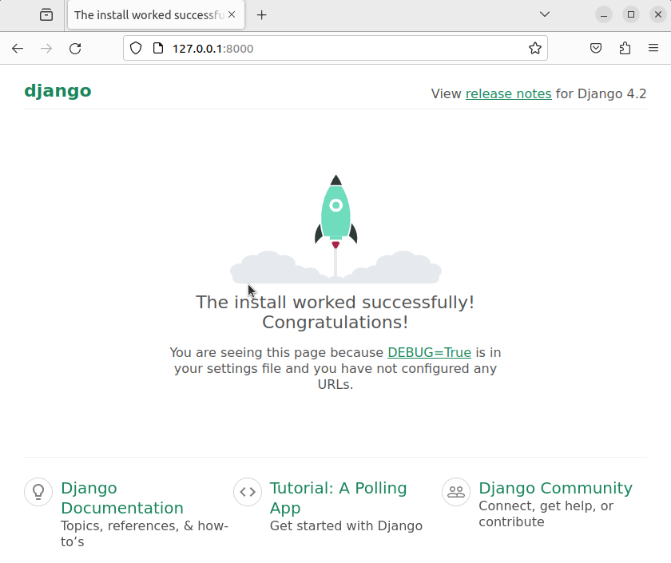
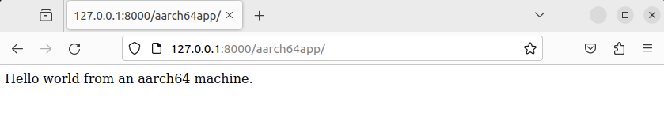

## Create the Django project

From the terminal where the virtual environment is activated, you need to
create a Django project:

```bash
django-admin startproject myproject
```

The above command creates a directory called `myproject` that contains the basic
structure of a Django application. Inspect the project files:

```bash
tree myproject/
```
The output should look like:

```output
myproject/
    manage.py
    myproject
        asgi.py
        __init__.py
        settings.py
        urls.py
        wsgi.py

```

Feel free to explore the content of these files.

Now you can test the application by starting the development server.

```bash
cd myproject
python manage.py runserver 0.0.0.0:8000
```
You will see messages similar to:

```output
Watching for file changes with StatReloader
Performing system checks...

System check identified no issues (0 silenced).

You have 18 unapplied migration(s). Your project may not work properly until
you apply the migrations for app(s): admin, auth, contenttypes, sessions.
Run 'python manage.py migrate' to apply them.
November 06, 2023 - 22:34:05
Django version 4.2.7, using settings 'myproject.settings'
Starting development server at http://0.0.0.0:8000/
Quit the server with CONTROL-C.
```

{}
In the above command you specified 0.0.0.0:8000. This means
that the web server is listening to all available ports. You need to specify
this value if you developing on a remote machine because, by default, the
development server listens only to the localhost.
{}

Now open a web browser and point it to the IP address of your machine followed
by `:8000`. You should see something like this:



## Create the Django application
Now that you have a Django project, it's time to create a Django
application within the project. Type:

```bash
python manage.py startapp aarch64app
tree aarch64app
```

The output should look similar to:

```output
aarch64app/
    admin.py
    apps.py
    __init__.py
    migrations
        __init__.py
    models.py
    tests.py
    views.py
```

Again, feel free to explore the content of these files.

It's now time to write some code that will be executed by the Django
application.
With your preferred editor, open `aarch64app/views.py` and replace the content
with the following:

```python
import platform

from django.http import HttpResponse

# Create your views here.
def index(request):
    return HttpResponse(f"Hello world from an {platform.machine()} machine.") 
```

Next you need to map a URL to this view. Create a new file `aarch64app/urls.py`
with the following content:

```python
from django.urls import path

from . import views

urlpatterns = [
    path("", views.index, name="index"),
]
```

Now you need to make it visible at the project level. Edit `myproject/urls.py`
and add the following code:

```python
from django.contrib import admin
from django.urls import include, path

urlpatterns = [
    path("aarch64app/", include("aarch64app.urls")),
    path('admin/', admin.site.urls),
]
```

You have now connected the index view with the URL `/aarch64app`. Run the
development web server again with:

```bash
python manage.py runserver 0.0.0.0:8000
```

Open http://your_IP:8000/aarch64app/ with
your browser. You should see the hello world message.



