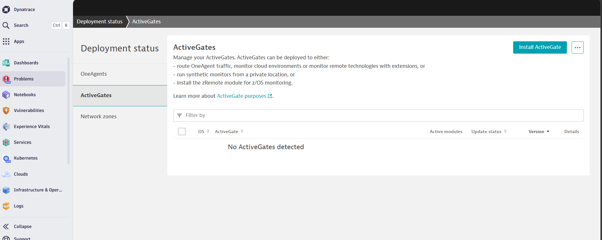
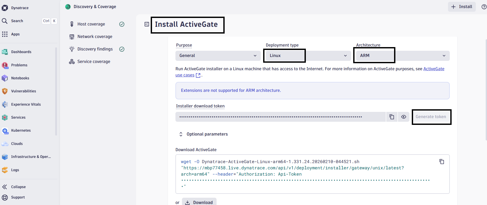
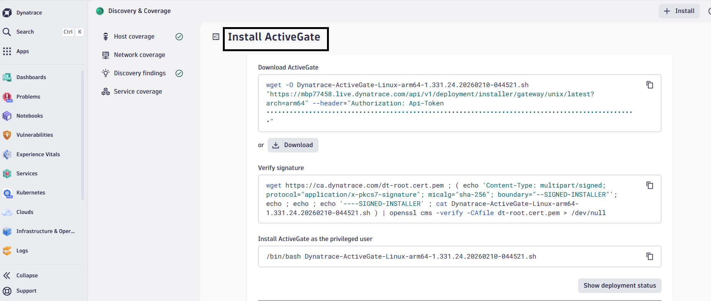
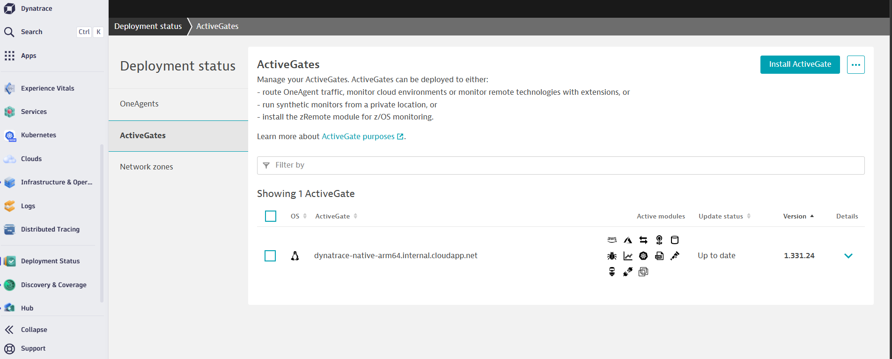
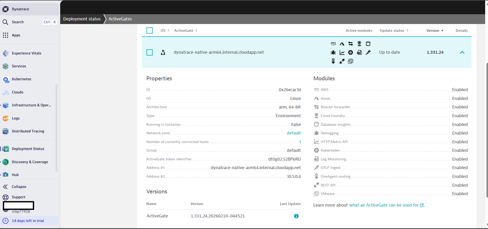
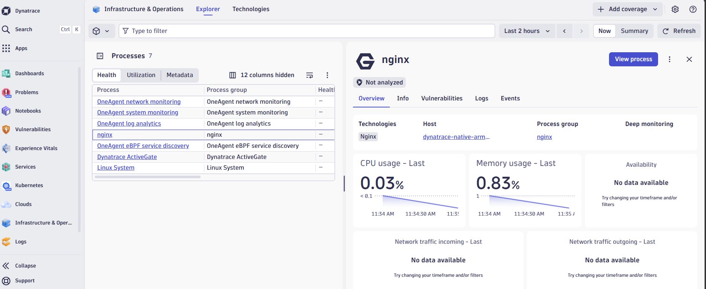

## Install Dynatrace ActiveGate on Azure Ubuntu Arm64

Dynatrace ActiveGate acts as a **secure gateway between monitored environments and the Dynatrace SaaS platform**.  
It improves scalability, enables Kubernetes monitoring, and routes monitoring traffic efficiently.

In this guide, you'll install Dynatrace ActiveGate on an **Azure Ubuntu 24.04 LTS Arm64 virtual machine running on Azure Cobalt 100 processors**.

After installation completes, ActiveGate:

* Runs as a system service
* Listens on port **9999** for Dynatrace communication
* Connects to your Dynatrace SaaS environment
* Operates natively on **Arm64 (`aarch64`)** architecture

## Verify OneAgent installation

ActiveGate is commonly installed on a host that already has **Dynatrace OneAgent** installed.  
This allows ActiveGate to securely route monitoring traffic from OneAgent to the Dynatrace environment.

Verify that OneAgent is running:

```console
sudo systemctl status oneagent
```

If OneAgent isn't installed, install it first using the previous guide.

## Log in to Dynatrace

Open your Dynatrace environment in a browser.

```text
https://<ENVIRONMENT-ID>.live.dynatrace.com
```

**Example:**

```text
https://qzo722404.live.dynatrace.com
```

This is your Dynatrace SaaS environment URL.

## Navigate to the ActiveGate deployment page

From the Dynatrace main dashboard:

* Select **Search** on the upper left and search for **Deployment**.
* Select **Deployment status**.
* Choose **ActiveGate**.
* Select **Install ActiveGate**.



Dynatrace generates an installation command specifically for your environment.

## Select Arm architecture

On the installer configuration page:

* Platform -> Linux
* Architecture -> ARM64
* Select **Generate token** to create an authentication token



This ensures that the installer downloads the Arm64-compatible ActiveGate binaries.

## Copy the ActiveGate installer command

Dynatrace generates a command similar to the following:

**Download ActiveGate:**

```console
wget -O Dynatrace-ActiveGate-Linux-arm.sh \
"https://<ENVIRONMENT-ID>.live.dynatrace.com/api/v1/deployment/installer/gateway/unix/latest?arch=arm" \
--header="Authorization: Api-Token <API_TOKEN>"
```

Example:

```console
wget -O Dynatrace-ActiveGate-Linux-arm.sh \
"https://qzo72404.live.dynatrace.com/api/v1/deployment/installer/gateway/unix/latest?arch=arm" \
--header="Authorization: Api-Token DT_API_TOKEN"
```

**Verify signature:**

```console
wget https://ca.dynatrace.com/dt-root.cert.pem
( echo 'Content-Type: multipart/signed; protocol="application/x-pkcs7-signature"; micalg="sha-256"; boundary="--SIGNED-INSTALLER"'; echo; echo; echo '----SIGNED-INSTALLER'; cat Dynatrace-ActiveGate-Linux-arm.sh ) | openssl cms -verify -CAfile dt-root.cert.pem > /dev/null
```



**Install ActiveGate as the privileged user:**

Copy the command under "Install ActiveGate as the privileged user" from your dashboard and prepend "sudo " to it to launch the install:

```console
sudo /bin/bash Dynatrace-ActiveGate-Linux-arm.sh
```

The installer automatically performs the following tasks:

* Downloads ActiveGate components
* Installs the ActiveGate service
* Configures communication with Dynatrace SaaS
* Starts the ActiveGate service

The output is similar to:

```output
2026-03-12 05:59:21 UTC Starting Dynatrace ActiveGate AutoUpdater...
2026-03-12 05:59:21 UTC Checking if Dynatrace ActiveGate AutoUpdater is running ...
2026-03-12 05:59:21 UTC Dynatrace ActiveGate AutoUpdater is running.
2026-03-12 05:59:21 UTC Cleaning autobackup...
2026-03-12 05:59:21 UTC Removing old installation log files...
2026-03-12 05:59:21 UTC
2026-03-12 05:59:21 UTC --------------------------------------------------------------
2026-03-12 05:59:21 UTC Installation finished successfully.
```

## Verify the ActiveGate service

Check that the ActiveGate service is running.

```console
sudo systemctl status dynatracegateway
```

The output is similar to:

```output
● dynatracegateway.service - Dynatrace ActiveGate service
     Loaded: loaded (/etc/systemd/system/dynatracegateway.service; enabled; preset: enabled)
     Active: active (running) since Thu 2026-03-12 05:59:07 UTC; 1min 7s ago
    Process: 20280 ExecStart=/opt/dynatrace/gateway/dynatracegateway start (code=exited, status=0/SUCCESS)
```

This confirms that ActiveGate started successfully.

## Verify the ActiveGate communication port

ActiveGate communicates using port 9999.

**Verify that the port is listening:**

```console
sudo ss -tulnp | grep 9999
```

The output is similar to:

```console
tcp   LISTEN 0      50                 *:9999             *:*    users:(("java",pid=20319,fd=403))
```

This confirms that ActiveGate is accepting incoming connections.

## Confirm ActiveGate in Dynatrace UI

Open the Dynatrace web interface and navigate to:

```text
Deployment Status → ActiveGates
```

You should see your ActiveGate instance listed with:

* Host name
* Version
* Status: Connected





## Test application monitoring with Nginx

To validate that Dynatrace is collecting monitoring data correctly, deploy a simple web server on the virtual machine. Dynatrace OneAgent automatically detects and monitors the process.

### Install Nginx

Update the package index and install the Nginx web server.

```console
sudo apt update
sudo apt install -y nginx
```

## Check the Nginx service status

```console
sudo systemctl status nginx
```

The output is similar to:

```output
Active: active (running)
```

## Verify process detection in Dynatrace

Dynatrace OneAgent automatically discovers running processes and services.

Return to the Dynatrace web interface and navigate to:

```text
Infrastructure & Operations → Hosts
```

Select your monitored host and open:

```text
Processes
```

You should see a process similar to:

* `nginx`

Dynatrace automatically begins collecting metrics such as:

* CPU usage
* memory consumption
* network activity
* request throughput



## What you've learned 

Your Azure Cobalt 100 virtual machine now has a complete Dynatrace monitoring stack. OneAgent monitors host resources and processes, while ActiveGate securely routes monitoring data to your Dynatrace environment through port 9999. The entire setup operates natively on Arm64 architecture, providing full observability for your applications and infrastructure.
