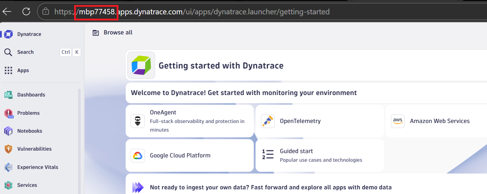
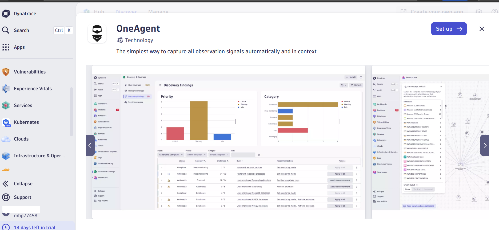
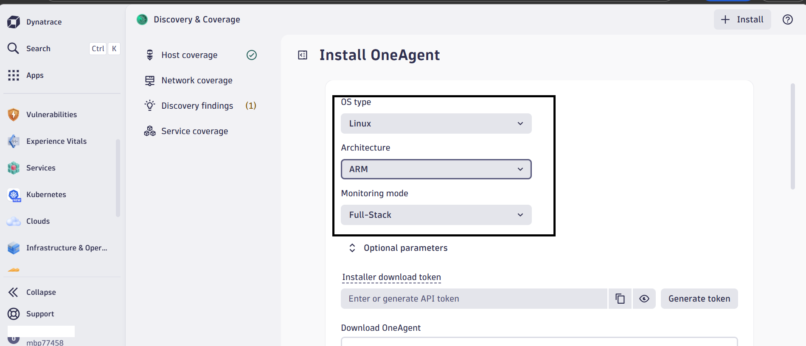
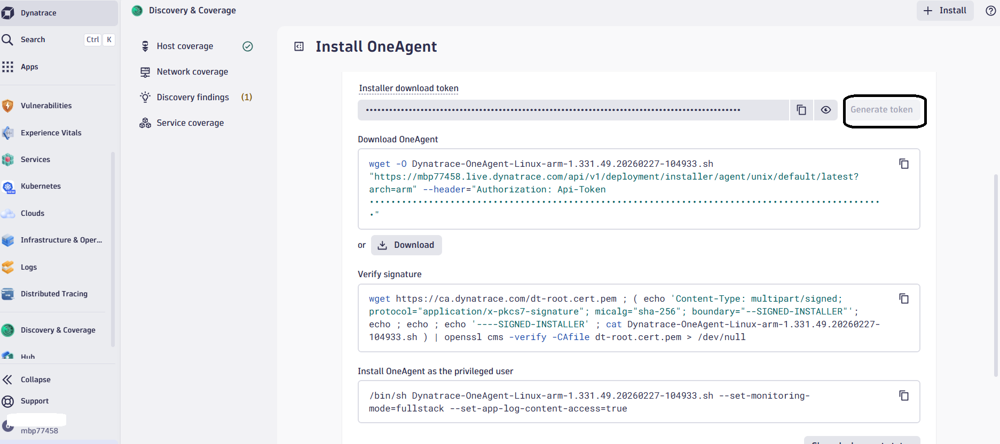
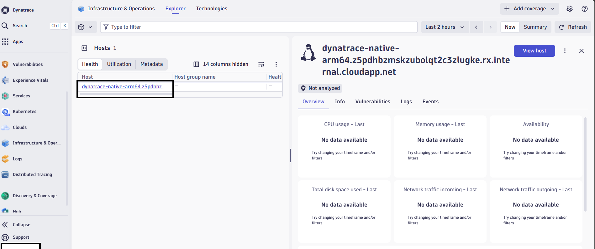
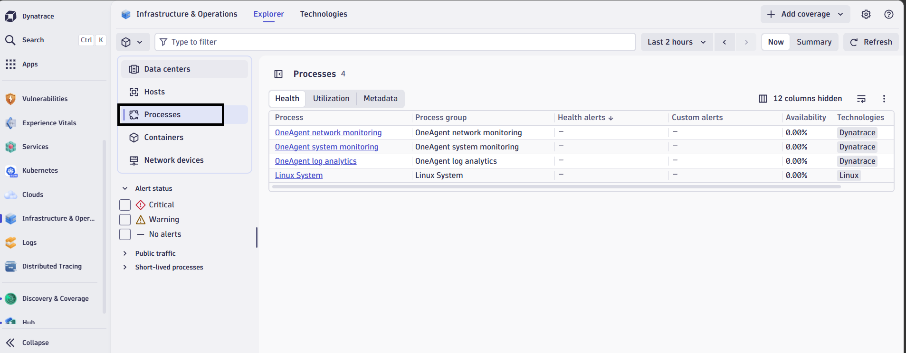

## Install Dynatrace OneAgent on Azure Ubuntu Arm64

To install Dynatrace OneAgent on an Azure Ubuntu 24.04 LTS Arm64 virtual machine, follow these steps.

After installation completes, Dynatrace OneAgent:

* Runs as a host monitoring agent
* Connects to your Dynatrace SaaS environment
* Monitors system processes and services automatically
* Operates natively on Arm64 (`aarch64`) architecture

## Update the system and install required tools

Update the operating system and install the tools required for downloading the Dynatrace installer.

```console
sudo apt update && sudo apt upgrade -y
sudo apt install -y curl wget unzip ca-certificates
```

## Verify Arm64 architecture

Confirm that the virtual machine is running on the Arm64 architecture.

```console
uname -m
```

The output is similar to:

```output
aarch64
```

This confirms the system is using the Arm64 architecture required for Cobalt 100 processors.

## Create your Dynatrace trial environment

In a web browser, go to [Dynatrace](https://dynatrace.com) and select **Try it free** followed by **Start trial**.

Enter your email and then complete the requested fields:

* Create and supply a password for your trial account
* First name
* Last name
* Work email address
* Company name
* Country

After submitting the form, Dynatrace creates a new SaaS monitoring environment for you.

This process usually takes 1–2 minutes.

## Access your Dynatrace environment

After the environment is created, your browser shows a button named **Launch Dynatrace**. Select it to open your Dynatrace environment.

Make a note of the environment ID assigned to your account because it appears in your dashboard URL.

**Example:**

```text
https://mbp77458.apps.dynatrace.com/ui/apps/dynatrace.launcher/getting-started 
```

The Environment ID uniquely identifies your Dynatrace tenant and is required for agent installation.



## Navigate to Deployment

From the Dynatrace dashboard:

* Choose **OneAgent**
* Choose **Setup**



This page generates the installation command tailored for your environment.

## Select Arm64 architecture

On the installer page, confirm these selections:

* Platform -> Linux
* Architecture -> ARM64
* Monitoring mode -> Full-stack monitoring

Then select **Generate token** to create an authentication token.



## Copy OneAgent installer command

Dynatrace generates an installer command that includes your environment ID and API token.:

```console
wget -O Dynatrace-OneAgent-Linux-arm.sh \
"https://<ENV>.live.dynatrace.com/api/v1/deployment/installer/agent/unix/default/latest?arch=arm" \
--header="Authorization: Api-Token <API_TOKEN>"
```

**Example:**

```console
wget -O Dynatrace-OneAgent-Linux-arm.sh \
"https://qzo72404.live.dynatrace.com/api/v1/deployment/installer/agent/unix/default/latest?arch=arm" \
--header="Authorization: Api-Token DT_API_TOKEN"
```

The API token allows secure access to the Dynatrace installer.

Run this command on the virtual machine to download the installer.

## Verify installer signature

For security, verify the installer signature using Dynatrace’s root certificate.

```console
wget https://ca.dynatrace.com/dt-root.cert.pem
( echo 'Content-Type: multipart/signed; protocol="application/x-pkcs7-signature"; micalg="sha-256"; boundary="--SIGNED-INSTALLER"'; echo; echo; echo '----SIGNED-INSTALLER'; cat Dynatrace-OneAgent-Linux-arm.sh ) | openssl cms -verify -CAfile dt-root.cert.pem > /dev/null
```

This command validates the downloaded installer before you run it.



## Install OneAgent as the privileged user

Copy the command under **Install OneAgent as the privileged user** from your Dynatrace dashboard and prepend `sudo` to run the install.

```console
sudo /bin/sh Dynatrace-OneAgent-Linux-arm.sh --set-monitoring-mode=fullstack --set-app-log-content-access=true
```

The output is similar to:

```output
Starting Dynatrace OneAgent installer...
Installing OneAgent...
Setting agent configuration...
Installation finished successfully.
```

The installer performs several tasks automatically:

* Downloads monitoring components
* Configures kernel instrumentation
* Installs the OneAgent system service
* Registers the host with your Dynatrace environment

## Verify OneAgent service

Check that the Dynatrace monitoring service is running.

```console
sudo systemctl status oneagent
```

The output is similar to:

```output
● oneagent.service - Dynatrace OneAgent
  Loaded: loaded (/etc/systemd/system/oneagent.service; enabled; preset: enabled)
  Active: active (running)
```

This confirms the monitoring agent started successfully.

## Verify Dynatrace processes

You can also check the OneAgent processes from the terminal.

```console
ps aux | grep oneagent
```

The output is similar to:

```output
dtuser     17754  0.0  0.0 307872  4388 ?        Ssl  05:48   0:00 /opt/dynatrace/oneagent/agent/lib64/oneagentwatchdog -bg -config=/opt/dynatrace/oneagent/agent/conf/watchdog.conf
dtuser     17761  0.2  0.3 1183000 59136 ?       Sl   05:48   0:06 oneagentos -Dcom.compuware.apm.WatchDogTimeout=900 -watchdog.restart_file_location=/var/lib/dynatrace/oneagent/agent/watchdog/watchdog_restart_file -Dcom.compuware.apm.WatchDogPipe=/var/lib/dynatrace/oneagent/agent/watchdog/oneagentos_pipe_17754
dtuser     17793  0.0  0.2 689184 34408 ?        Sl   05:48   0:01 oneagentloganalytics -Dcom.compuware.apm.WatchDogTimeout=900 -Dcom.compuware.apm.WatchDogPipe=/var/lib/dynatrace/oneagent/agent/watchdog/oneagentloganalytics_pipe_17754
dtuser     17795  0.1  0.2 361936 42940 ?        Sl   05:48   0:04 oneagentnetwork -Dcom.compuware.apm.WatchDogTimeout=900 -Dcom.compuware.apm.WatchDogPipe=/var/lib/dynatrace/oneagent/agent/watchdog/oneagentnetwork_pipe_17754
dtuser     17883  0.0  0.0  28212  5340 ?        Sl   05:49   0:00 /opt/dynatrace/oneagent/agent/lib64/oneagentebpfdiscovery --log-dir /var/log/dynatrace/oneagent/os/ --log-no-stdout --log-level info
azureus+   23847  0.0  0.0   9988  2772 pts/0    S+   06:33   0:00 grep --color=auto oneagent
```

This confirms the monitoring agent started successfully.

## Confirm host detection in Dynatrace

Return to the Dynatrace web interface.

Navigate to:

```text
Infrastructure & Operations
→ Hosts
```

You should see:

```output
Host name: <vm-name>
OS: Linux
Architecture: ARM64
Monitoring mode: Full Stack
```



## Check automatic process discovery

Dynatrace automatically discovers running applications and services.

View them under:

```text
Hosts → Processes
```

Dynatrace identifies services such as:

* system processes
* web servers
* databases
* container runtimes



## What you've learned and what's next

Dynatrace OneAgent is now monitoring your Azure Cobalt 100 virtual machine. The agent runs as a system service, automatically discovers processes, and securely transmits monitoring data to your Dynatrace environment.

Next, you'll install Dynatrace ActiveGate to enable secure data routing, Kubernetes monitoring, and extension support.
