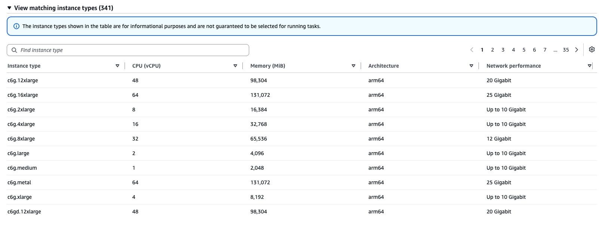

---
# User change
title: Specify Graviton-based instance requirement with a capacity provider
description: Create an Amazon ECS cluster and capacity provider that selects AWS Graviton-based instances using CPU, memory, and processor requirements.

weight: 3 # 1 is first, 2 is second, etc.

# Do not modify these elements
layout: "learningpathall"
---

## Create an Amazon ECS cluster and a custom capacity provider

When you use Amazon ECS Managed Instances, you'll need to create a capacity provider. The capacity provider is used to manage compute capacity. 

To specify custom instance requirements and select Arm-based instances, create a custom capacity provider in the AWS management console:

1. Navigate to the [console for Amazon ECS](https://console.aws.amazon.com/ecs/v2).
2. Select **Clusters**.
3. Select **Create cluster**.
4. Under **Cluster configuration**, for **Cluster name**, enter **ecs-managed-instances-cluster**.
5. Under **Infrastructure - *advanced***, select **Fargate and Managed Instances** as the method for obtaining compute capacity. 
6. For **Instance profile**, select the instance profile that you created earlier.
7. For **Infrastructure role**, select the Amazon ECS infrastructure role that you created earlier. 
8. For **Instance selection**, select **Use custom - *advanced***.
9. To add a third instance attribute, select **Add instance attribute**. 
10. For the third attribute, select **CPU manufacturers** for **Attribute**, then select **Amazon** as the **Attribute value**. Leave the **CPU (vCPU)** and **Memory (MiB)** attribute values as defaults. You'll see a list of instance types that match the criteria:
 
11. Under **Network settings**, configure the following:
    - For **VPC**, select an available VPC such as the default VPC.
    - For **Subnets**, select available subnets that are associated with the VPC.
    - For **Security group**, select **Use an existing security group**, then select a security group that has port `80` open for inbound traffic.
12. Leave other settings as defaults and select **Create**. 

By creating a capacity provider with these requirements, you're selecting for instance types that are based on Arm-based AWS Graviton CPUs that are manufactured by Amazon. 

## What you've accomplished and what's next

You've now created an Amazon ECS cluster in which you'll run your container, and a security group that allows inbound traffic on port `80`. You've also specified CPU manufacturer requirements in a capacity provider to filter for Arm-based instance types. 

Next, you'll run a container on an Arm-based instance that meets these instance requirements. 

