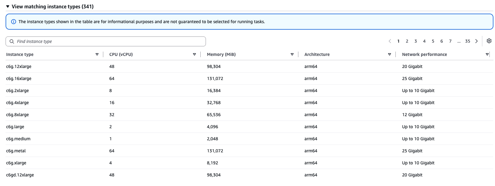

---
# User change
title: Create a capacity provider for Graviton instances
description: Create an Amazon ECS cluster and capacity provider that selects AWS Graviton-based instances using CPU, memory, and processor requirements.

weight: 3 # 1 is first, 2 is second, etc.

# Do not modify these elements
layout: "learningpathall"
---

## Understand capacity providers and Graviton selection

When you use Amazon ECS Managed Instances, a capacity provider manages the compute capacity for your tasks. It defines a launch template that tells Amazon ECS how to launch instances, including the instance profile, networking, storage, and the *instance requirements* used to select instance types.

The instance requirements are the key to running on AWS Graviton. Instead of naming specific instance types, you describe the attributes you need, such as vCPU count, memory, and CPU manufacturer, and Amazon ECS selects matching instance types automatically.

AWS Graviton is Amazon's family of Arm-based processors, built on Arm Neoverse cores. To target Graviton, you combine two settings:

- The task definition's `runtimePlatform.cpuArchitecture` value of `ARM64`, which you set on the previous page.
- The capacity provider's **CPU manufacturers** attribute set to **Amazon**, which filters the instance pool to Amazon-built (Graviton) CPUs.

Together, these two settings ensure that Amazon ECS runs your Arm64 task on a Graviton-based instance.

## Before you begin

This page assumes you already have a VPC with public subnets and a security group that allows inbound traffic on TCP port 80. You'll select these in the steps that follow. If you need to create a security group, see [Create a security group for your Amazon EC2 instance](https://docs.aws.amazon.com/AWSEC2/latest/UserGuide/creating-security-group.html).

## Create the cluster and capacity provider

To create a custom capacity provider in the AWS Management Console:

1. Navigate to the [console for Amazon ECS](https://console.aws.amazon.com/ecs/v2).
2. Select **Clusters**.
3. Select **Create cluster**.
4. Under **Cluster configuration**, for **Cluster name**, enter **ecs-managed-instances-cluster**.
5. Under **Infrastructure - *advanced***, select **Fargate and Managed Instances** as the method for obtaining compute capacity. 
6. For **Instance profile**, select the **ecsInstanceRole** instance profile that you created earlier.
7. For **Infrastructure role**, select the **ecsInfrastructureRole** infrastructure role that you created earlier. 
8. For **Instance selection**, select **Use custom - *advanced***. By default, **CPU (vCPU)** and **Memory (MiB)** are configured as the first two instance attributes.
9. To add a third instance attribute, select **Add instance attribute**. 
10. For the third attribute, select **CPU manufacturers** for **Attribute**, then select **Amazon** as the **Attribute value**. Leave the **CPU (vCPU)** and **Memory (MiB)** attribute values as defaults. You'll see a list of instance types that match the criteria:
 
11. Under **Network settings**, configure the following:
    - For **VPC**, select an available VPC such as the default VPC.
    - For **Subnets**, select available subnets that are associated with the VPC.
    - For **Security group**, select **Use an existing security group**, then select a security group that has port `80` open for inbound traffic.
12. Leave other settings as defaults and select **Create**. 

By setting the **CPU manufacturers** attribute to **Amazon**, you filter the instance pool to Amazon-built CPUs, which are AWS Graviton processors. Combined with the `ARM64` architecture in your task definition, this ensures that Amazon ECS runs your task on an Arm-based Graviton instance.

## What you've accomplished and what's next

You've now created an Amazon ECS cluster in which you'll run your container, and configured a capacity provider that uses a security group allowing inbound traffic on port `80`. You've also specified CPU manufacturer requirements in the capacity provider to filter for Arm-based instance types. 

Next, you'll run a container on an Arm-based instance that meets these instance requirements. 