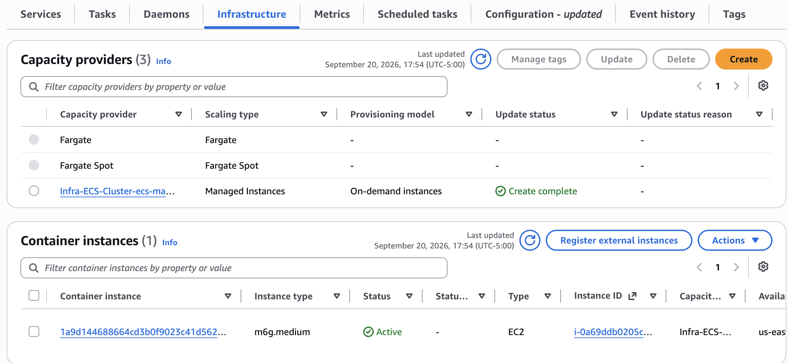
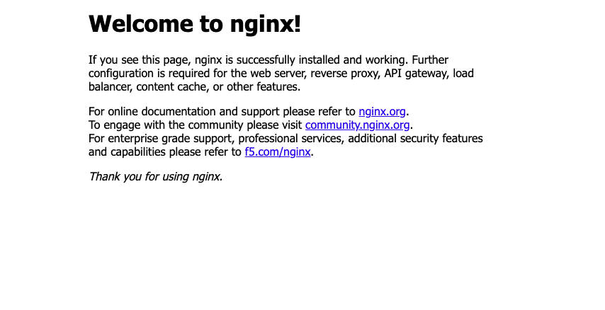

---
# User change
title: Run a container as an Amazon ECS task on AWS Graviton
description: Run an NGINX container as a standalone Amazon ECS task on Managed Instances and verify that it runs on AWS Graviton-based compute.

weight: 4 # 1 is first, 2 is second, etc.

# Do not modify these elements
layout: "learningpathall"
---

## Run a standalone Amazon ECS task

Use the cluster, capacity provider, and task definition that you created earlier to deploy a containerized application as a standalone task:

1. Navigate to the [console for Amazon ECS](https://console.aws.amazon.com/ecs/v2).
2. Select **Clusters**.
3. Select the cluster **ecs-managed-instances-cluster** that you created earlier.
4. Under **Tasks**, select **Run new task**.
5. Under **Task details**, for **Task definition family**, select the task definition **ecs-managed-instances-graviton-task-def** that you created earlier. 
6. Leave all other values as defaults and select **Create**.

## Verify application deployment 

To verify that the application deployed successfully:

1. Select the cluster **ecs-managed-instances-cluster**. 
2. Select **Infrastructure**.
2. Under **Container instances**, note that the **Instance type** that AWS chose based on the capacity provider is a Graviton-based instance type. The following screenshot shows that the instance type selected by AWS is `m6g.medium`:
      
3. Select the container instance that's associated with the ECS Managed Instances capacity provider.
4. Under **Networking**, you'll find the public DNS name and IP address for the instance. Copy the **Public IP** and paste it into a web browser of your choice. 

    You'll see the following welcome message:

    

## What you've accomplished

You've successfully deployed a containerized application on Graviton-based instances using Amazon ECS Managed Instances. 

To avoid accruing costs, stop the task after you've completed testing. For more information, see [Stopping an Amazon ECS task](https://docs.aws.amazon.com/AmazonECS/latest/developerguide/standalone-task-stop.html). Also consider [deleting the cluster](https://docs.aws.amazon.com/AmazonECS/latest/developerguide/delete_cluster-new-console.html), [deregistering the task definition](https://docs.aws.amazon.com/AmazonECS/latest/developerguide/deregister-task-definition-v2.html), and [deleting the task definition](https://docs.aws.amazon.com/AmazonECS/latest/developerguide/delete-task-definition-v2.html). 

You can extend this workflow to deploy containers on AWS-managed Arm-based instances powered by AWS Graviton, while maintaining control over the instance types and features that you use. 
