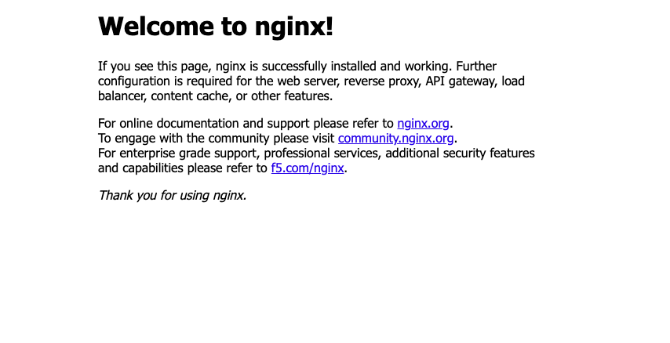

---
# User change
title: Run a container as an Amazon ECS task on AWS Graviton
description: Run an NGINX container as a standalone Amazon ECS task on Managed Instances and verify that it runs on AWS Graviton-based compute.

weight: 4 # 1 is first, 2 is second, etc.

# Do not modify these elements
layout: "learningpathall"
---

## Run a standalone Amazon ECS task

You can deploy your application on Amazon ECS either as a standalone task or as a service.

A standalone task is one instance of your application. It runs once and isn't automatically replaced when it stops, which suits batch jobs and short tests.

A service is a collection of tasks. Using a service, you can maintain a desired number of tasks and replace failed tasks. A service can integrate with a load balancer, which suits long-running applications.

To test whether your application lands on Graviton-based compute, run a standalone task.

Use the cluster, capacity provider, and task definition that you created earlier to deploy a containerized application as a standalone task.

### Run a task using the console

1. Navigate to the [console for Amazon ECS](https://console.aws.amazon.com/ecs/v2).
2. Select **Clusters**.
3. Select the cluster **ecs-managed-instances-cluster** that you created earlier.
4. Under **Tasks**, select **Run new task**.
5. Under **Task details**, for **Task definition family**, select the **nginx** task definition that you created earlier.
6. Leave all other values as defaults and select **Create**.

### Run a task using the AWS CLI

Run the `nginx` task definition using the Graviton capacity provider that you created earlier. Save the task Amazon Resource Name (ARN) so that you can use it in later commands:

```console
TASK_ARN=$(aws ecs run-task \
  --cluster ecs-managed-instances-cluster \
  --task-definition nginx \
  --capacity-provider-strategy \
    capacityProvider=graviton-managed-instances-cp,weight=1 \
  --query 'tasks[0].taskArn' \
  --output text)
echo "$TASK_ARN"
```

The task initially enters the `PROVISIONING` state while Amazon ECS selects and launches matching compute. Wait until the task reaches the `RUNNING` state:

```console
aws ecs wait tasks-running \
  --cluster ecs-managed-instances-cluster \
  --tasks "$TASK_ARN"
```

## Verify application deployment

This is where you confirm that the Amazon CPU-manufacturer and `ARM64` settings that you configured earlier resulted in Amazon ECS selecting a Graviton-based instance.

### Verify deployment using the AWS Management Console

To verify that the application deployed successfully using the console:

1. Select the cluster **ecs-managed-instances-cluster**.
2. Select **Infrastructure**.
3. Under **Container instances**, note the **Instance type** that AWS chose based on the capacity provider. The `g` in an instance family name, such as `m6g` or `c6g`, indicates an AWS Graviton (Arm-based) processor. The following screenshot shows that the instance type selected by AWS is `m6g.medium`:
      
4. Select the container instance that's associated with the ECS Managed Instances capacity provider.
5. Under **Networking**, you'll find the public DNS name and IP address for the instance. Copy the **Public IP** and paste it into a web browser of your choice.

    You'll see the following welcome message:

    

### Verify deployment using the AWS CLI

Get the ARN of the container instance where Amazon ECS placed the task:

```console
CONTAINER_INSTANCE_ARN=$(aws ecs describe-tasks \
  --cluster ecs-managed-instances-cluster \
  --tasks "$TASK_ARN" \
  --query 'tasks[0].containerInstanceArn' \
  --output text)
echo "$CONTAINER_INSTANCE_ARN"
```

Use the container instance ARN to get the ID of the underlying Amazon EC2 instance:

```console
EC2_INSTANCE_ID=$(aws ecs describe-container-instances \
  --cluster ecs-managed-instances-cluster \
  --container-instances "$CONTAINER_INSTANCE_ARN" \
  --query 'containerInstances[0].ec2InstanceId' \
  --output text)
echo "$EC2_INSTANCE_ID"
```

Display the instance type and public IP address:

```console
aws ec2 describe-instances \
  --instance-ids "$EC2_INSTANCE_ID" \
  --query 'Reservations[0].Instances[0].{InstanceType:InstanceType,PublicIpAddress:PublicIpAddress}'
```

The output is similar to:

```output
{
    "InstanceType": "m6g.large",
    "PublicIpAddress": "203.0.113.10"
}
```

The instance type that Amazon ECS selects can differ. Confirm that its family name contains `g`, as in `m6g` or `c6g`, which indicates an AWS Graviton processor.

Get the public IP address and request the NGINX welcome page:

```console
PUBLIC_IP=$(aws ec2 describe-instances \
  --instance-ids "$EC2_INSTANCE_ID" \
  --query 'Reservations[0].Instances[0].PublicIpAddress' \
  --output text)
curl -s "http://$PUBLIC_IP" | grep '<title>'
```

The expected output is:

```output
<title>Welcome to nginx!</title>
```

{}
Because the task definition uses `host` network mode, the task doesn't receive a separate public IP address. The request uses the public IP address of the backing Managed Instance. If the command returns `None` for the public IP, confirm that the selected subnet automatically assigns public IPv4 addresses.
{}

## What you've accomplished and what's next

You've successfully deployed a containerized application on Graviton-based instances using Amazon ECS Managed Instances. 

Next, you'll remove the task and the AWS resources that you created.
