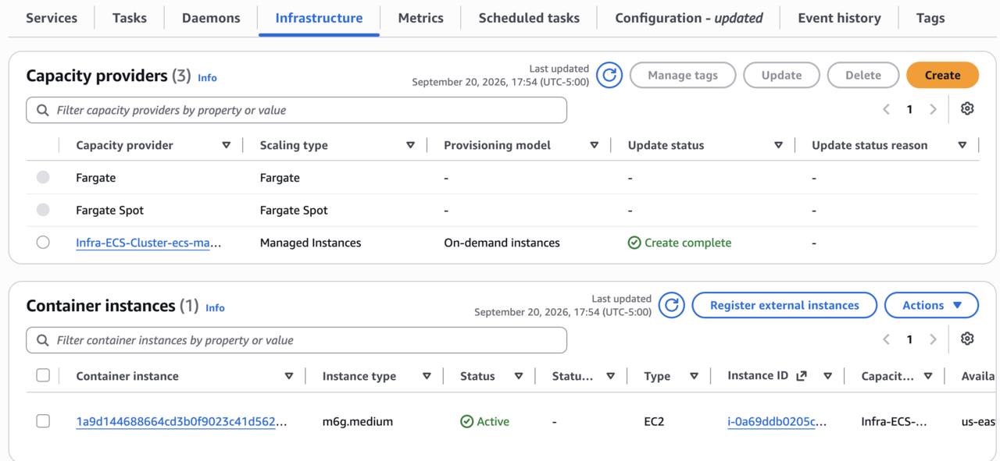

---
# User change
title: Run a container as an Amazon ECS task on AWS Graviton
description: Run an NGINX container as a standalone Amazon ECS task on Managed Instances and verify that it runs on AWS Graviton-based compute.

weight: 4 # 1 is first, 2 is second, etc.

# Do not modify these elements
layout: "learningpathall"
---

## Run a standalone Amazon ECS task

You can run a task definition in two ways on Amazon ECS. A *service* maintains a desired number of tasks, replaces failed tasks, and can integrate with a load balancer, which suits long-running applications. A *standalone task* runs once and isn't automatically replaced when it stops, which suits batch jobs and short tests.

You run a standalone task here because you're verifying that a single container lands on Graviton-based compute.

Use the cluster, capacity provider, and task definition that you created earlier to deploy a containerized application as a standalone task:

1. Navigate to the [console for Amazon ECS](https://console.aws.amazon.com/ecs/v2).
2. Select **Clusters**.
3. Select the cluster **ecs-managed-instances-cluster** that you created earlier.
4. Under **Tasks**, select **Run new task**.
5. Under **Task details**, for **Task definition family**, select the **nginx** task definition that you created earlier. 
6. Leave all other values as defaults and select **Create**.

## Verify application deployment 

This is where you confirm the payoff of the Learning Path: that the Amazon CPU-manufacturer and `ARM64` settings you configured earlier caused Amazon ECS to select a Graviton-based instance.

To verify that the application deployed successfully:

1. Select the cluster **ecs-managed-instances-cluster**. 
2. Select **Infrastructure**.
2. Under **Container instances**, note that the **Instance type** that AWS chose based on the capacity provider is a Graviton-based instance type. The following screenshot shows that the instance type selected by AWS is `m6g.medium`:
      
3. Select the container instance that's associated with the ECS Managed Instances capacity provider.
4. Under **Networking**, you'll find the public DNS name and IP address for the instance. Copy the **Public IP** and paste it into a web browser of your choice. 

    You'll see the following welcome message:

    

## What you've accomplished

You've successfully deployed a containerized application on Graviton-based instances using Amazon ECS Managed Instances. You can extend this workflow to deploy containers on AWS-managed Arm-based instances powered by AWS Graviton, while maintaining control over the instance types and features that you use. 

## Clean up resources

To avoid ongoing charges, remove the resources you created. Delete them in the following order, because Amazon ECS won't let you delete a cluster while a cluster-scoped capacity provider is still attached, and it won't let you delete a capacity provider while it's part of the cluster's default capacity provider strategy or still has running tasks:

1. Stop the running task.
2. Remove the capacity provider from the cluster's default capacity provider strategy.
3. Delete the capacity provider. This also terminates the Managed Instances compute.
4. Delete the cluster.
5. Deregister and delete the task definition.

You can clean up using either the AWS Management Console or the AWS CLI.

### Use the AWS Management Console

1. Stop the task: open the cluster **ecs-managed-instances-cluster**, select **Tasks**, select the running task, then select **Stop**.
2. Delete the capacity provider: on the cluster page, select **Infrastructure**, select the Managed Instances capacity provider, then select **Delete**. If the deletion is blocked because the capacity provider is part of the cluster's default capacity provider strategy, edit the cluster to remove it from the default strategy first, then delete it. Deleting the capacity provider terminates the Managed Instances compute.
3. Delete the cluster: on the **Clusters** page, select **ecs-managed-instances-cluster**, then select **Delete cluster** and confirm.
4. Deregister the task definition: select **Task definitions**, select the **nginx** family, select the revision, then select **Deregister**. You can then delete the task definition.

### Use the AWS CLI

First, find the running task ARN and stop it:

```console
TASK_ARN=$(aws ecs list-tasks --cluster ecs-managed-instances-cluster --query 'taskArns[0]' --output text)
aws ecs stop-task --cluster ecs-managed-instances-cluster --task "$TASK_ARN"
```

Next, find the name of the capacity provider that the console created for the cluster:

```console
aws ecs describe-clusters \
  --clusters ecs-managed-instances-cluster \
  --query 'clusters[0].capacityProviders' \
  --output text
```

The console sets this capacity provider as the cluster's default capacity provider strategy. You must clear that strategy before you can delete the capacity provider. Remove the default strategy from the cluster:

```console
aws ecs put-cluster-capacity-providers \
  --cluster ecs-managed-instances-cluster \
  --capacity-providers [] \
  --default-capacity-provider-strategy []
```

Then, delete the capacity provider, replacing `<capacity-provider-name>` with the name from the earlier command. Deleting the capacity provider deprovisions and terminates the Managed Instances compute, which can take a few minutes to reach `DELETE_COMPLETE`:

```console
aws ecs delete-capacity-provider \
  --capacity-provider <capacity-provider-name> \
  --cluster ecs-managed-instances-cluster
```

After the capacity provider is deleted, delete the cluster:

```console
aws ecs delete-cluster --cluster ecs-managed-instances-cluster
```

Finally, deregister and delete the task definition:

```console
aws ecs deregister-task-definition --task-definition nginx:1
aws ecs delete-task-definitions --task-definitions nginx:1
```

### Remove the IAM roles (optional)

If you don't plan to use Amazon ECS Managed Instances again, you can also remove the IAM roles and instance profile that you created on the first page:

```console
aws iam remove-role-from-instance-profile \
  --instance-profile-name ecsInstanceRole \
  --role-name ecsInstanceRole
aws iam delete-instance-profile --instance-profile-name ecsInstanceRole

aws iam detach-role-policy \
  --role-name ecsInstanceRole \
  --policy-arn arn:aws:iam::aws:policy/AmazonECSInstanceRolePolicyForManagedInstances
aws iam delete-role --role-name ecsInstanceRole

aws iam detach-role-policy \
  --role-name ecsInfrastructureRole \
  --policy-arn arn:aws:iam::aws:policy/AmazonECSInfrastructureRolePolicyForManagedInstances
aws iam delete-role --role-name ecsInfrastructureRole
```
