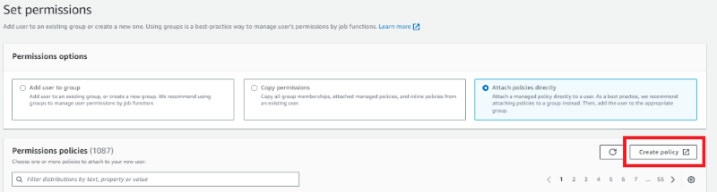
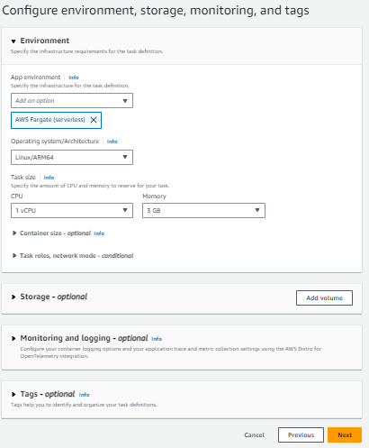

---
# User change
title: "Deploy containers using ECS on AWS Graviton processors"

weight: 2 # 1 is first, 2 is second, etc.

# Do not modify these elements
layout: "learningpathall"
---

## Deploy ECS containers on AWS Graviton processor

Amazon Elastic Container Service (ECS) is a fully managed container orchestration service that makes it easy to deploy, manage, and scale containerized applications. You will learn how to deploy a simple application to ECS and run it on a Fargate cluster. Fargate is a serverless service so you don’t need to worry about provisioning or maintaining EC2 instances (virtual machines).  Fargate supports AWS Graviton processors so you can run containers for the Arm architecture. You will also learn how to create and configure the necessary Identity and Access Management (IAM) user and role permissions.

## Before you begin

You should have the prerequisite tools installed before starting the Learning Path. 

Any computer which has the required tools installed can be used for this section. The computer can be your desktop or laptop computer or a virtual machine.

Use the [Docker install guide](/install-guides/docker/), the [AWS CLI install guide](/install-guides/aws-cli/), and the [Terraform install guide](/install-guides/terraform/) if you need to setup any of these tools on your machine.

You will need an [AWS account](https://portal.aws.amazon.com/billing/signup?nc2=h_ct&src=default&redirect_url=https%3A%2F%2Faws.amazon.com%2Fregistration-confirmation#/start) to complete this Learning Path. Create an account if you don't have one.

## Create an IAM user and assign permissions

Login to your AWS account as the root user and search for IAM.


From the IAM dashboard select `Users` from the left menu and click on `Create user` from the top of the page.


On the `Create user` screen enter a username and select the check box before `Provide user access to the AWS Management Console` and click `Next`


### Create an ECR policy

You will need access to the Amazon Elastic Container Registry (ECR) to store container images.  You can create a new policy to attach to the IAM user.

To do so, select `Create policy`.



Under `Service`, select `Elastic Container Registry`. 

Select `All Elastic Container Registry actions (ecr:*)` under `Actions allowed`. 


Under `Resources`, select `specific` and `Add ARN`. Here you can select the `region` and select `Any` for Repository name under `This account` and click on `Add ARNs`.


Skip the tags by clicking `Next`. 

Fill in an appropriate policy name. You can use `ECR_FullAccess` and select `Create policy`.

### Attaching the access policy

ECS requires permissions for services such as creating ECS clusters and launching containers. 

The best way to add permissions to the new IAM user is to use an Amazon managed policy to grant access.

Select `Attach existing policies directly` under `Set permissions` and search for `AmazonECS_FullAccess` & `ECR_FullAccess`. 

Select the checkbox next to the policies.


Select `Next` to review and then `Create user`. 


When you create the user you will see a confirmation screen. 

Save the information in safe place. You will need it to deploy containers.  

A new user is now visible on the `IAM > Users` page. Click on the user and go to the `Security credentials` section. 

Click on `Create access key`


Select `Command Line Interface (CLI)` and click on `Next`


Add a description and click `Create access key`


Save `Access key` and `Secret access key`, you will need them to configure the AWS CLI. 

## Create an Elastic Container Registry (ECR)

You can create a repository in ECR to store container images. 

You will need the Amazon Resource Name (ARN), a unique identifier for all AWS resources, of the repository to properly tag and upload a container image.

Log in to the AWS console with the `test_user` credentials you created earlier. 

AWS will ask for your `account id`, `username`, and `password`.


Change your password when prompted. 


Once you log in, search for Elastic Container Registry.


From there fill in the name of the repository as `myapp` and leave the defaults for everything else.


Select `Create Repository` in the lower right of the page and your repository will be created. 

You will see your repository in the list, and the ARN (here it is called a URI for universal resource identifier) which you will need to push your container image to ECR. 

Copy the URI for the next step.


## Create the Docker image

You can use the Nginx web server as a test application. 

You can either pull the image from Docker Hub or build it from source files. The instructions below use the container image from Docker Hub.

Download the Nginx image for Arm64 platform using the below command. 

```console
docker pull arm64v8/nginx
```

Tag the image with the ECR URI so it can be saved to the newly created ECR repository. 

```console
docker tag arm64v8/nginx [uri]
```

{} 
Replace `[uri]` with your respective URI 
{}

## Log in to ECR 

Configure CLI access to your AWS account using the access key and secret access key you saved.

Run the command below to configure the AWS CLI:

```console
aws configure
```

The `configure` command will ask for the access key and secret access key you saved while creating the IAM user. 

Next, generate an ECR log in token for Docker. 

The ECR log in token is piped to `docker login` so you can push the container image to ECR using the Docker CLI. 

Make sure to replace `[your account number]` with your account number. 

```console
aws ecr get-login-password --region us-east-2 | docker login --username AWS --password-stdin [your account number].dkr.ecr.us-east-2.amazonaws.com
```

If the command succeeds, you will see a `Login Succeeded` message.

## Upload your Docker image to ECR

Use below command to push the image to the ECR repository.

```console
docker push [your account number].dkr.ecr.us-east-2.amazonaws.com/myapp
```

{} 
Replace `[your account number]` with your AWS account number.
{}

## Create a Fargate cluster

Search for `Elastic Container Service` and select `Elastic Container Service`

From the left menu select `Clusters` and then select `Create cluster`


Name the cluster and the leave the other options with the default values. 

Select `Create`


A cluster will be created as shown below:


## Create an ECS task

An ECS Task is the action that takes your container image and deploys it as a running container. 

To create an ECS Task do the following:

Select `Task Definitions` from the left menu. Then select `Create new Task Definition`


Enter the name of the `Task definition family` in  `Task definition configuration` 

Enter the name of your container and ARN of our image in the Image box. 

You can copy this from the ECR dashboard if you haven’t already. Leave everything else with default values. 

Click `Next`


{} No additional port mapping is needed because Nginx runs on port 80 by default.{} 

Under Environment Section, select `Operating system/Architecture` as  `Linux/ARM64` and leave everything else as default values. 

Click `Next` in the lower right corner of the dialog.




Review everything and click on `create` 

Go to the ECS page, select Task Definitions and you should see the new task with a status of ACTIVE.


Select the task in the task definition list. 

Click `Deploy` and select `Run Task`


Select your cluster from drop down menu of `Existing cluster`. 

In Networking section, select a virtual private cloud (VPC) from the list. If you are building a custom app this should be the VPC assigned to any other AWS services you will need to access from your application. For Nginx, any VPC works. Add at least one subnet.

Edit the security group. Because Nginx runs on port 80 by default, and port 80 is open for the container, you also need to open port 80 in the security group. 

Select `Create a new security group` and enter a Security group name and security group description and add a Custom TCP inbound rule that opens port 80.

Auto-assign public IP should be set to ENABLED.

Click on `Create`


With everything set up, run the task by clicking `Create` in the lower right corner.

## Check that Nginx is running 

After you run the task, you will be forwarded to the Fargate-cluster page. 

When the `Last status` of your cluster changes to `RUNNING`, your app is up and running. 

You may have to refresh the table a couple of times before the status is `RUNNING` 


Click on the link in the Task column and find the Public IP address in the `Configuration` section of the Task page.


Enter the public IP address in your browser to see your app running.


## Shut down the app

When you are done, you’ll want to shut down your Nginx application to avoid charges.

From the ECS page select `Clusters` from the left menu and select your cluster from the list of clusters.


From the table at the bottom of the page select `Tasks`. 

Check the box next to the running task and select `Stop` from the dropdown menu at the top of the table.


