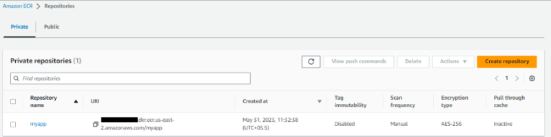
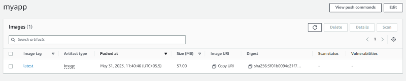
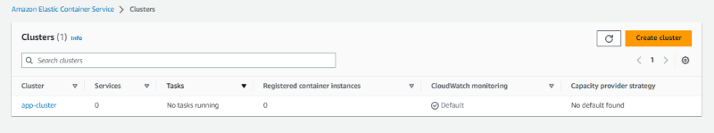
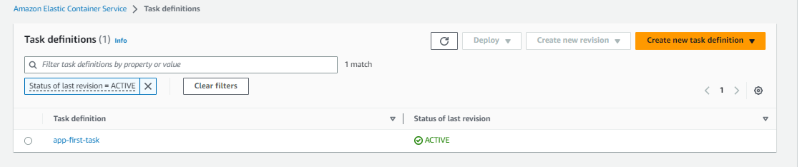
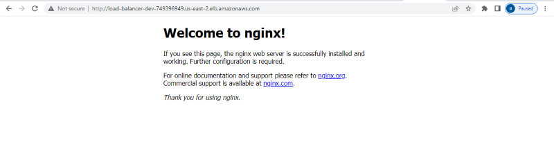

---
# User change
title: "Deploy ECS containers on AWS Graviton processor using Terraform"

weight: 3 # 1 is first, 2 is second, etc.

# Do not modify these elements
layout: "learningpathall"
---


You can also automate the deployment of containerized applications on AWS ECS with Terraform. 

This section incrementally constructs a Terraform file named `main.tf` to automate the same steps for deployment of Nginx on ECS.

## Create a repository in AWS ECS for container images

ECR is an AWS service for sharing and deploying container applications. 

To create a repository in ECR, use a text editor to create a file named `main.tf` with the contents below:

```console
# main.tf
terraform {
  required_providers {
    aws = {
      source  = "hashicorp/aws"
      version = "4.45.0"
    }
  }
}
resource "aws_ecr_repository" "app_ecr_repo" {
  name = "myapp"
}
```

Run the `terraform init` command. This should be the first command executed after creating a new Terraform configuration. It creates the Terraform configuration files in your working directory.

```console
terraform init
```

The message `Terraform has been successfully initialized!` will be displayed on your terminal:

```output
Initializing the backend...

Initializing provider plugins...
- Finding hashicorp/aws versions matching "4.45.0"...
- Installing hashicorp/aws v4.45.0...
- Installed hashicorp/aws v4.45.0 (signed by HashiCorp)

Terraform has created a lock file .terraform.lock.hcl to record the provider
selections it made above. Include this file in your version control repository
so that Terraform can guarantee to make the same selections by default when
you run "terraform init" in the future.

Terraform has been successfully initialized!

You may now begin working with Terraform. Try running "terraform plan" to see
any changes that are required for your infrastructure. All Terraform commands
should now work.

If you ever set or change modules or backend configuration for Terraform,
rerun this command to reinitialize your working directory. If you forget, other
commands will detect it and remind you to do so if necessary.
```

To create a repository in ECR, run the `plan` command. You will be able to preview the above Terraform configuration file and the resources that will be created:

```console
terraform plan
```

Terraform `plan` displays the resources that will be added, changed, or deployed to AWS. 

In this example, one resource `aws_ecr_repository.app_ecr_repo` will be added to AWS.

```output
Terraform used the selected providers to generate the following execution plan. Resource actions are indicated with the following
symbols:
  + create

Terraform will perform the following actions:

  # aws_ecr_repository.app_ecr_repo will be created
  + resource "aws_ecr_repository" "app_ecr_repo" {
      + arn                  = (known after apply)
      + id                   = (known after apply)
      + image_tag_mutability = "MUTABLE"
      + name                 = "myapp"
      + registry_id          = (known after apply)
      + repository_url       = (known after apply)
      + tags_all             = (known after apply)
    }

Plan: 1 to add, 0 to change, 0 to destroy.
```

To provision the displayed infrastructure on AWS, run the `apply` command: 

```console
terraform apply
```

Enter yes when prompted to allow Terraform to execute the command.

```output
Terraform used the selected providers to generate the following execution plan. Resource actions are indicated with the following
symbols:
  + create

Terraform will perform the following actions:

  # aws_ecr_repository.app_ecr_repo will be created
  + resource "aws_ecr_repository" "app_ecr_repo" {
      + arn                  = (known after apply)
      + id                   = (known after apply)
      + image_tag_mutability = "MUTABLE"
      + name                 = "my-app-terraform"
      + registry_id          = (known after apply)
      + repository_url       = (known after apply)
      + tags_all             = (known after apply)
    }

Plan: 1 to add, 0 to change, 0 to destroy.
aws_ecr_repository.app_ecr_repo: Creating...
aws_ecr_repository.app_ecr_repo: Creation complete after 0s [id=myapp]

Apply complete! Resources: 1 added, 0 changed, 0 destroyed.
```

Terraform has created the repository in ECR. You can confirm this on your Amazon Elastic Container Registry Repositories list.



Push the container image to the new repository using `docker push` as in the previous section.

```console
docker push [your account number].dkr.ecr.us-east-2.amazonaws.com/myapp
```

Refresh the repository’s page to verify you’ve successfully pushed the image to the AWS ECR repository.



## Create an ECS Cluster

You have created a repository and put a container image into the repository. 

Next, create a cluster to act as a target to run containers. 

Clusters run ECS tasks which specify the containers to create. 

To create a cluster to run your tasks, use a text editor to add the following configurations to your main.tf file:

```console
# main.tf
resource "aws_ecs_cluster" "my_cluster" {
  name = "app-cluster" # Name your cluster here
}
```

This instructs ECS to create a new cluster named `app-cluster`

Re-run the `apply` command to add these changes:

```console
terraform apply
```

Navigate to Amazon ECS Clusters and verify that you can see the changes:



## Configure an AWS ECS task 

To run the image, you can launch it as an ECS container.

To deploy the image to ECS, you can create a task. A task tells ECS how you want to run your Docker container. A task describes the container’s critical specifications of how to launch your container. 

These specifications include:

* Port mappings
* Application image
* CPU and RAM resources
* Container launch types such as EC2 or Fargate

An AWS ECS workload has two main launch types: EC2 and Fargate.

Fargate is an AWS orchestration tool. It allows you to give AWS the role of managing your container life cycle and the hosting infrastructure. Fargate is serverless, which means you don’t need to provision your container using EC2 instances (virtual machines). 

You can use Fargate to run your container on ECS without provisioning a virtual machine on AWS.

Add below configuration in your `main.tf` file:

```console
# main.tf
resource "aws_ecs_task_definition" "app_task" {
  family                   = "app-first-task" # Name your task
  container_definitions    = <<DEFINITION
  [
    {
      "name": "app-first-task",
      "image": "${aws_ecr_repository.app_ecr_repo.repository_url}",
      "essential": true,
      "portMappings": [
        {
          "containerPort": 80,
          "hostPort": 80
        }
      ],
      "memory": 512,
      "cpu": 256
    }
  ]
  DEFINITION
  requires_compatibilities = ["FARGATE"] # use Fargate as the launch type
  network_mode             = "awsvpc"    # add the AWS VPN network mode as this is required for Fargate
  memory                   = 512         # Specify the memory the container requires
  cpu                      = 256         # Specify the CPU the container requires
  execution_role_arn       = aws_iam_role.ecsTaskExecutionRole.arn
}
```
{} Change `containerPort`, `hostPort`, `memory` & `cpu` as per your requirement.{}

As described in the above config block, Terraform will create a task named `app-first-task` and assign the resources needed to run the container using this task. This process includes assigning the deployed image, container ports, launch type, and the hardware requirements that the container needs to run.

Creating a task definition requires `ecsTaskExecutionRole` to be added to your IAM. The above task definition needs this role, and it is specified as `aws_iam_role.ecsTaskExecutionRole.arn`. 

Create a resource to execute this role as follows:

```console
# main.tf
resource "aws_iam_role" "ecsTaskExecutionRole" {
  name               = "ecsTaskExecutionRole"
  assume_role_policy = data.aws_iam_policy_document.assume_role_policy.json
}

data "aws_iam_policy_document" "assume_role_policy" {
  statement {
    actions = ["sts:AssumeRole"]

    principals {
      type        = "Service"
      identifiers = ["ecs-tasks.amazonaws.com"]
    }
  }
}

resource "aws_iam_role_policy_attachment" "ecsTaskExecutionRole_policy" {
  role       = aws_iam_role.ecsTaskExecutionRole.name
  policy_arn = "arn:aws:iam::aws:policy/service-role/AmazonECSTaskExecutionRolePolicy"
}
```

Run the `apply` command to add these changes to AWS. 

```console
terraform apply
```

Navigate to Amazon ECS Task Definitions and you can see the task definitions: 



## Launch the Container

You now have most of the configurations needed. You need to connect all the above-created specifications together to launch your container successfully.

### Create a VPC

You need to create a Virtual Private Cloud Module (VPC) and subnet to launch your cluster into. VPC and subnet allow you to connect to the internet, communicate with ECS, and expose the application to available zones.

Create a default VPC and a subnet for your AWS availability zones by adding the resources below to your `main.tf` file:

```console
# main.tf
# Provide a reference to your default VPC
resource "aws_default_vpc" "default_vpc" {
}

# Provide references to your default subnets
resource "aws_default_subnet" "default_subnet_a" {
  # Use your own region here but reference to subnet 1a
  availability_zone = "us-east-2a"
}

resource "aws_default_subnet" "default_subnet_b" {
  # Use your own region here but reference to subnet 1b
  availability_zone = "us-east-2b"
}
```

### Implement a Load Balancer

Create a security group that will route HTTP traffic using a load balancer. 

Add a load balancer by adding the lines below to `main.tf`:

```console
# main.tf
resource "aws_alb" "application_load_balancer" {
  name               = "load-balancer-dev" #load balancer name
  load_balancer_type = "application"
  subnets = [ # Referencing the default subnets
    "${aws_default_subnet.default_subnet_a.id}",
    "${aws_default_subnet.default_subnet_b.id}"
  ]
  # security group
  security_groups = ["${aws_security_group.load_balancer_security_group.id}"]
}
```

The configuration creates a load balancer that will distribute the workloads across multiple resources to ensure application’s availability, scalability, and security.

### Create a security group for the load balancer

A security group allows HTTP traffic to access the ECS cluster. This is be required for access to the application. 

Add the security group for the load balancer as by adding the lines below to `main.tf`: 

```console
# main.tf
# Create a security group for the load balancer:
resource "aws_security_group" "load_balancer_security_group" {
  ingress {
    from_port   = 80
    to_port     = 80
    protocol    = "tcp"
    cidr_blocks = ["0.0.0.0/0"] # Allow traffic in from all sources
  }

  egress {
    from_port   = 0
    to_port     = 0
    protocol    = "-1"
    cidr_blocks = ["0.0.0.0/0"]
  }
}
```

Configure the load balancer with the VPC you created earlier by adding the lines below to `main.tf`:

```console
# main.tf
resource "aws_lb_target_group" "target_group" {
  name        = "target-group"
  port        = 80
  protocol    = "HTTP"
  target_type = "ip"
  vpc_id      = aws_default_vpc.default_vpc.id # default VPC
}

resource "aws_lb_listener" "listener" {
  load_balancer_arn = aws_alb.application_load_balancer.arn #  load balancer
  port              = "80"
  protocol          = "HTTP"
  default_action {
    type             = "forward"
    target_group_arn = aws_lb_target_group.target_group.arn # target group
  }
}
```
### Create an ECS Service

The last step is to create an ECS Service to maintain the task definition in the ECS cluster. 

The service will run the cluster, task, and Fargate containers behind the created load balancer and distribute traffic across the containers that are associated with the service. 

You can add the service by adding the following to your `main.tf`:

```console
# main.tf
resource "aws_ecs_service" "app_service" {
  name            = "app-first-service"                  # Name the service
  cluster         = aws_ecs_cluster.my_cluster.id        # Reference the created Cluster
  task_definition = aws_ecs_task_definition.app_task.arn # Reference the task that the service will spin up
  launch_type     = "FARGATE"
  desired_count   = 3 # Set up the number of containers to 3

  load_balancer {
    target_group_arn = aws_lb_target_group.target_group.arn # Reference the target group
    container_name   = aws_ecs_task_definition.app_task.family
    container_port   = 80 # Specify the container port
  }

  network_configuration {
    subnets          = ["${aws_default_subnet.default_subnet_a.id}", "${aws_default_subnet.default_subnet_b.id}"]
    assign_public_ip = true                                                # Provide the containers with public IPs
    security_groups  = ["${aws_security_group.service_security_group.id}"] # Set up the security group
  }
}
```

To access the ECS service over HTTP while ensuring the VPC is secure, create security groups that will only allow the traffic from the created load balancer. 

Create a `aws_security_group.service_security_group` resource as follows in `main.tf`:

```console
# main.tf
resource "aws_security_group" "service_security_group" {
  ingress {
    from_port       = 0
    to_port         = 0
    protocol        = "-1"
    security_groups = ["${aws_security_group.load_balancer_security_group.id}"] # Only allowing traffic in from the load balancer security group
  }

  egress {
    from_port   = 0
    to_port     = 0
    protocol    = "-1"
    cidr_blocks = ["0.0.0.0/0"]
  }
}
```

Add an output configuration to `main.tf` that will extract the load balancer URL value from the state file and print it to the terminal.

```console
# main.tf
# Log the load balancer app URL
output "app_url" {
  value = aws_alb.application_load_balancer.dns_name
}
```

You are now ready to create and provision all infrastructure on AWS. 

Run the `validate` command to detect syntax errors, version errors, and other problems associated with your `main.tf` module.

```console
terraform validate
```

Run the `plan` command to inspect what Terraform will perform and the resources it will create.

```console
terraform plan
```

Run the `apply` command to provision infrastructure on AWS. Remember to enter yes when prompted to do so.

```console
terraform apply
```

When the `apply` command is complete you will see the application’s URL on your terminal.

```output
Plan: 9 to add, 0 to change, 0 to destroy.

Changes to Outputs:
  + app_url = (known after apply)
aws_default_subnet.default_subnet_b: Creating...
aws_default_subnet.default_subnet_a: Creating...
aws_default_vpc.default_vpc: Creating...
aws_security_group.load_balancer_security_group: Creating...
aws_default_subnet.default_subnet_b: Creation complete after 0s [id=subnet-59ed1524]
aws_default_subnet.default_subnet_a: Creation complete after 0s [id=subnet-9dee6cf6]
aws_default_vpc.default_vpc: Creation complete after 0s [id=vpc-a0d44ecb]
aws_lb_target_group.target_group: Creating...
aws_lb_target_group.target_group: Creation complete after 1s [id=arn:aws:elasticloadbalancing:us-east-2:173141235168:targetgroup/target-group/2832f2b9ca78fe10]
aws_security_group.load_balancer_security_group: Creation complete after 1s [id=sg-063cda74d5b146ee8]
aws_alb.application_load_balancer: Creating...
aws_security_group.service_security_group: Creating...
aws_security_group.service_security_group: Creation complete after 2s [id=sg-023c421dcd0a6e502]
aws_ecs_service.app_service: Creating...
aws_alb.application_load_balancer: Still creating... [10s elapsed]
aws_ecs_service.app_service: Still creating... [10s elapsed]
aws_alb.application_load_balancer: Still creating... [20s elapsed]
aws_ecs_service.app_service: Still creating... [20s elapsed]
aws_alb.application_load_balancer: Still creating... [30s elapsed]
aws_ecs_service.app_service: Still creating... [30s elapsed]
aws_alb.application_load_balancer: Still creating... [40s elapsed]
aws_ecs_service.app_service: Still creating... [40s elapsed]
aws_alb.application_load_balancer: Still creating... [50s elapsed]
aws_ecs_service.app_service: Still creating... [50s elapsed]
aws_alb.application_load_balancer: Still creating... [1m0s elapsed]
aws_ecs_service.app_service: Still creating... [1m0s elapsed]
aws_alb.application_load_balancer: Still creating... [1m10s elapsed]
aws_ecs_service.app_service: Still creating... [1m10s elapsed]
aws_alb.application_load_balancer: Still creating... [1m20s elapsed]
aws_ecs_service.app_service: Still creating... [1m20s elapsed]
aws_alb.application_load_balancer: Still creating... [1m30s elapsed]
aws_ecs_service.app_service: Still creating... [1m30s elapsed]
aws_alb.application_load_balancer: Still creating... [1m40s elapsed]
aws_ecs_service.app_service: Still creating... [1m40s elapsed]
aws_alb.application_load_balancer: Still creating... [1m50s elapsed]
aws_ecs_service.app_service: Still creating... [1m50s elapsed]
aws_alb.application_load_balancer: Still creating... [2m0s elapsed]
aws_ecs_service.app_service: Still creating... [2m0s elapsed]
aws_alb.application_load_balancer: Still creating... [2m10s elapsed]
aws_alb.application_load_balancer: Creation complete after 2m12s [id=arn:aws:elasticloadbalancing:us-east-2:173141235168:loadbalancer/app/load-balancer-dev/dfebe1a9804a7e3d]
aws_lb_listener.listener: Creating...
aws_lb_listener.listener: Creation complete after 0s [id=arn:aws:elasticloadbalancing:us-east-2:173141235168:listener/app/load-balancer-dev/dfebe1a9804a7e3d/c75cce00dcd03c5d]
aws_ecs_service.app_service: Still creating... [2m10s elapsed]
aws_ecs_service.app_service: Creation complete after 2m19s [id=arn:aws:ecs:us-east-2:173141235168:service/app-cluster/app-first-service]

Apply complete! Resources: 9 added, 0 changed, 0 destroyed.

Outputs:

app_url = "load-balancer-dev-xxxxxxxxxx.us-east-x.elb.amazonaws.com"
```

You can also access the URL from your `load-balancer-dev` as the DNS name.

Copy the URL to your browser. 

You will see NGINX running:



{} 
If you see a `503 Service Temporarily Unavailable` immediately after running the `terraform apply` command you should wait a few seconds for all infrastructure to be created and try again. 
{}

To destroy the infrastructure and avoid additional cost, run the `destroy` command:

```console
terraform destroy
```
