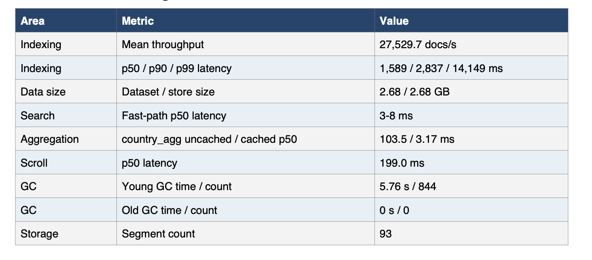
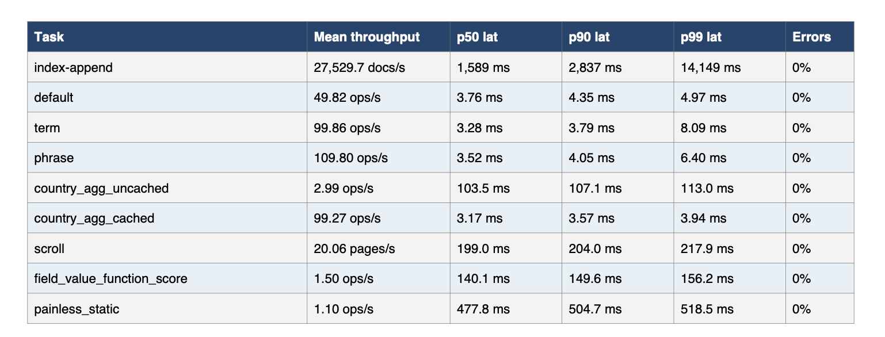

## Introduction

ESRally is designed to benchmark Elasticsearch instances. It uses a race model where a selected track exercises specific indexing and query patterns. In this section, you run the geonames track to benchmark your Elasticsearch deployment.

## The geonames track in ESRally

The geonames track is a general-purpose Elasticsearch workload based on the GeoNames dataset. ESRally indexes millions of location records and runs representative search operations so you can measure indexing throughput and query latency under mixed ingest and search conditions.

## Run the benchmark

Open an SSH shell on the virtual machine and run the benchmark command:

```bash
esrally race --distribution-version=9.3.0 --track=geonames --kill-running-processes
```

The benchmark starts and runs through the geonames "racetrack".

{}
This benchmarking test will take 15-20 minutes to complete. Please do not interrupt or pause the benchmark because doing so will skew the results.
{}

## Interpreting the benchmark results

The following sample output shows a baseline geonames run on an Azure Cobalt 100 E4pds_v6 virtual machine. Indexing
sustained about 27,530 docs/s with 0% errors, while common read-path workloads such as default search, term
search, phrase search, and cached aggregation stayed in an excellent 3-4 ms p50 range. The system also completed
the run without any old-generation garbage collections, suggesting healthy JVM behavior under this benchmark. The
main latency costs appeared in heavier workloads such as uncached aggregation, scroll, expression queries, and
script-based scoring, which is consistent with Elasticsearch performance expectations for compute-intensive query
patterns.

### Example performance summary



### Example detailed metrics



## Key findings

1. Indexing throughput averaged 27,530 docs/s and completed without reported errors.
2. Common search workloads were consistently fast, with default, term, and phrase queries all clustered around 3-4
ms p50 latency.
3. Caching made a major difference for aggregation: cached country aggregation was about 32.7x faster than
uncached at p50 latency.
4. Scripted scoring remained expensive: field_value_script_score was about 1.33x slower than
field_value_function_score at p50 latency, and painless_static was one of the slowest tasks in the run.
5. Scroll and uncached aggregation were the most notable non-script latency costs at about 199 ms and 103 ms p50
latency, respectively.
6. JVM behavior looked stable because 844 young-generation collections consumed only 5.76 seconds total and
there were no old-generation collections.
7. Merge work totaled 5.76 minutes with 2.36 minutes of throttle time, indicating some ingest-side background
pressure but not a throughput collapse.
8. The final store footprint matched the dataset size at 2.68 GB, suggesting low additional storage overhead in this
run.

## Conclusions

This benchmark result supports the view that Azure Cobalt 100 E4pds_v6 is capable of delivering strong Elasticsearch baseline performance for the geonames track, especially for ordinary search, sort, and cached aggregation paths. The run also suggests good operational stability under this workload because the benchmark completed successfully with zero errors, no old-generation GC, and sustained ingest throughput. The main practical limitation is query complexity: scripting, score computation, scroll, and uncached aggregation create a clear latency step-up relative to fast-path queries, so these workloads should be isolated, cached, or minimized when low latency matters.

## What you've learned and what's next

In this section, you ran ESRally on Elasticsearch and interpreted the main throughput and latency indicators. Next, use the related Learning Paths in the next steps page to continue tuning or evaluating Arm-based deployments.
