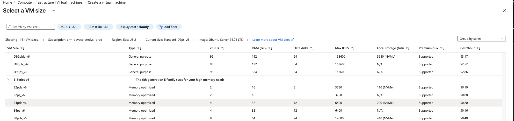
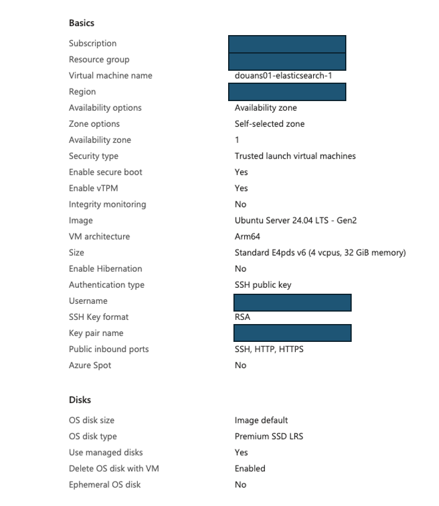
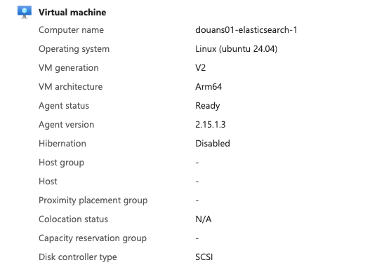

## Use Azure portal to create an Arm-based virtual machine

In this section, you'll create a virtual machine with the Arm-based Azure Cobalt 100 processor using the Azure portal.

This Learning Path uses a memory-optimized virtual machine in the Epdsv6 series. For more information, see the [Microsoft Azure guide for the Epdsv6 size series](https://learn.microsoft.com/en-us/azure/virtual-machines/sizes/memory-optimized/epdsv6-series?tabs=sizebasic).

While the steps to create this instance are included here for convenience, you can also refer to the [Deploy a Cobalt 100 virtual machine on Azure Learning Path](/learning-paths/servers-and-cloud-computing/cobalt/).

### Configure an Azure Cobalt 100 virtual machine

Creating a virtual machine on Azure Cobalt 100 follows the standard Azure VM flow. You specify basic settings, select an operating system image, configure authentication, and set up networking and security options.

For more information, see the [Azure VM creation documentation](https://learn.microsoft.com/en-us/azure/virtual-machines/linux/quick-create-portal).

To create a VM using the Azure portal, follow these steps:

1. In the Azure portal, go to **Virtual machines**.

2. Select **Create**, then choose **Virtual machine** from the drop-down.

3. On the **Basics** tab, enter **Virtual machine name** and **Region**.

4. Under **Image**, choose your OS (for example, *Ubuntu Pro 24.04 LTS*) and set **Architecture** to **Arm64**.

5. In **Size**, select **See all sizes**, choose the **E-series v6** series, then select **E4pds_v6**.

   

6. Under **Authentication type**, choose **SSH public key**. Azure can generate a key pair and store it for future use. For **SSH key type**, **ED25519** is recommended (RSA is also supported).

7. Enter the **Administrator username**.

8. If generating a new key, select **Generate new key pair**, choose **ED25519** (or **RSA**), and provide a **Key pair name**.

9. In **Inbound port rules**, select **HTTP (80)** and **SSH (22)**.

   

10. Select **Review + create** and review your configuration. It should look similar to:

    

11. When you’re ready, select **Create**, then **Download private key and create resources**.

    

12. After deployment completes, confirm that the VM is running and note the public IP address.

    

Your virtual machine should be ready in a few minutes. You can then connect over SSH using your private key and the VM public IP address.

{}To learn more about Arm-based virtual machines on Azure, see the section *Getting Started with Microsoft Azure* within the Learning Path [Get started with Arm-based cloud instances](/learning-paths/servers-and-cloud-computing/csp/azure/).{}

## What you've accomplished and what's next

You've now created an Arm-based Azure Cobalt 100 virtual machine and confirmed the deployment details needed for SSH access. 

Next, you'll install Elasticsearch and ESRally on the virtual machine.
