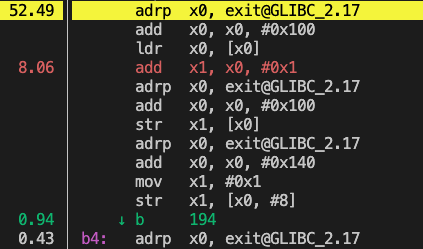
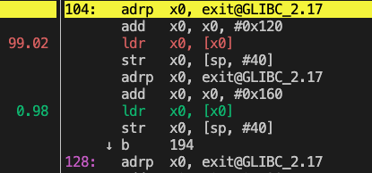
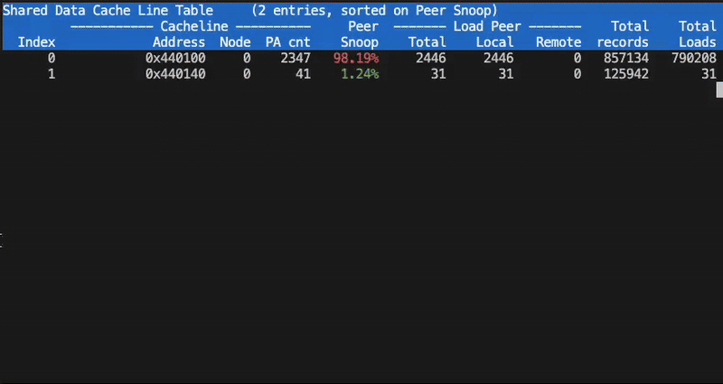

## Compare Performance with perf stat

{}
In this section, you’ll learn how to use Linux Perf tools and Arm SPE to identify performance bottlenecks in multithreaded applications. You’ll compare aligned and unaligned workloads, detect cache-related slowdowns such as false sharing, and trace memory contention down to the source code using Perf C2C.
{}

A simple way to observe the performance difference of both binaries is to use the `perf stat` command. 

For example, run the false sharing version using:

```bash
perf stat -r 3 -d ./false_sharing 1
```

The output is similar to:

```output
Performance counter stats for './false_sharing 1' (3 runs):

          21759.39 msec task-clock                       #    1.672 CPUs utilized            ( +-  6.11% )
                30      context-switches                 #    1.470 /sec                     ( +-  4.84% )
                 0      cpu-migrations                   #    0.000 /sec                   
                77      page-faults                      #    3.772 /sec                     ( +-  0.43% )
       54398142665      cycles                           #    2.665 GHz                      ( +-  6.11% )
       37780364970      instructions                     #    0.74  insn per cycle           ( +-  0.00% )
   <not supported>      branches                                                    
             41162      branch-misses                                                        ( +-  2.77% )
       13115601948      L1-dcache-loads                  #  642.550 M/sec                    ( +-  0.00% )
         262171680      L1-dcache-load-misses            #    2.00% of all L1-dcache accesses  ( +-  1.60% )
   <not supported>      LLC-loads                                                   
   <not supported>      LLC-load-misses                                             

            13.012 +- 0.699 seconds time elapsed  ( +-  5.37% )
```

Run the version without false sharing:

```bash
perf stat -r 3 -d ./no_false_sharing 1
```

The output is similar to:

```output
 Performance counter stats for './no_false_sharing 1' (3 runs):

           8866.24 msec task-clock                       #    1.365 CPUs utilized            ( +-  0.01% )
                27      context-switches                 #    3.045 /sec                     ( +- 11.91% )
                 0      cpu-migrations                   #    0.000 /sec                   
                77      page-faults                      #    8.685 /sec                   
       22165375057      cycles                           #    2.500 GHz                      ( +-  0.01% )
       37773034710      instructions                     #    1.70  insn per cycle           ( +-  0.00% )
   <not supported>      branches                                                    
             29884      branch-misses                                                        ( +-  0.75% )
       13113314994      L1-dcache-loads                  #    1.479 G/sec                    ( +-  0.00% )
             38517      L1-dcache-load-misses            #    0.00% of all L1-dcache accesses  ( +-  5.06% )
   <not supported>      LLC-loads                                                   
   <not supported>      LLC-load-misses                                             

         6.4942219 +- 0.0000428 seconds time elapsed  ( +-  0.00% )
```

Comparing the results you can see the run time is significantly different (13.01 s vs. 6.49 s). 

The instructions per cycle (IPC) are also notably different, (0.74 vs. 1.70) and look to be commensurate to run time. 

## Pinpoint pipeline bottlenecks with top-down analysis

There are many root causes of variations in IPC. 

To identify where the bottleneck occurs, we’ll start by using the [Arm Topdown methodology](https://developer.arm.com/documentation/109542/0100/Arm-Topdown-methodology). Install the python script using the [Telemetry Solution Install Guide](/install-guides/topdown-tool/).

Run the following command to observe the ratio of frontend to backend stall cycles. These indicate which section of the CPU pipeline is waiting on resources and causing slower performance. 

```bash
topdown-tool -m Cycle_Accounting -a ./false_sharing 1
```

The output is similar to:

```output
Stage 1 (Topdown metrics)
=========================
[Cycle Accounting]
Frontend Stalled Cycles 0.43% cycles
Backend Stalled Cycles. 75.24% cycles
```

The output shows there are disproportionately more backend stall cycles. This indicates the CPU is waiting for data. You could follow the top-down methodology further looking at the stage 2 microarchitecture analysis, but for sake of brevity you can jump to recording events with SPE.

## Skid: When perf record misleads

The naive approach would be to record the events using the `perf record` subcommand. Running the following commands can be used to demonstrate skid, inaccuracy or "slippage" in the instruction location recorded by the Performance Monitoring Unit (PMU) when a performance event is sampled. 

To record performance using PMU counters run:

```bash
sudo perf record -g ./false_sharing 1
sudo perf annotate
```

To record performance using Perf C2C and SPE run:

```bash
sudo perf c2c record -g ./false_sharing 1
sudo perf annotate
```
 
The left screenshot shows the canonical `perf record` command, here the `adrp` instruction falsely reports 52% of the time. However, using `perf c2c` that leverages `arm_spe`, you can see 99% of time associated with the `ldr`, load register command. The standard `perf record` data can be quite misleading!




### Using Perf C2C

Clearly Perf C2C is more accurate. You are able to observe the instruction that is being used most frequently. You can also find the specific variable causing the problem in the source code. 

Compile a debug version of both applications with the following commands: 

```bash
gcc -g -lnuma -pthread false_sharing_example.c -o false_sharing.debug
gcc -g -lnuma -pthread false_sharing_example.c -DNO_FALSE_SHARING -o no_false_sharing.debug
```

Next, record the application with call stacks using the `perf c2c` subcommand with the `-g` flag. 

```bash
sudo perf c2c record -g ./false_sharing.debug 1
```

Run the following command to view the cache report. 

```bash
sudo perf c2c report
```

The screen shot below shows the terminal UI (TUI). The first columns to view is the `Snoop` and `PA cnt`. The percentage highlighted red with the associated `PA cnt` of 2347 shows that the specific address `0x440100` is being snooped heavily by other cores. 

Next, press `d` character to display the cache line details. The last `Source:Line`column, as the name implies, maps to the source code line that is attempted to access the associated address. 



Looking at the corresponding source code, you can see the following:

```output
...
165:        buf1.lock0 += 1;  
...
174:        var = *(volatile uint64_t *)&buf1.reader1;
```

The output from SPE-based profiling with Perf C2C shows that attempting to access and increment the `lock0` and `reader1` variable, is causing the bottleneck. 

The insight generated from Perf C2C indicates to reorganize the layout of the data structure.

## Summary

In this section, you used multiple tools to analyze and diagnose a real performance issue caused by false sharing. You compared performance between aligned and unaligned code using perf stat, investigated backend stalls with topdown-tool, and saw how standard perf record can mislead due to instruction skid. Finally, you used Perf C2C with Arm SPE to pinpoint the exact variables and code lines causing contention, giving you actionable insight into how to reorganize your data layout for better performance.