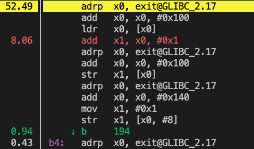
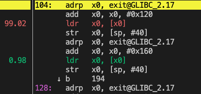
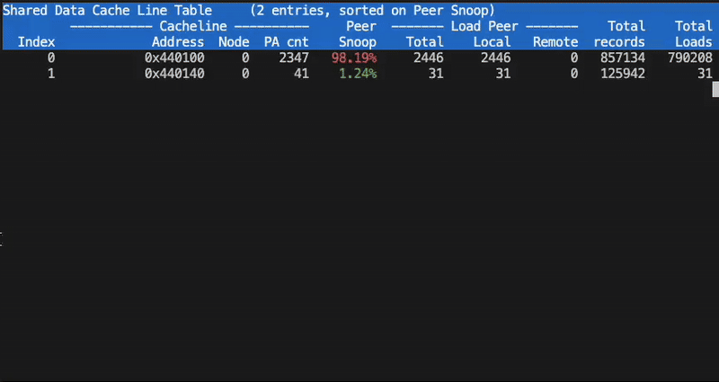

## Compare Performance with perf stat

{}
In this section, you’ll learn how to use Linux Perf tools and Arm SPE to identify performance bottlenecks in multithreaded applications. You’ll compare aligned and unaligned workloads, detect cache-related slowdowns such as false sharing, and trace memory contention down to the source code using Perf C2C.
{}

A simple way to observe the performance difference of both binaries is to use the `perf stat` command. 

For example, run the false sharing version using:

```bash
perf stat -r 3 -d ./false_sharing 1
```

The output is similar to:

```output
Performance counter stats for './false_sharing 1' (3 runs):

                14      context-switches                 #      1.3 cs/sec  cs_per_second       ( +-  4.12% )
                 0      cpu-migrations                   #      0.0 migrations/sec  migrations_per_second
                67      page-faults                      #      6.0 faults/sec  page_faults_per_second  ( +-  0.50% )
         11,124.43 msec task-clock                       #      1.4 CPUs  CPUs_utilized         ( +-  1.16% )
        94,607,174      L1-dcache-load-misses            #      0.7 %  l1d_miss_rate            ( +-  1.52% )  (15.41%)
        47,396,916      LLC-loads                        #      0.0 %  llc_miss_rate            ( +-  1.51% )  (23.16%)
            88,701      branch-misses                    #      0.0 %  branch_miss_rate         ( +-  5.15% )  (23.21%)
     7,325,010,900      branches                         #    658.5 M/sec  branch_frequency     ( +-  0.14% )  (23.23%)
    30,931,997,598      cpu-cycles                       #      2.8 GHz  cycles_frequency       ( +-  1.22% )  (30.93%)
    40,846,002,727      instructions                     #      1.3 instructions  insn_per_cycle  ( +-  0.07% )  (30.87%)
         1,959,896      stalled-cycles-frontend          #     0.00 frontend_cycles_idle        ( +-  8.91% )  (30.79%)
    24,739,777,784      stalled-cycles-backend           #     0.80 backend_cycles_idle         ( +-  1.46% )  (30.74%)
    24,735,208,758      stalled-cycles-backend           #     0.60 stalled_cycles_per_instruction  ( +-  1.46% )  (23.08%)
                        TopdownL1                        #      0.0 percent of slots  bad_speculation  ( +-  0.07% )  (7.71%)
                                                         #      1.8 percent of slots  frontend_bound  ( +-  1.11% )  (7.71%)
                                                         #     12.3 percent of slots  retiring  ( +-  1.33% )  (15.40%)
                                                         #     85.8 percent of slots  backend_bound  ( +-  1.35% )  (15.39%)

       7.739760343 +- 0.045801207 seconds time elapsed  ( +-  0.59% )
```

Run the version without false sharing:

```bash
perf stat -r 3 -d ./no_false_sharing 1
```

The output is similar to:

```output
 Performance counter stats for './no_false_sharing 1' (3 runs):

                11      context-switches                 #      1.6 cs/sec  cs_per_second       ( +-  6.06% )
                 0      cpu-migrations                   #      0.0 migrations/sec  migrations_per_second
                67      page-faults                      #      9.8 faults/sec  page_faults_per_second  ( +-  0.50% )
          6,834.93 msec task-clock                       #      1.2 CPUs  CPUs_utilized         ( +-  0.14% )
           160,152      L1-dcache-load-misses            #      0.0 %  l1d_miss_rate            ( +-  3.31% )  (15.31%)
            68,812      LLC-loads                        #      2.1 %  llc_miss_rate            ( +-  2.49% )  (23.18%)
            61,358      branch-misses                    #      0.0 %  branch_miss_rate         ( +-  3.46% )  (23.27%)
     7,323,309,287      branches                         #   1071.5 M/sec  branch_frequency     ( +-  0.15% )  (23.34%)
    18,869,229,246      cpu-cycles                       #      2.8 GHz  cycles_frequency       ( +-  0.21% )  (31.09%)
    40,865,293,293      instructions                     #      2.2 instructions  insn_per_cycle  ( +-  0.36% )  (31.05%)
           994,831      stalled-cycles-frontend          #     0.00 frontend_cycles_idle        ( +- 10.91% )  (30.99%)
    13,122,288,700      stalled-cycles-backend           #     0.69 backend_cycles_idle         ( +-  0.15% )  (30.91%)
    13,152,431,413      stalled-cycles-backend           #     0.32 stalled_cycles_per_instruction  ( +-  0.11% )  (23.09%)
                        TopdownL1                        #      0.0 percent of slots  bad_speculation  ( +-  0.42% )  (7.69%)
                                                         #      1.9 percent of slots  frontend_bound  ( +-  0.17% )  (7.72%)
                                                         #     19.9 percent of slots  retiring  ( +-  0.40% )  (15.38%)
                                                         #     78.1 percent of slots  backend_bound  ( +-  0.39% )  (15.32%)

       5.557039735 +- 0.005567408 seconds time elapsed  ( +-  0.10% )
```

Comparing the results you can see the run time is significantly different (7.74 s vs. 5.55 s). 

The instructions per cycle (IPC) are also notably different, (1.3 vs. 2.2) and look to be commensurate to run time. 

## Pinpoint pipeline bottlenecks with top-down analysis

There are many root causes of variations in IPC. Our version of `perf stat` output on the 1st generation AGI CPU reports `stalled-cycles-frontend` and `stalled-cycles-backend` metrics. From the output above, comparing `false_sharing` to `no_false_sharing` binary, we observe a reduction in the ratio of `stalled-cycles-backend` from 0.80 (80%) to 0.69 (69%):

```output
1,959,896           stalled-cycles-frontend          #     0.00 frontend_cycles_idle        ( +-  8.91% )  (30.79%)
24,739,777,784      stalled-cycles-backend           #     0.80 backend_cycles_idle         ( +-  1.46% )  (30.74%)
...
994,831             stalled-cycles-frontend          #     0.00 frontend_cycles_idle        ( +- 10.91% )  (30.99%)
13,122,288,700      stalled-cycles-backend           #     0.69 backend_cycles_idle         ( +-  0.15% )  (30.91%)
```

{}


Alternatively, if your version of `perf` on your Arm-based server doesn't report top-down metrics you can use the [Arm Topdown methodology](https://developer.arm.com/documentation/109542/0100/Arm-Topdown-methodology). Install the python script using the [Telemetry Solution Install Guide](/install-guides/topdown-tool/).

Run the following command to observe the ratio of frontend to backend stall cycles. These indicate which section of the CPU pipeline is waiting on resources and causing slower performance. 

```bash
topdown-tool -m Cycle_Accounting ./false_sharing 1
```

The output is similar to:

```output
CPU Neoverse V3AE metrics
└── Stage 2 (uarch metrics)
    └── Cycle Accounting (Cycle_Accounting)
        └── ┏━━━━━━━━━━━━━━━━━━━━━━━━━┳━━━━━━━━┳━━━━━━┓
            ┃ Metric                  ┃ Value  ┃ Unit ┃
            ┡━━━━━━━━━━━━━━━━━━━━━━━━━╇━━━━━━━━╇━━━━━━┩
            │ Backend Stalled Cycles  │ 76.149 │ %    │
            │ Frontend Stalled Cycles │  0.045 │ %    │
            └─────────────────────────┴────────┴──────┘
```

The exact values vary by system. A disproportionately high percentage of backend stalled cycles indicates that the CPU is waiting for data. You could follow the top-down methodology further, but for the sake of brevity you can jump to recording events with SPE.

{}


## Skid: When perf record misleads

The naive approach would be to record the events using the `perf record` subcommand. Running the following commands can be used to demonstrate skid, inaccuracy or "slippage" in the instruction location recorded by the Performance Monitoring Unit (PMU) when a performance event is sampled. 

To record performance using PMU counters run:

```bash
sudo perf record -g ./false_sharing 1
sudo perf annotate
```

To record performance using Perf C2C and SPE run:

```bash
sudo perf c2c record -g ./false_sharing 1
sudo perf annotate
```
 
The left screenshot shows the canonical `perf record` command, here the `adrp` instruction falsely reports 52% of the time. However, using `perf c2c` that leverages `arm_spe`, you can see 99% of time associated with the `ldr`, load register command. The standard `perf record` data can be quite misleading!




### Using Perf C2C

Clearly Perf C2C is more accurate. You are able to observe the instruction that is being used most frequently. You can also find the specific variable causing the problem in the source code. 

Compile a debug version of both applications with the following commands: 

```bash
gcc -g -fno-omit-frame-pointer false_sharing_example.c  -lnuma -pthread -o false_sharing.debug
gcc -g -fno-omit-frame-pointer false_sharing_example.c -lnuma -pthread  -DNO_FALSE_SHARING -o no_false_sharing.debug
```

Next, record the application with call stacks using the `perf c2c` subcommand with the `-g` flag. 

```bash
sudo perf c2c record -g ./false_sharing.debug 1
```

Run the following command to view the cache report. 

```bash
sudo perf c2c report
```

{}

If the data cache line table is empty when running `perf c2c` on an Arm AGI CPU, you may need to apply [this patch](https://lore.kernel.org/linux-arm-kernel/20260928-perf_arm_spe_add_neoverse_v3ae-v1-1-738c9ed12d31@arm.com/T/#u) to the linux kernel and build `perf` from the patched source so it parses the table correctly. As of October 2026, this patch is not part of the latest stable mainline release `7.2.9`.

{}

On supported Neoverse systems, the screen shot below shows the terminal UI (TUI). The `Peer Snoop` value of 98.19% means that cache line `0x440100` accounts for 98.19% of the sampled peer accesses in this recording. `Load Peer Total` reports 2446 corresponding samples, all classified as local peer traffic in this example.

On those systems, press the `d` character to display the cache line details. The last `Source:Line` column maps the associated address to the source-code line that accessed it.



Looking at the corresponding source code, you can see the following:

```output
...
165:        buf1.lock0 += 1;  
...
174:        var = *(volatile uint64_t *)&buf1.reader1;
```

The output from SPE-based profiling with Perf C2C shows that attempting to access and increment the `lock0` and `reader1` variable, is causing the bottleneck. 

The insight generated from Perf C2C indicates to reorganize the layout of the data structure.

## Summary

In this section, you used multiple tools to analyze and diagnose a real performance issue caused by false sharing. You compared performance between aligned and unaligned code using perf stat, investigated backend stalls with topdown-tool, and saw how standard perf record can mislead due to instruction skid. Finally, you used Perf C2C with Arm SPE to pinpoint the exact variables and code lines causing contention, giving you actionable insight into how to reorganize your data layout for better performance.
