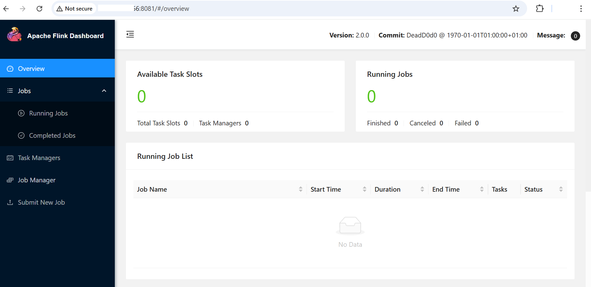
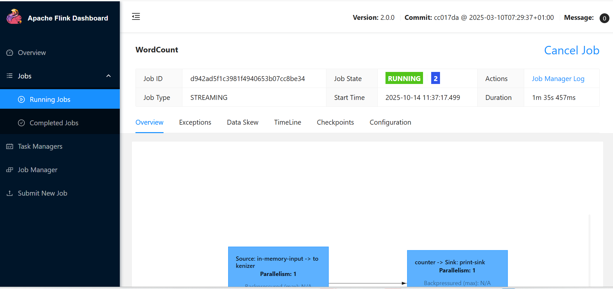

## Apache Flink Baseline Testing on GCP SUSE VM
This guide explains how to perform **baseline testing** for Apache Flink after installation on a **GCP SUSE VM**. Baseline testing ensures that the Flink cluster is operational, the environment is correctly configured, and basic jobs run successfully.

### Download and Extract Maven
Before running Flink jobs, ensure that **Java** and **Maven** are installed on your VM.  
Download Maven and extract it:

```console
cd /opt
sudo wget https://archive.apache.org/dist/maven/maven-3/3.8.6/binaries/apache-maven-3.8.6-bin.tar.gz
sudo tar -xvzf apache-maven-3.8.6-bin.tar.gz
sudo mv apache-maven-3.8.6 /opt/maven
```

### Set Environment Variables
Configure the environment so Maven commands are recognized system-wide:

```console
echo "export M2_HOME=/opt/maven" >> ~/.bashrc
echo "export PATH=\$M2_HOME/bin:\$PATH" >> ~/.bashrc
source ~/.bashrc
```
Verify the Maven installation:

```console
mvn -version
```
At this point, both Java and Maven are installed and ready to use.

### Start the Flink Cluster
Before proceeding to start the Flink cluster, you need to allow port 8081 from your GCP console.

Start the Flink cluster using the provided startup script:

```console
cd $FLINK_HOME
./bin/start-cluster.sh
```

You should see output similar to:
```output
Starting cluster.
[INFO] 1 instance(s) of standalonesession are already running on lpprojectsusearm64.
Starting standalonesession daemon on host lpprojectsusearm64.
Starting taskexecutor daemon on host lpprojectsusearm64.
```

Verify that the JobManager and TaskManager processes are running:

```console
jps
```

You should see output similar to:
```output
21723 StandaloneSessionClusterEntrypoint
2621 Jps
2559 TaskManagerRunner
```

### Access the Flink Web UI

Open the Flink Web UI in a browser:

```console
http://<VM_IP>:8081
```

- A successfully loaded dashboard confirms the cluster network and UI functionality.
-This serves as the baseline for network and UI validation.



### Run a Simple Example Job
Execute a sample streaming job to verify that Flink can run tasks correctly:

```console
cd $FLINK_HOME
./bin/flink run examples/streaming/WordCount.jar
```

- Monitor the job in the Web UI or check console logs.
- Confirm that the job completes successfully.



Flink baseline testing has been completed. You can now proceed to Flink benchmarking.
