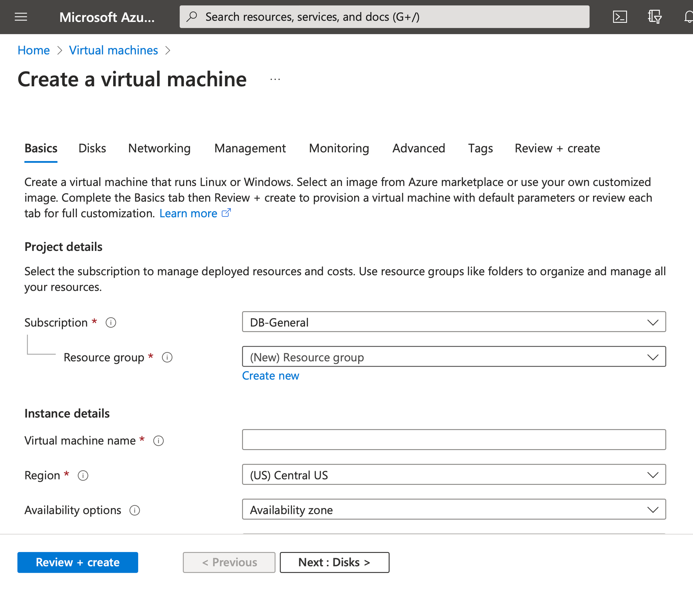
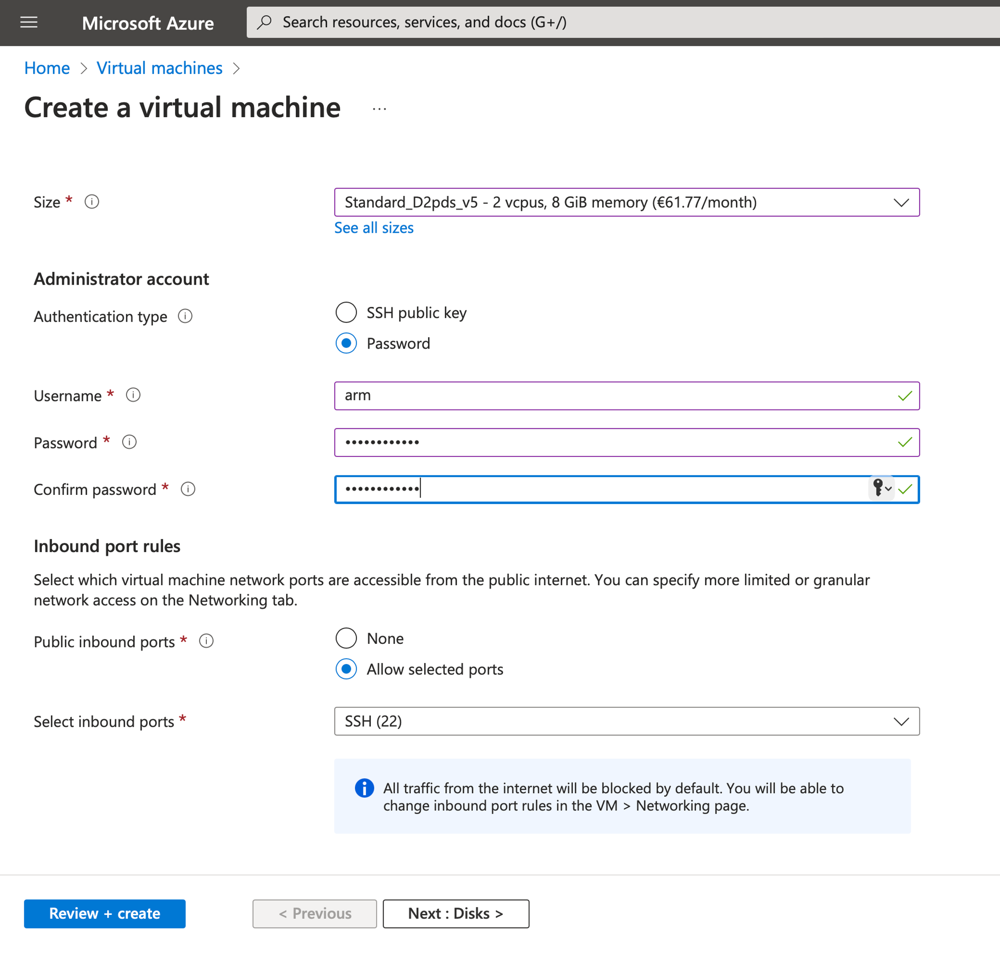
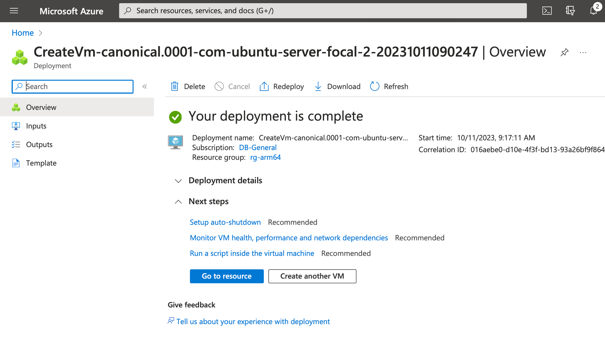

## Virtual Machine

### Virtual Machine Azure Resource
Let's start by creating the Virtual Machine. To do so, go to https://portal.azure.com and then sign in. You will see the screen which enables you to create Azure resources:

In the search box (which is on the top of the screen), type **VM**, and pick the first item on the list (Virtual machines):

In the Virtual machines, click **+ Create (top left corner)**, and then select **Azure virtual machine**:

This will take you to the Create a Virtual Machine wizard, which looks as follows:

### Virtual machine configuration
1. Subscription. Select your subscription.
2. Resource group. Click Create new link, then type **rg-arm64**, and click OK.
3. Virtual machine name: **vm-arm64**.
4. Region. Select East US (or any other, depending on your physical location).
5. Availability options. Select **No infrastructure redundancy required**.
6. Security type: **Standard**.
7. VM architecture: **arm64**.
8. Image: **Ubuntu Server 20.04 LTS – ARM64 Gen 2**.
9. Size:
    * Click See all sizes.
    * In the Select a VM size type **D2pds** in the search box
    * Select **D2pds_v5**. Note that this size might not be available due to quota limits. In such a case click Request quota link (which will be located next to the VM size name). This will activate the New Quota Request, in which you type **2** under New limit and click Submit. Wait a few minutes for the quota limits to be updated.

At this point, your configuration should look as follows:
")

Let's now configure other aspects of the Virtual Machine (Figure 6):
1.	Administrator account. **Select Password**, and then populate other fields:
    * Username: **arm**
    * Password: type your password. Make a note of this password. You'll need it to connect to VM.
    * Confirm password: re-type your password.
2.	Inbound port rules. Keep them default: **SSH(22)**.

Click the **Review + create** button. Azure Portal will validate your configuration, and you will see a green box saying: Validation passed: 

Click the Create button. The portal will now start the process of creating your VM. You will notice that apart from the VM itself, the portal is creating additional resources for you: 
* Public IP address – you'll use it to connect to VM and then to see your application running,
* Network Security Group,
* Virtual network,
* Network interface,
* Virtual disk.

Wait a few moments for the deployment to be completed:

Finally, click the **Go to resource** button. You'll be redirected to the overview of your newly created virtual machine in Microsoft Azure:

Note your Public IP address (top right part of the overview). In this tutorial, that is **52.149.156.228**.