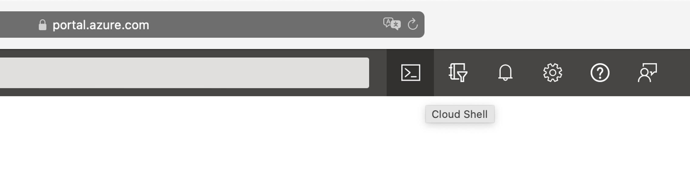
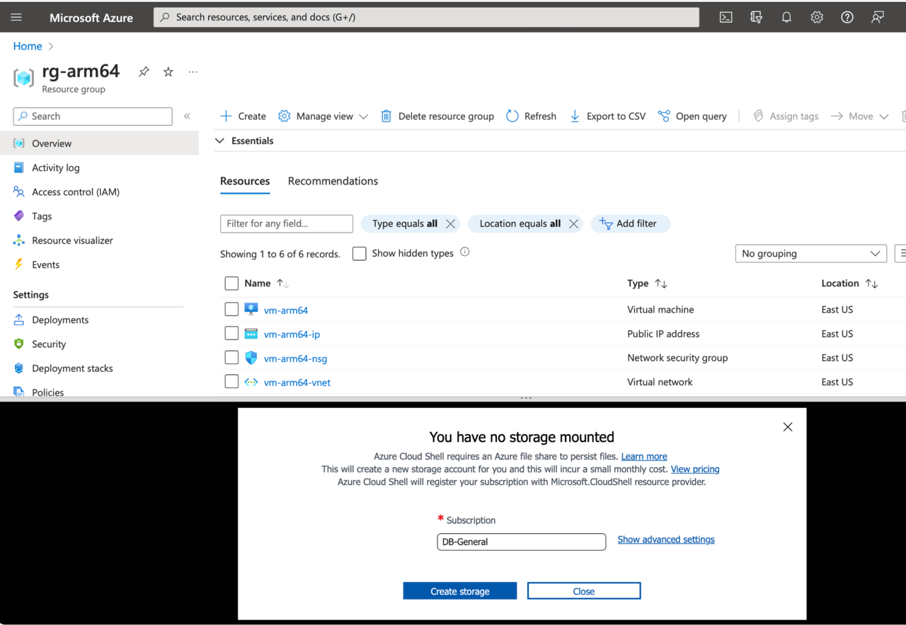
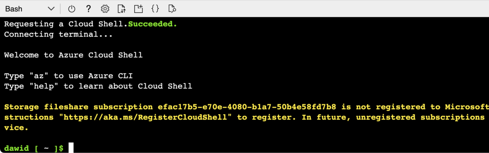
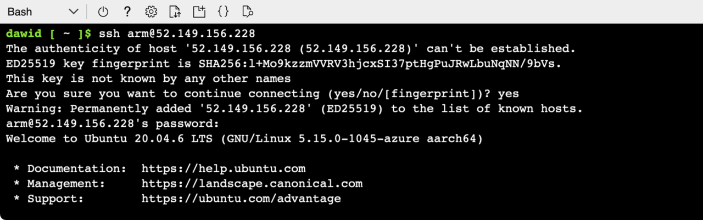

## Objective
You will now connect to the VM using the SSH protocol and the public IP address of the virtual machine. 
{} In this tutorial, we will use the public IP address, **52.149.156.228**. Please make sure that you use the public IP of your virtual machine instead. {}

You can use a local terminal or the Azure Cloud Shell to connect to the VM. The latter is available directly from the Azure Portal and to avoid installing additional tools, we will use the Cloud Shell.

### Azure Cloud Shell
To open the Cloud Shell, click on the Cloud Shell icon located in the top right corner of Azure Portal:


This will activate a new popup window which appears at the bottom of the Azure Portal:


Click **Create storage**, and wait until the storage account is created. A Cloud Shell terminal should be ready. If it asks you for the interpreter, select **Bash**. The Cloud Shell terminal will look as follows:


### Connecting to the Virtual Machine using Azure Cloud Shell
You can now use the Cloud Shell to connect to the VM via SSH. To do so, type the Public IP address (remember to use the Public IP address of your virtual machine):

```console
ssh arm@52.149.156.228
```

This will initiate the connection with the VM. The SSH will display the following message: Are you sure you want to continue connecting (yes/no/[fingerprint])? Type **yes**. Then provide your password to authenticate:


You now have terminal access to the VM. You can use it in the next step to install application dependencies (.NET SDK).
