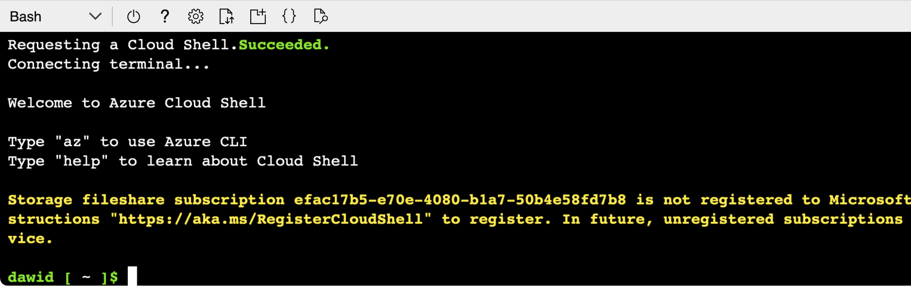

## Objective
You'll now connect to the VM using SSH protocol and the public IP address of the virtual machine. Note that we will be using the public IP **52.149.156.228**. Please make sure to use the public IP of your virtual machine instead. 

You can use a local terminal or the Azure Cloud Shell to connect to the VM. The latter is available straight from the Azure Portal. So you do not need to install additional tools. Therefore, in this tutorial, we use Cloud Shell.

### Azure Cloud Shell
To open the Cloud Shell, click a Cloud Shell icon located in the top right corner of Azure Portal:


This will activate the new popup window, which appears at the bottom of Azure Portal:


Click **Create storage**, and wait until the storage account is created. A Cloud Shell terminal should be ready. If it asks you for the interpreter, select Bash. The Cloud Shell terminal will look as follows


### Connecting to the Virtual Machine using Azure Cloud Shell
You will now use the Cloud Shell to connect to the VM via SSH. To do so, type (remember to use the Public IP address of your virtual machine):

```console
ssh arm@52.149.156.228
```

This will initiate the connection with VM. The ssh will display the following message: Are you sure you want to continue connecting (yes/no/[fingerprint])? Type **yes**. Then provide your password to authenticate:


You are now having terminal access to the VM. You'll use it in the next step to install application dependencies (.NET SDK).