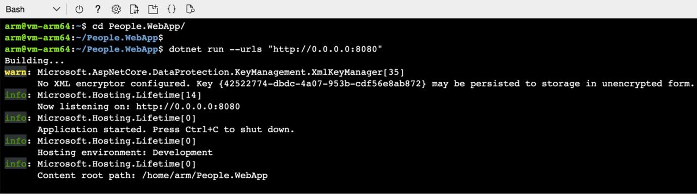
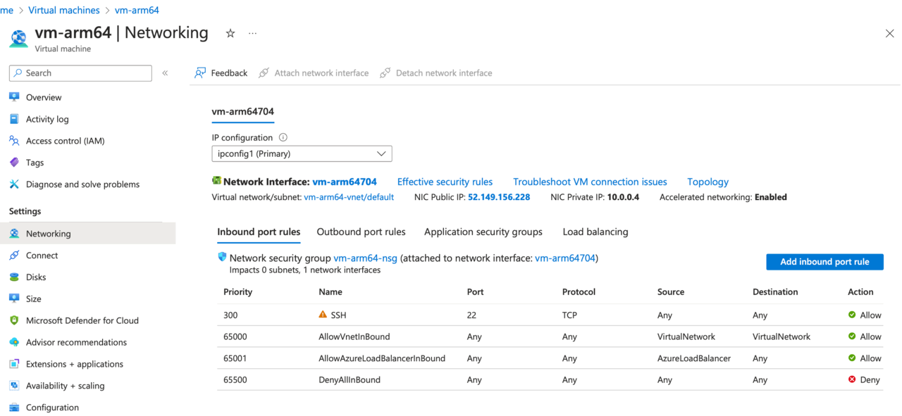
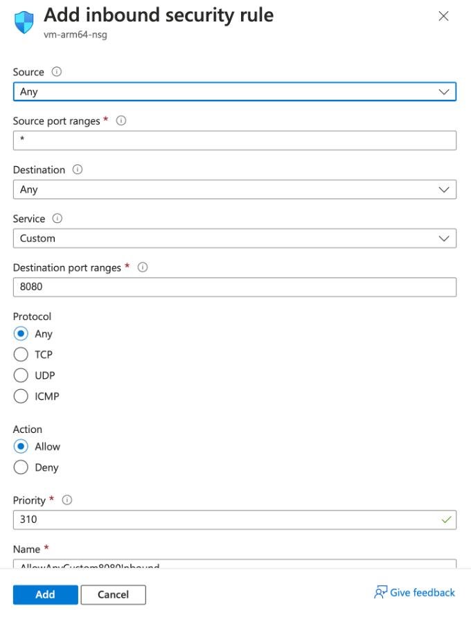
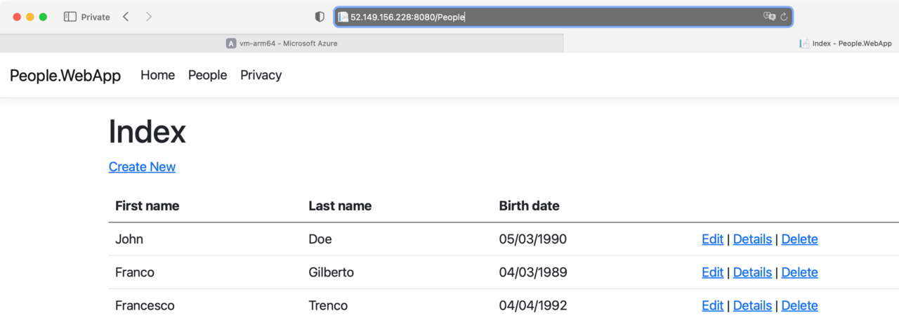

## Objective
In this step, you will install the following tools in the virtual machine:
- .NET 7 SDK – to build and run the application
- git – to clone application sources

Next, you will use git to clone application sources and finally, you will build and launch the application.

### Dependencies
To install .NET SDK:
1.	In the terminal of the virtual machine type:
```console 
wget https://dot.net/v1/dotnet-install.sh
```
This will download the installation script.

2.	Make the script executable:
```console
chmod +x dotnet-install.sh 
```
3.	Run the script (it will install .NET SDK 7 under the folder .dotnet): 
```console
./dotnet-install.sh --channel 7.0
```
4.	Add the .dotnet folder to the PATH by typing:
```console
export PATH="/home/arm/.dotnet/:$PATH"
```
5.	To check that the installation was successful, type: 
```console 
dotnet --list-sdsk
```

{} In this tutorial, we installed .NET 7 because the application we will deploy was built using .NET 7. If you need to install another .NET version, modify the channel parameter of the installation script.{}

To install git, use the terminal of the virtual machine and type: 
```console
sudo apt-get install -y git-all
```
Wait for the installation to be completed. It will take a while.

### Clone and run the application
You will now clone the application by typing:
```console
git clone https://github.com/dawidborycki/People.WebApp.git
```
The application sources will be cloned to the People.WebApp folder. Change the working directory to:
```conolse 
cd People.WebApp/
```
Then, run the application so that it will listen for requests on port 8080:
```console
dotnet run --urls "http://0.0.0.0:8080"
```
After completing this step, you will see the following output:



The application is ready and listening for the requests on port 8080. However, the network traffic is blocked on all ports except 22. You will need to configure the Network Security Group to enable the traffic. 

### Configure Network Security Group 
To allow traffic on port 8080 for the Virtual Machine **vm-arm64**, proceed as follows:
1.	In the search box of the Azure Portal, type **vm-arm64** and select this resource
2.	In the **vm-arm64** screen, click the **Networking** tab on the left (it's under **Settings**). You will see the following screen:


In the **Networking** tab of the Virtual Machine, click the **Add inbound port rule** button (it's on the right). This will open a new popup window **Add inbound security rule**:


Ensure the rule is configured as follows:
1.	Source: **Any**
2.	Source port ranges: *****
3.	Destination: **Any**
4.	Service: **Custom**
5.	Destination port ranges: **8080**
6.	Protocol: **Any**
7.	Action: **Allow**
8.	Priority: **310**
9.	Name: **AllowAnyCustom8080Inbound**

Then, click **Add** and wait for the security rule to be applied.

Once this is done, open your web browser and type the public IP address of your VM followed by 8080 port: **52.149.156.228:8080**. You'll see that the application is up and running:


## Summary
This part of the tutorial has shown you how to create an arm64-powered Virtual Machine in Microsoft Azure, how to connect to that VM using SSH, and how to install the tools required to build and run the .NET web application. Finally, you have learned how to configure a network security group to enable inbound traffic on port 8080.
