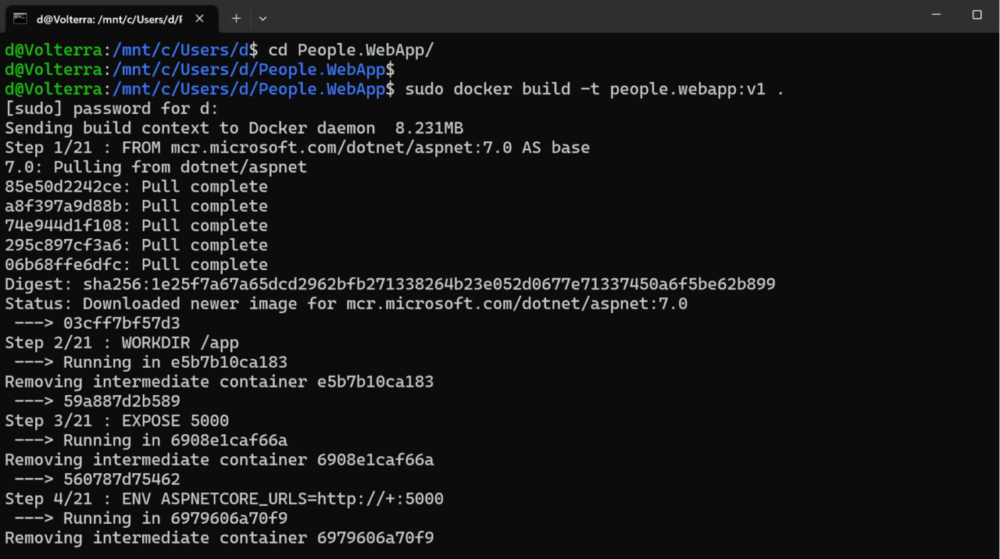

In this section you will modify the Dockerfile and then build the Docker image.

### Modify a Dockerfile
We need to modify the following line in the Dockerfile (in Visual Studio Code):

```
FROM --platform=$BUILDPLATFORM mcr.microsoft.com/dotnet/sdk:7.0 AS build
```

to 

```
FROM mcr.microsoft.com/dotnet/sdk:7.0 AS build
```

Ensure the Docker image will be built for the current platform, which is arm64 (alternatively, you could set the BUILDPLATFORM environment variable).

Then, you save the file and go back to the WSL console, where you type:
```console
cd People.WebApp/
```

You can now build the Docker image using the docker build command:
```console
sudo docker build -t people.webapp:v1 .
```

Then, type your password, and you will see the Docker build progress:


{} In the above example, we used the -t flag to tag the image (people.webapp:v1). Also, we used . to set the build context to the working directory. 

If you see errors during the build, double check that you invoked the build command from the People.WebApp folder as shown in the figure above.{}
