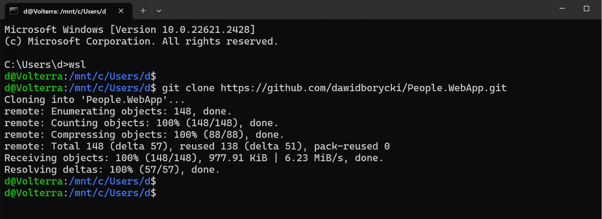
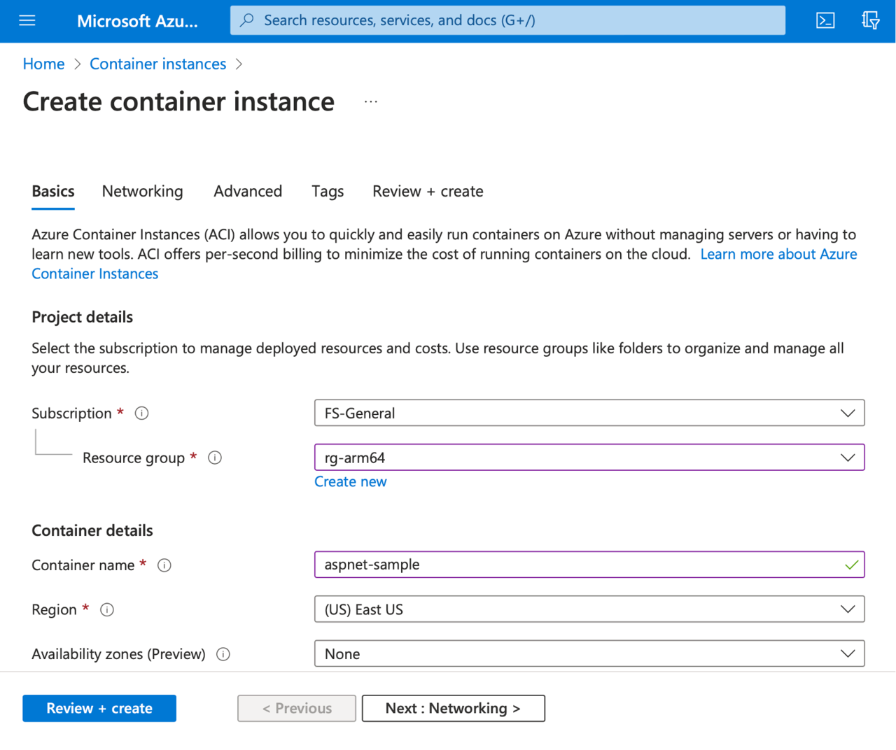
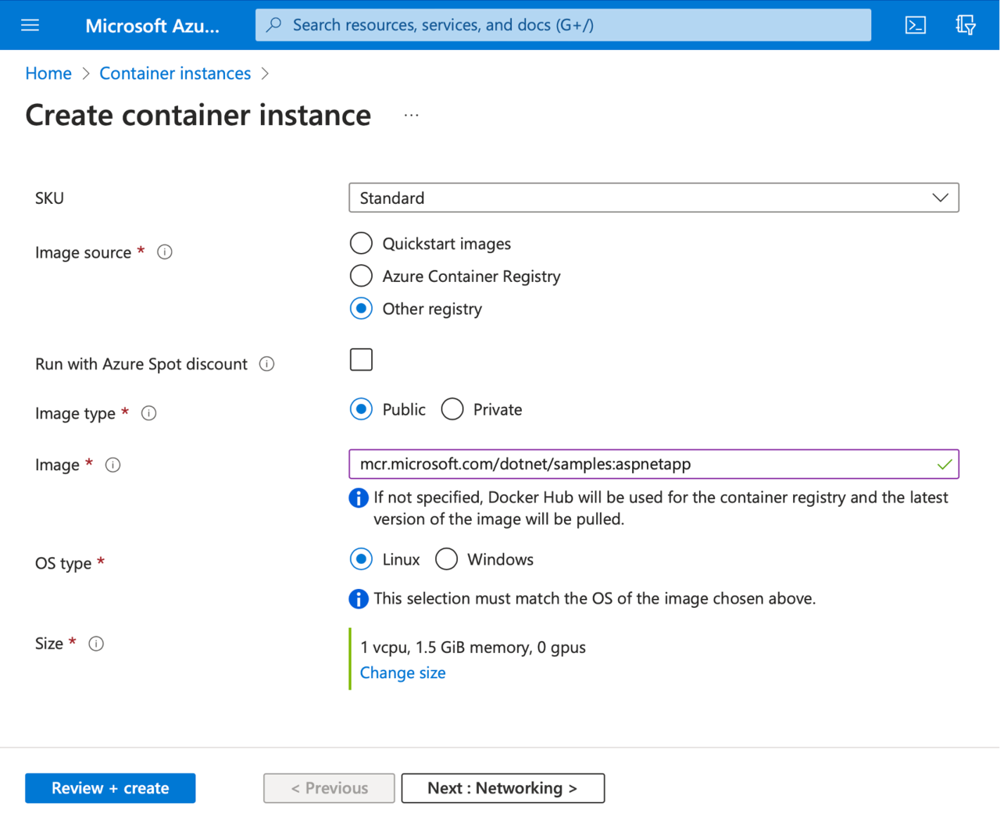
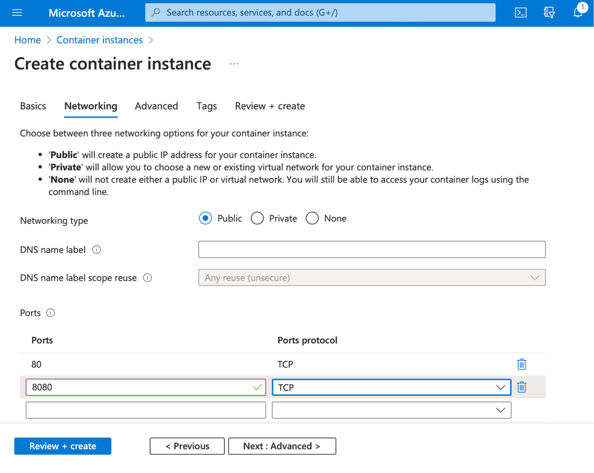
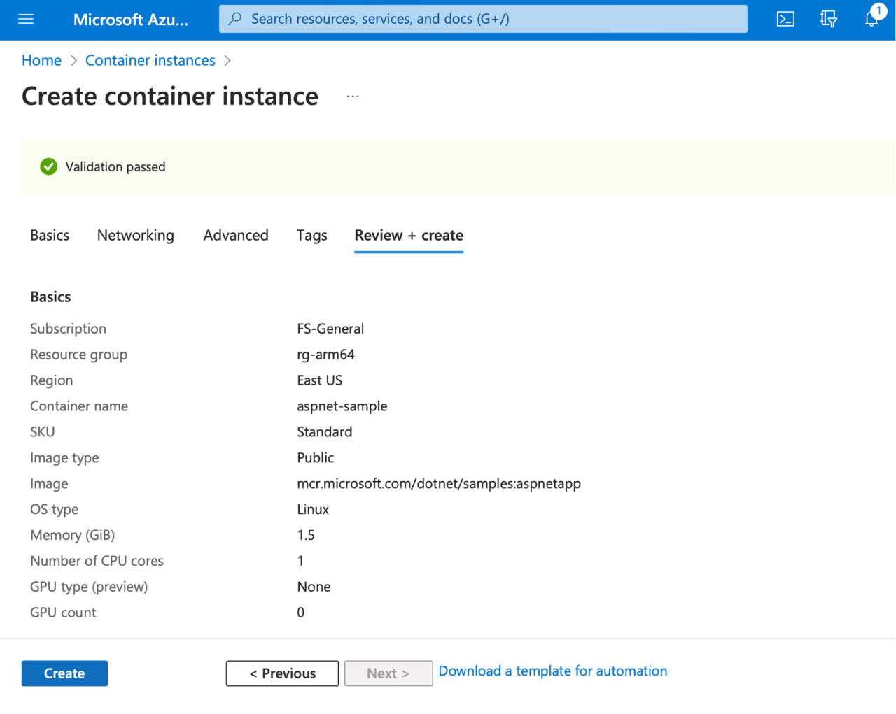
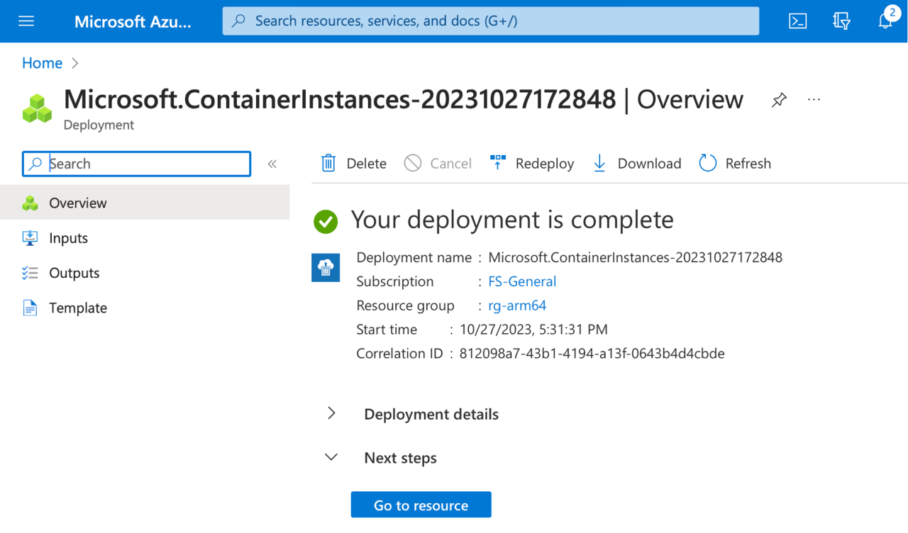

## Recap
In the previous part of this learning path series, you pushed a container image to the Azure Container Registry. This container image can be now used to launch the application in the cloud using various services. Here, I will show you how you can use Azure Container Instances for this purpose.

At the time of writing, the Azure Container Instances service was not yet compatible with arm64 Docker containers. Therefore, I will use a sample ASP.NET application from the Microsoft Container Registry: mcr.microsoft.com/dotnet/samples:aspnetapp. 

Then, we will see what happens if we try to deploy our Arm64 Docker container image to the Azure Container Instances.

## Create an Azure Container Instance
In this section, you will create an Azure Container Instance using Azure Portal and deploy the sample ASP.NET application from the Microsoft Container Registry. 

To begin, we log into the Azure Portal. Then, in the search box, we type **Container instances**, and select the first item on the list:

The above procedure will open the Container instances, in which you click the **+Create** button. This will activate the wizard, which you use to configure your Azure Container Instance:
1.	Subscription: **Select your subscription**
2.	Resource group: **rg-arm64** (create a new group, if needed)
3.	Container name: **aspnet-sample**
4.	Region: **East US** (or select the region closest to your location)
5.	Availability zones: **None** or default

At this point, the Create container instance wizard will look as shown below:

Then, continue with the other settings:
1.	SKU: **Standard**
2.	Image source: **Other registry**
3.	Run with Azure Spot Discount: **Unchecked**
4.	Image type: **Public**
5.	Image: **mcr.microsoft.com/dotnet/samples:aspnetapp**
6.	OS type: **Linux**
7.	Size: **1 vcpu, 1.5 GiB memory, 0 gpus** (or choose any other size if this specific size is unavailable in the Azure region you used)

You should end up with the following configuration:

Now you will need to configure the port mapping. Let's click the **Next: Networking >** button, and under the Networking tab scroll down to Ports. Then, add an 8080 port for the TCP protocol: 

This setting enables us to create the port mapping, which will map port 8080 of the container instance to the corresponding point inside the running container.

{}Here, we used the 8080 port because the sample ASP.NET application listens to this port by default. {}

Finally, click the **Review + create** button. This will run the final validation of your configuration, and you will see the following screen:

Click the **Create** button, and wait a few moments for the resource to be created. You will then see the confirmation screen, where you click the **Go to resource** button.

