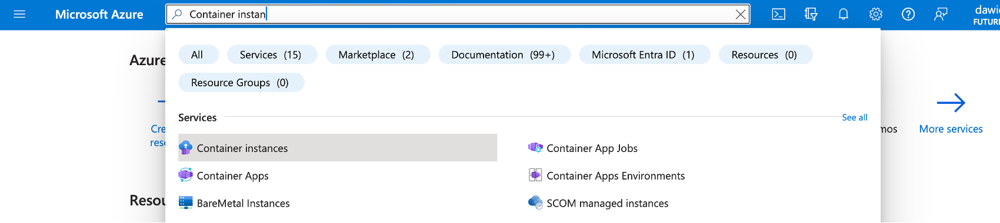

## Objective
In this learning path, you will learn how to create and push a Docker image to the Azure Container Registry. So, later, it can be deployed to various cloud services. You will now use the Docker to containerize the People.WebApp (the same application you used in part I of this learning path series). In the first step, you will create the Dockerfile and build the image.

### Application source code
Start by opening a new Command Prompt window, and then type:
```console
wsl
```

In the wsl terminal type:
```console
git clone https://github.com/dawidborycki/People.WebApp.git
```

This will clone the source code to the local folder (here it is C:\Users\d\People.WebApp):


### Creating a Dockerfile
You will now create the Dockerfile using Visual Studio Code. To do so, proceed as follows:
1.	In Visual Studio Code, click File/Open Folder, and then select People.WebApp folder.
2.	Click the View menu and select Command Palette...
3.	In the Command Palette type Dockerfile and select Docker: Add Docker Files to Workspace...:


This will activate the Add Docker Files wizard, in which you select the following:
1.	Application: **.NET: ASP.NET Core**
2.	Select Operating Windows: **Linux**,
3.	Port: **5000**,
4.	Include optional Docker Compose Files: **No**.

After a short while, the application folder will be supplemented by two files: .dockerignore and Dockerfile. The first one is like. gitignore and includes file and folder files, which will be excluded from the image build. The second one is more important and specifies the exact operations to containerize an application. In other words, it instructs Docker how to build the Docker image.

The actual Dockerfile depends on the programming tools you use to create your application. In our specific case, the Dockerfile looks as follows:
```
FROM mcr.microsoft.com/dotnet/aspnet:7.0 AS base
WORKDIR /app
EXPOSE 5000

ENV ASPNETCORE_URLS=http://+:5000

# Creates a non-root user with an explicit UID and adds permission to access the /app folder
# For more info, please refer to https://aka.ms/vscode-docker-dotnet-configure-containers
RUN adduser -u 5678 --disabled-password --gecos "" appuser && chown -R appuser /app
USER appuser

FROM --platform=$BUILDPLATFORM mcr.microsoft.com/dotnet/sdk:7.0 AS build
ARG configuration=Release
WORKDIR /src
COPY ["People.WebApp.csproj", "./"]
RUN dotnet restore "People.WebApp.csproj"
COPY . .
WORKDIR "/src/."
RUN dotnet build "People.WebApp.csproj" -c $configuration -o /app/build

FROM build AS publish
ARG configuration=Release
RUN dotnet publish "People.WebApp.csproj" -c $configuration -o /app/publish /p:UseAppHost=false

FROM base AS final
WORKDIR /app
COPY --from=publish /app/publish .
ENTRYPOINT ["dotnet", "People.WebApp.dll"]
```

The Dockerfiles start with the **FROM** instruction, which indicates the base image. Usually, base images contain a slim operating system with code build tools. The above Dockerfile uses a multi-stage build, in which two different base images are used. Both base images come from the dotnet repository under the Microsoft container registry (mcr.microsoft.com/dotnet) and are tagged aspnet:7.0 or sdk:7.0. The first image contains only the .NET runtime, which is required to run the application from binaries. On the contrary, the second image includes the SDK needed to build the application. The runtime-only base image is used in the final Docker image to reduce its size.

The Dockerfile includes several other instructions: 
1. **ARG** to specify the Dockerfile variables,
2. **WORKDIR** to change the directory inside the building image,
3. **COPY** to copy files between the build context (typically a working directory, where you invoke the docker build command) and the building image,
4. **RUN** to execute commands inside the building image,
5. **ENTRYPOINT** to indicate the container entry point, which is the command to perform when the container is created and run.

In the above example, the Dockerfile will use **dotnet build** and **dotnet publish** commands from the .NET SDK to build an application from the source code and prepare the binaries. Note that the last command, dotnet People.WebApp.dll, is equivalent to dotnet run, which we used in the first part of this series.
