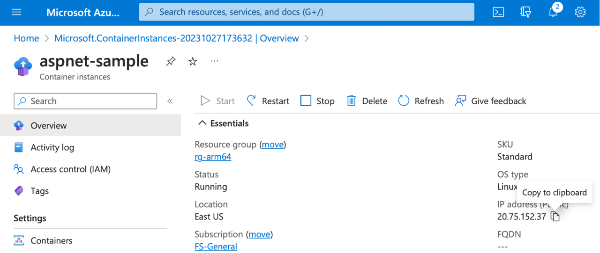
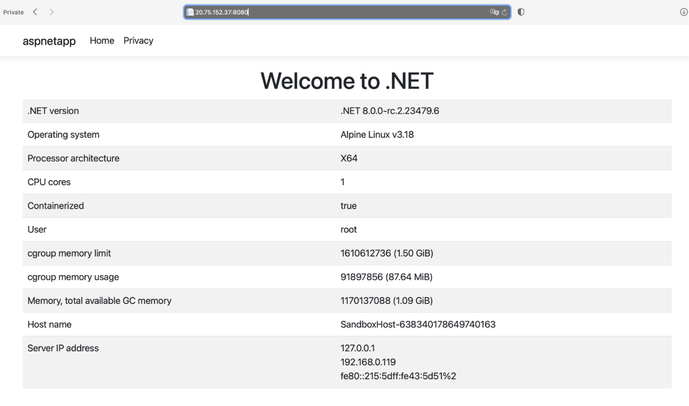

## Objective
To see that the containerized application is up and running. To check this, use the public IP address that Azure assigned during the provisioning of the Azure Container Instance.

### Public IP
To get the public IP address, use an Overview tab of the aspnet-sample container instance (see below). The IP is displayed under the IP address (Public). In my case, that is **20.75.152.37**.

Copy the IP address to the clipboard, and then open the web browser and paste this IP address followed by the 8080 port to the web browser address bar, e.g., **20.75.152.37:8080**:

This result shows that the Azure Container Instance uses x64 processor architecture. 
