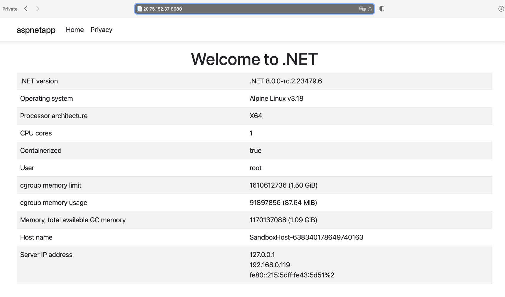

## Objective
We’ve learned how to containerize the application. In the next step, we will push the Docker image to Azure Container Registry. Before we can push the image, we need to create the container registry in Azure.

### Creating the container registry in Azure
To create the Azure Container Registry we will uze the Azure Command Line Interface (Azure CLI):
1. In the WSL console, type the following command and wait for the installation to complete:

```console
curl -sL https://aka.ms/InstallAzureCLIDeb | sudo bash
```

2.	Login to your Azure subscription:
```console
az login
```
3.	The command will open the web browser and redirect to the Azure login page. Use this page to provide your credentials.
4.	Afterward, create the resource group name rg-arm64 with a default location set to EastUS:
```console
az group create -n rg-arm64 -l eastus
```
5.	Create the Azure Container Registry of name people in the rg-arm64 group using the Basic pricing tier:
```console
az acr create -n people -g rg-arm64 --sku Basic
```

The output of the above commands will look as shown below:


In the next step, we must configure the role assignment so the current Azure user can push Docker images to the Azure Container Registry. To do so, we use the WSL terminal, in which we type
```console
USER_ID=$(az ad user show --id "<YOUR_USER_ID>" –query "id" -o tsv)

ACR_ID = $(az acr list --query "[?contains(name, 'people')].id" -o tsv)

az role assignment create --assignee $USER_ID --role AcrPush --scope $ACR_ID
```

{} You’ll need to replace <YOUR_USER_ID> with the username you used (in my case, that was dawid@borycki.com.pl).  {}

The last command’s output will look as follows:
