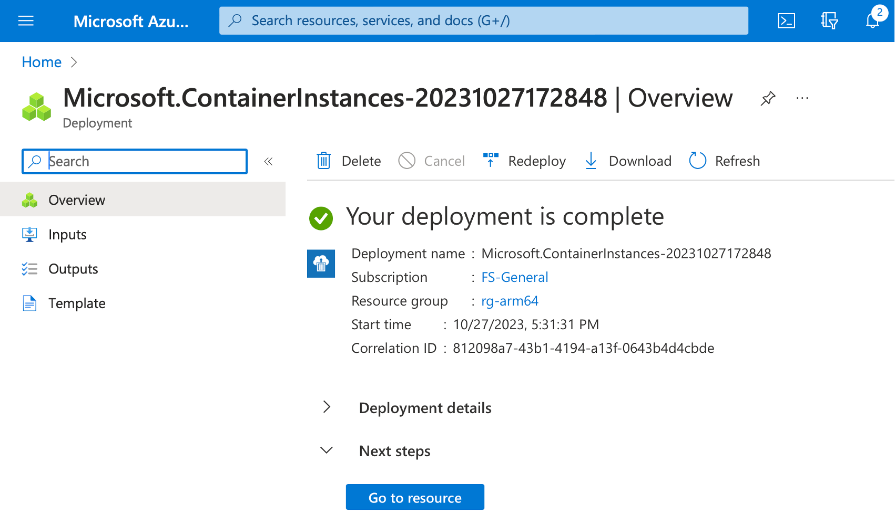
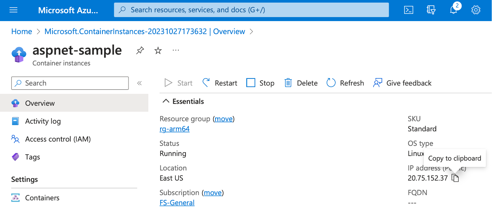

## Objective
You will now run a containerized People.WebApp to see that it works the same as its non-containerized version, you used in part I of this learning path series.

### Running a Docker container
To run a container, go back to the WSL console, and type:

```console
sudo docker run -dp 80:5000 --name people-webapp people.webapp:v1
```

The above command will run the container from the people.webapp:v1 image. The container will run in the detached (background) mode, specified using the -d flag. Also, the application running in the container will be available on port 80. We configured this host-to-container port mapping usingthe  -p parameter. Finally, the –name flag was used to specify the container name.

The command output will look as follows:



To display the list of running containers, you type:
```console
sudo docker ps
```

To see the application running, open the web browser and type localhost in the address bar:


