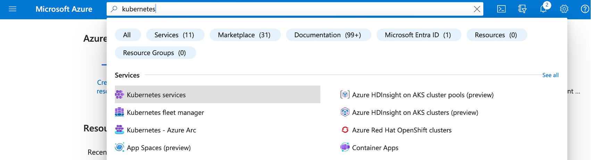
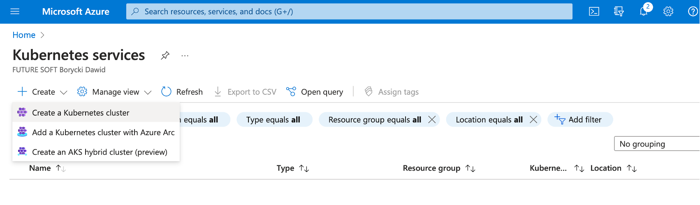
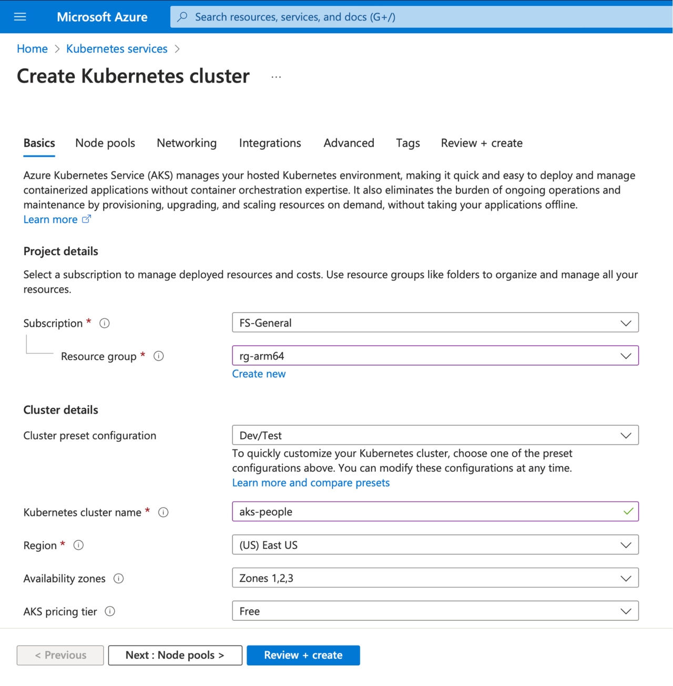
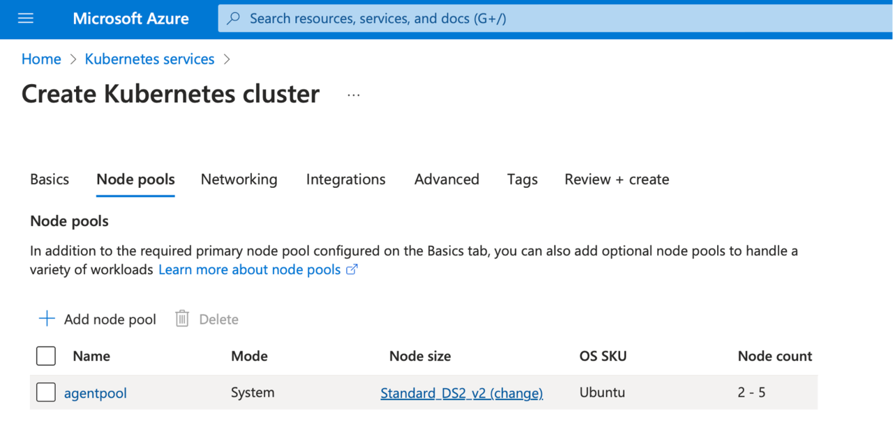
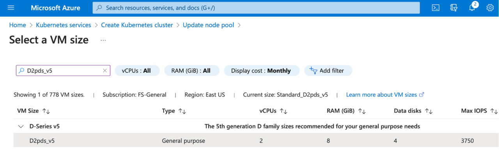
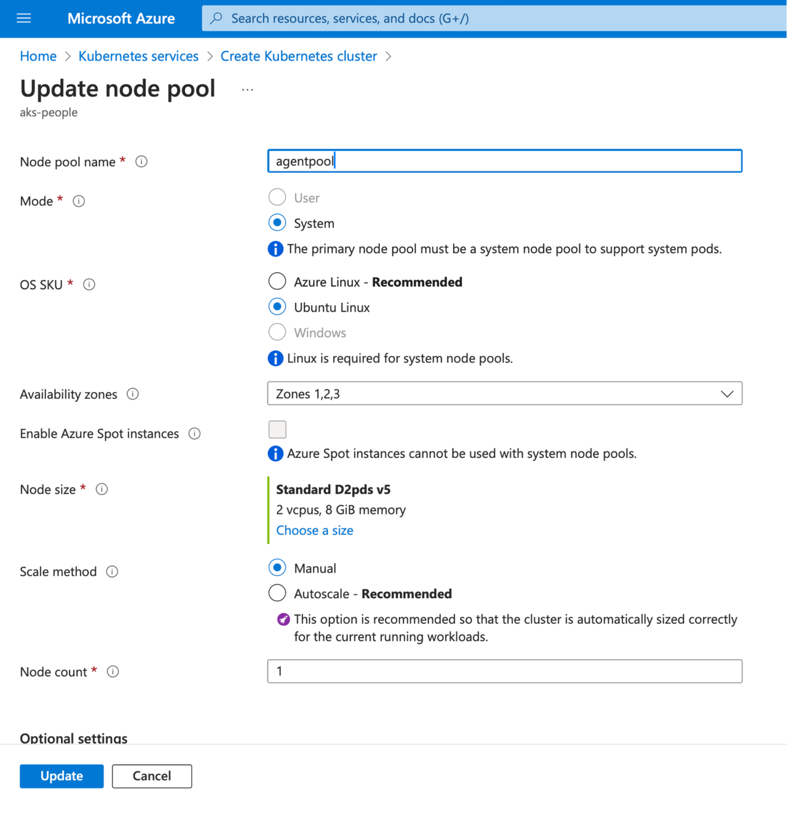
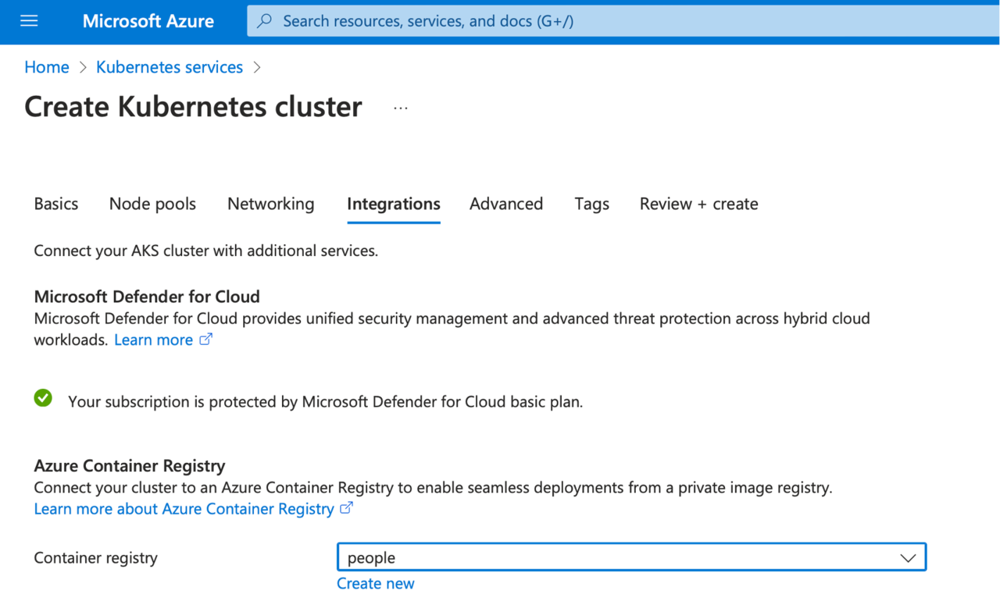
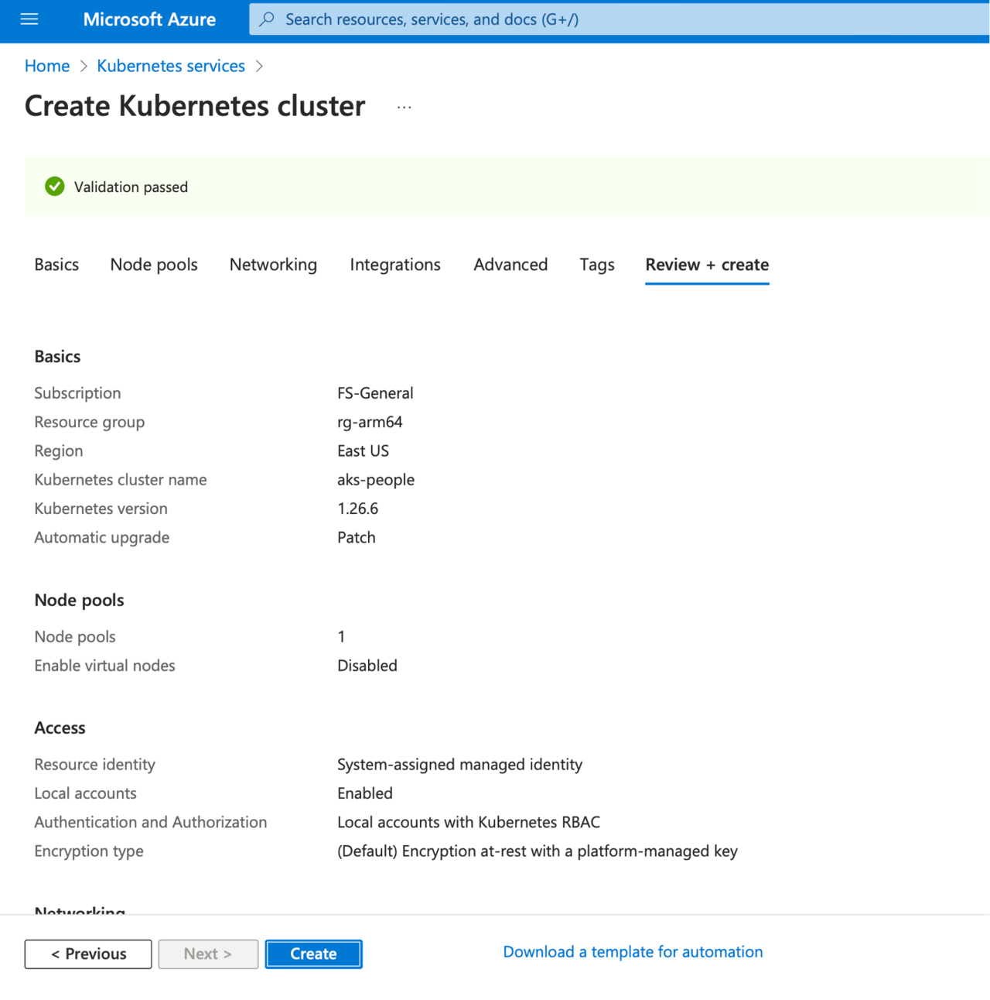

## Objective
You will create the managed Kubernetes cluster in Azure, which is integrated with the Azure Container Registry. The cluster will use arm64 VMs as the nodes. This tutorial shows how to manually create the cluster. Optionally you can use Terraform-based deployment as described here: https://learn.arm.com/learning-paths/servers-and-cloud-computing/aks/cluster_deployment/.

## Create the Kubernetes cluster
Login to the Azure Portal and type **Kubernetes** in the search box. Then, look for the Kubernetes services:

This will open Kubernetes services, click **+ Create** and then select Create a Kubernetes cluster:

The previous step will activate the Create Kubernetes cluster wizard, which you use to configure your cluster as follows:
1.	Subscription: **select your subscription**
2.	Resource group: **rg-arm64**
3.	Cluster preset configuration: **Dev/Test**
4.	Kubernetes cluster name: **aks-people**
5.	Region: **US East** (or any other region)
6.	Availability Zones: **Select all (if available)**. Otherwise, keep the default setting.
7.	AKS pricing tier: **Free**
8.	Kubernetes version: **default** (here that is 1.26.6)
9.	Automatic upgrade: **Enabled with patch (recommended)**
10.	Authentication and Authentication: **Local accounts with Kubernetes RBAC**

At this point, your configuration should look as follows:

Click **Next: Node pools >**. This will open the Node pools tab. Under the Node pools tab, click the hyperlink **Standard DS2_v2 (change)** under the Node size column of the agent pool:

You will see the Update node pool wizard, in which you do the following:
1.	Under the Scale method, select **Manual**
2.	Set Node count to **1**
3.	Click **Choose a size** under the Node size
4.	This will open Select a VM size screen, where you look for **D2pds_v5 VM** (the arm64-based VM you used in the first part of this learning series).
5.	Click the **Select** button

Your Update node pool wizard should look as follows:

Click the **Update** button. This will take you back to the Create Kubernetes cluster wizard, where you click the **Next: Networking >** button. Under the **Networking** tab, scroll down to Network policy and select **None**. Then click the **Next: Integrations >** button.

Under integrations, look for the Container registry and select **people** (or your Azure Container Registry, if you used a different name):

Finally, click the **Review + create** button and wait for the validation to complete. Then, click the **Create** button:

Wait a few moments for the cluster to be deployed, and in the confirmation screen, click the **Go to resource** button.

