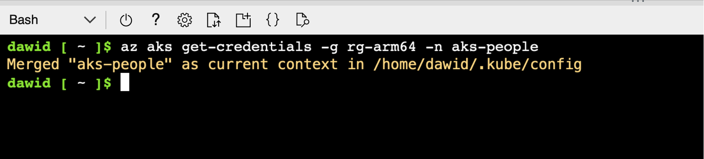
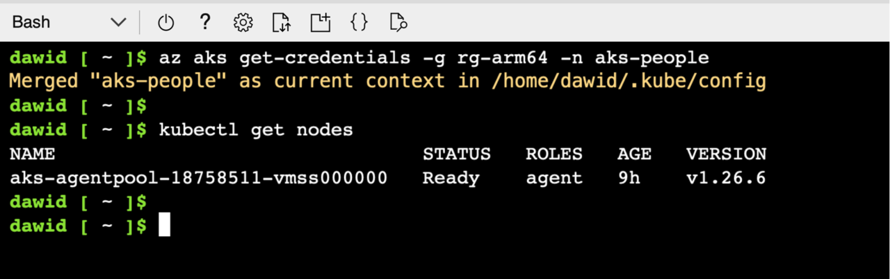

## Objective
You’ve just created the Kubernetes cluster in Microsoft Azure. This cluster uses arm64-powered Virtual Machines as the compute nodes. You will now connect to this cluster using Azure Cloud Shell. 

## Connecting to the cluster
To connect to the cluster, proceed as follows:
1.	Open Cloud Shell (refer to part 2 of this learning path for detailed instruction)
2.	In the Cloud Shell, type:

```console
az aks get-credentials -g rg-arm64 -n aks-people
```

You should see the following output from this command:



From now on, you can manage the cluster using the `kubectl`. This tool provides the command line interface for controlling the Kubernetes control plane. This communication happens over the REST API. So, under the hood, kubectl needs to know the API server address of the control plane. Fortunately, we do not need to explicitly use this address. The `az aks get-credentials` command we used previously has configured this for us automatically. Therefore, the `kubectl` commands will be communicating with the cluster we created. 

{} From this point, you can use any `kubectl` command, and follow many Kubernetes tutorials. {}

For instance, let's display the list of nodes by typing the following command: 

```console
kubectl get nodes
```

The output of this command will look as shown below:



We have one node, which we will now use to deploy the application.
