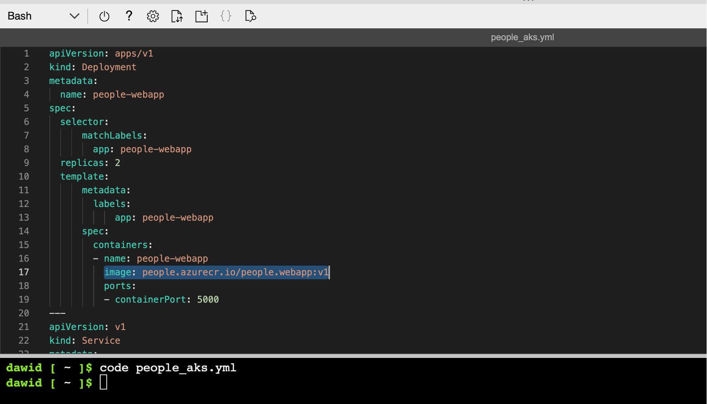
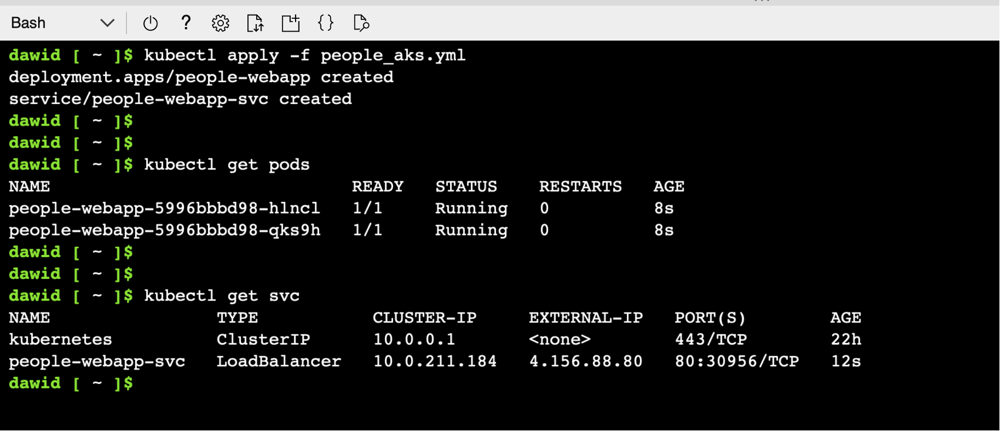
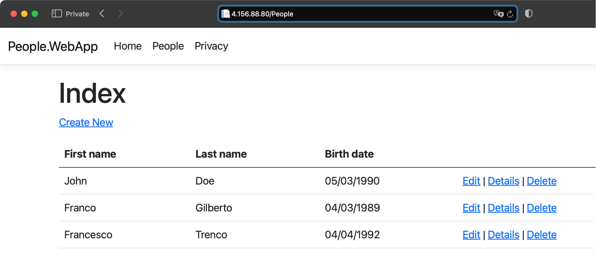

## Objective
In this section, you will deploy the Docker container from the Azure Container Registry to the Azure Container Instances. First, you must configure the Azure Container Registry to enable an Admin account. The Azure Container Instance requires the latter. 

### Deployment
Under the Azure Portal, open the Cloud Shell. To do so, click a Cloud Shell icon located in the top right corner of the Azure Portal (refer to the first part of this learning series for detailed instruction):


In the Cloud Shell, type:
```console
az acr list -o table
```

This command will display the list of container registries. Look for the **ADMIN ENABLED** column to ensure that the people registry has an Admin account disabled:


Now, you enable the Admin account:

```console
az acr update -n people --admin-enabled true
```

The command will generate the following output:


You can now create another Azure Container Instance. To do so, go to Azure Container instances and click the **+ Create** button. Then configure an instance as follows:
1.	Subscription: **Select your subscription**.
2.	Resource group: **rg-arm64** (create a new group, if needed).
3.	Container name: **people**.
4.	Region: **East US** (or select the region close to your location).
5.	Availability zones: **None**.
6.	SKU: **Standard**.
7.	Image source: **Azure Container Registry**.
8.	Run with Azure Spot Discount: **Unchecked**.
9.	Registry: **people**
10.	Image: **people.webapp**
11.	Image tag: **v1**.
12.	OS type: **Linux**.
13.	Size: **1 vcpu, 1.5 GiB memory, 0 gpus** (or choose any other size, if this specific size is unavailable in the Azure region you used).



Click the **Review + create** button. Wait for the validation to complete, and click the **Create** button.

The container will be created. However, it will not run as the Azure Container instance is not yet compatible with arm64 containers. To verify the container status, open the **Containers** tab of the newly created Azure Container instance:



Compare this status with the **aspnet-sample** container instance, which you created before.

## Summary
This tutorial taught you how to deploy containerized applications using the Azure Container Instances. You deployed a Docker container from the public (Microsoft Container Registry) and a private registry (created with Azure Container Registry). Along the way, you also learned how to configure Azure Container Registry to enable such deployments.