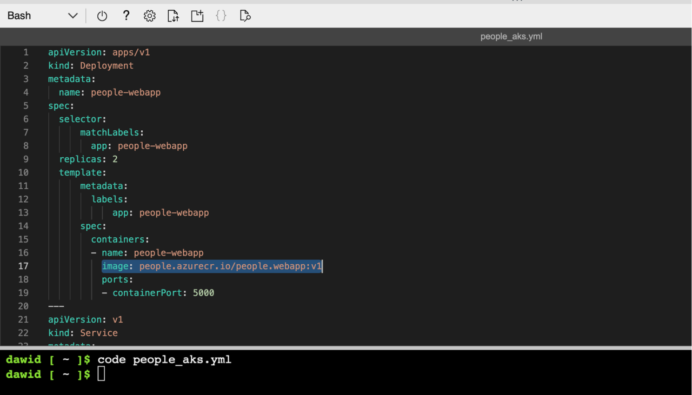
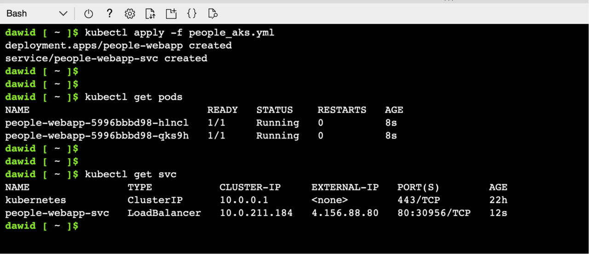
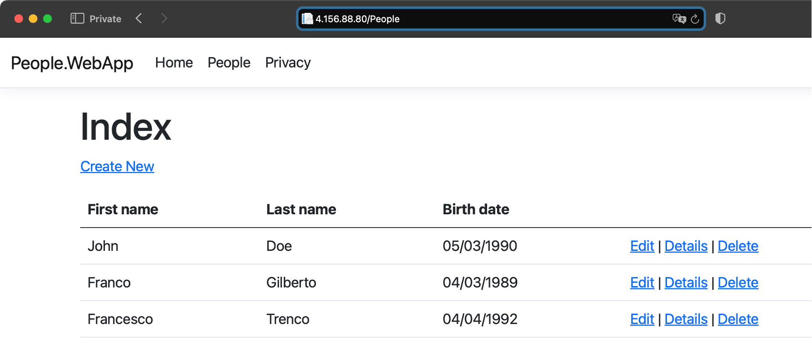

## Objective
You will now deploy a containerized application to the Kubernetes cluster running in Azure.

## Deploying an application

To deploy an application to the Kubernetes cluster, you typically use the YAML files containing a workload declaration. To deploy an application, we will use a declaration containing two objects: deployment and a service. A deployment will create a specific number of Kubernetes pods. These are the smallest deployable units in Kubernetes. A single pod includes one or more containers sharing the volumes and network capabilities. Thus, the declaration of the deployment consists of elements such as:
1. The container image to be used to spin up containers
2. The number of container instances (container replicas)
3. Ports on which containers will listen to incoming requests

To expose the pod to other services and the Internet, we will use a Service of the type Load Balancer. Under the hood, Kubernetes will request a public IP from Azure. We will use this IP to access our application.

Let's now use this declaration to deploy our People.WebApp to the Azure Kubernetes Cluster. To do so, we proceed as follows:
1.	Open the Cloud Shell

2.	Download the declaration file by typing:
```console
wget https://raw.githubusercontent.com/dawidborycki/People.WebApp.Declarations/main/Kubernetes/people_aks.yml
```

3.	To edit the file, you type: 
```console
code people_aks.yaml
```

4.	This will open the code/text editor in Azure:



5.	Check line number 17. In our case, it points to the fully qualified container image name, **image: people.azurecr.io/people.webapp:v1**. This includes the container registry login server, image name, and image tag. The login server is the same one we created in part 2 of this learning path series. If you use a different name for either the container registry or the container name, update line 17 correspondingly. Then save the changes to the same file, people_aks.yml (CTRL+S), and close the editor (CTRL+Q).

6.	To deploy the workload, type the following command in the Cloud Shell:

```console
kubectl apply -f people_aks.yml
```

It will take a few moments to deploy the workload. Then, use the following command to display the list of pods:
```console
kubectl get pods
```

Ensure the status of each pod is running. Then type:
```console
kubectl get svc
```

This will display the list of services as shown below:



Note the IP address under the **EXTERNAL-IP** column of **people-web-appsvc**. That is the Public IP where you can find your application. In my case, that is **4.156.88.80**. By typing this IP in the web browser, you will see an application up and running:



## Clean up
To remove all the cloud resources, we deployed for this tutorial, open the Cloud Shell, and type the following command:

```console
az group delete -n rg-arm64 --yes --no-wait
```

## Summary

This tutorial has shown you how to create the Azure Kubernetes cluster with the arm64-powered VMs. Then, you learned how to deploy a containerized application to this cluster. Finally, you exposed the application over the Internet using the LoadBalancer service. Along the way, you saw how to use the Cloud Shell built-in code editor to modify the Kubernetes workload declaration file.
