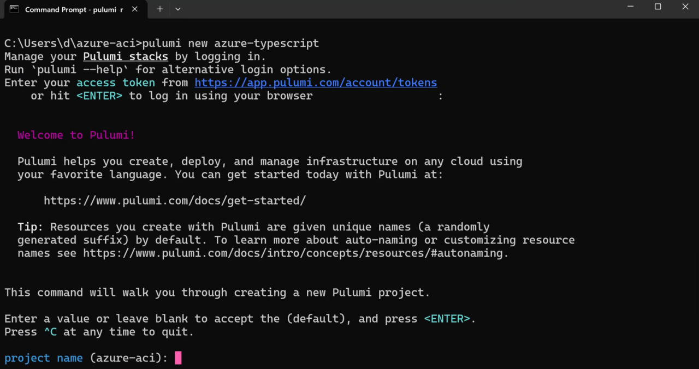
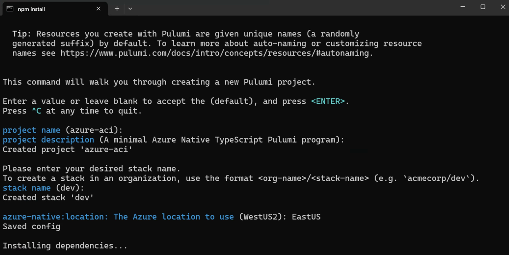

## Setting up the Pulumi
You will now set up Pulumi on Windows for Azure. Follow these steps to install the required tools:
1.	Install Node.js for Arm64 by downloading and running the following installer: https://nodejs.org/dist/v20.9.0/node-v20.9.0-arm64.msi 
2.	Install Pulumi CLI. Here is the link to the installer: https://github.com/pulumi/pulumi-winget/releases/download/v3.92.0/pulumi-3.92.0-windows-x64.msi 
3.	Install Azure CLI for Windows using this installer: https://aka.ms/installazurecliwindowsx64 
4.	Go to the Pulumi website (https://www.pulumi.com) and create a new account

Now, you will create the Pulumi project for Azure:
1.	Open the Windows Command Prompt, and then type:
```console
az login
```

The command will open the web browser and let you log into your Azure subscription.

2.	Using the Command Prompt, create a new folder for your project by typing:
```console
mkdir azure-aci
```

3.	Then, change the working directory to azure-aci:
```console
cd azure-aci
```

4.	Create the new Pulumi project for Azure using the following command:
```console
pulumi new azure-typescript
```

The last command starts the wizard, but you first need to log in to Pulumi (see below).



You can use the access token or press ENTER to log in using a web browser.

After you log in to Pulumi, configure the project as follows:
1.	Project name (azure-aci): **press enter to keep the default**
2.	Project description: **press enter to keep the default**
3.	Stack name: **dev**
4.	azure-native-location: **EastUS**

The wizard will save this configuration and proceed to install the npm packages required by Pulumi: 


