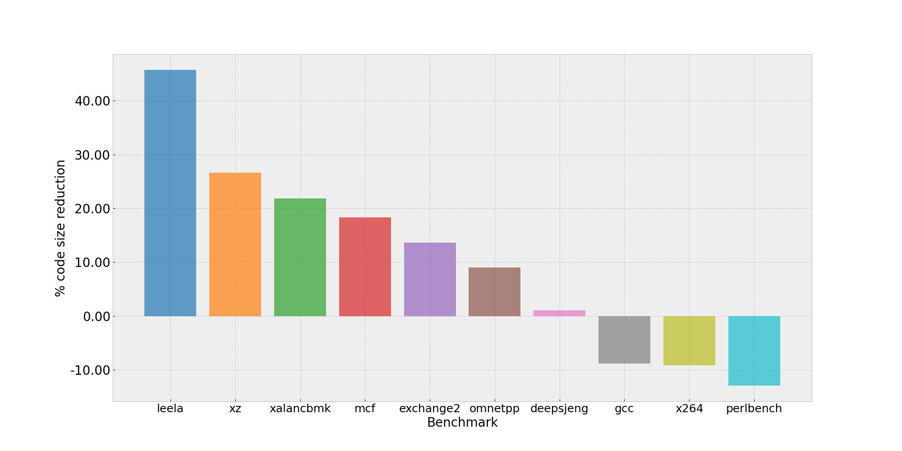

## Comparing Performance

The potential benefits of link-time optimization can be illustrated through a performance comparison using the SPEC CPU®2017 integer (SPECint2017) benchmark suite. In this example, benchmarks were compiled with GCC 15.1, with and without LTO, and executed on an Arm Neoverse V2 CPU.

Across the benchmark suite, enabling LTO resulted in an improvement in the geometric mean score of approximately 3.4%. Some workloads benefited more noticeably, including:
  * `gmcf` (+11%)
  * `deepsjeng` (+9.9%)
  * `leela` (+6.6%)
These results highlight how workloads with significant cross-module interaction can benefit from the additional visibility provided by LTO.

### Code-size Considerations

While performance improvements are often the primary motivation for enabling LTO, its impact is not limited to execution speed. Link-time optimization can also significantly affect the final code size of an executable.

As shown in figure 2, the use of LTO can have considerable impact on the final code size of the resulting executable.

#### Potential Code Size Reduction

One common source of code size reduction with LTO is cross-translation-unit dead code elimination. With whole-program visibility, the compiler can determine whether non-static functions or global variables are ever referenced anywhere in the final executable.
Without LTO, such symbols must be retained conservatively, as they may be referenced by other translation units or during linking. With LTO enabled, the compiler can make a definitive decision and eliminate unused functions and variables, reducing the size of the resulting binary.

#### Potential Code Size Increase

While global visibility often enables code size reductions, some LTO-driven optimizations can lead to larger binaries when they are deemed profitable for performance.
Examples include:
  * Aggressive loop unrolling when iteration counts are known in specific call paths
  * Increased function inlining when call relationships are well understood
    
In addition, LTO enables function cloning. When a function exhibits multiple common usage patterns, the compiler may generate specialized versions optimized for frequent cases, while retaining a generic version for less common ones. Although this approach preserves correctness and improves performance for hot paths, it can introduce code duplication and increase overall binary size.
As with other interprocedural optimizations, these trade-offs reflect the compiler’s attempt to balance performance gains against code size growth, and the net effect depends heavily on the structure of the application.
