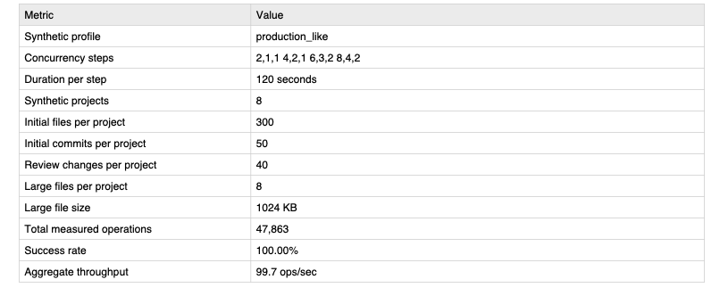
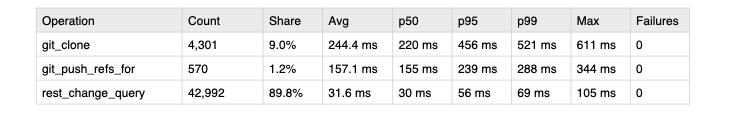
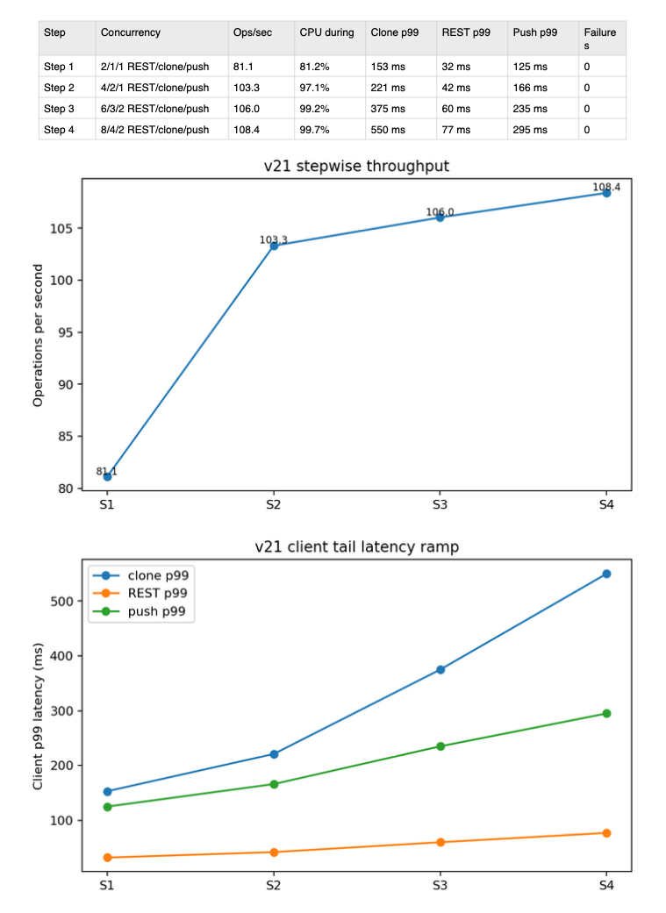
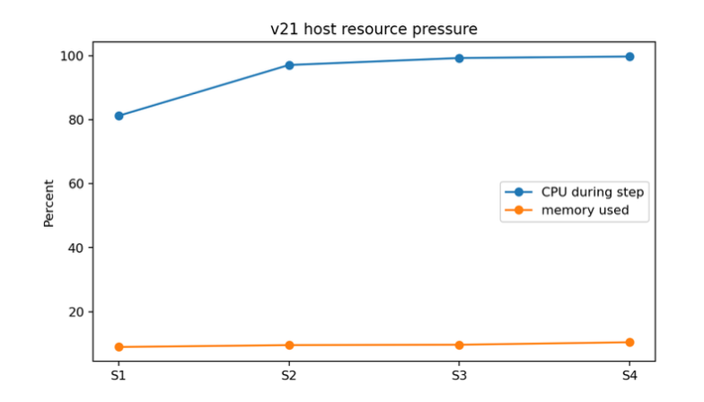
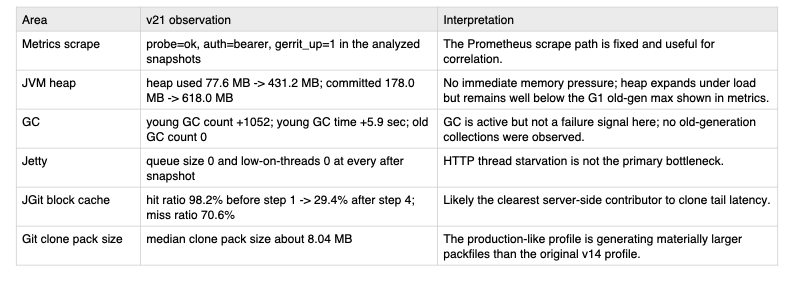
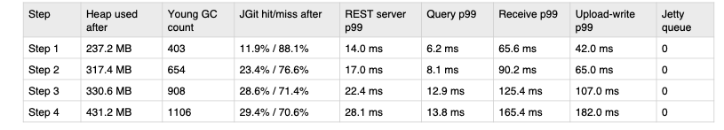

##  Overview 
This section guides you through benchmarking basic Gerrit performance on our Axiom VM. The benchmark consists of a custom script that will exercise and time key Gerrit features/functions. 

## Download and Install the benchmarking script

Clone the following repo into your VM:

```bash
cd $HOME
git clone https://github.com/DougAnsonAustinTx/gerrit_test
```

## Run Benchmark

Run the benchmark:

```bash
cd $HOME/gerrit_test
chmod 755 *.sh
sudo SYNTH_PROFILE=production_like REQUIRE_GERRIT_METRICS=true ./gerrit_perf_test.sh
```

The benchmark script will run through some sample exercises that Gerrit supports and will capture performance data from those exercises and place them into a specified JSON file similar to this (partial omitted for brevity):

```json
{
  "run": {
    "run_id": "20260622T152549Z",
    "timestamp_utc": "2026-06-22T15:35:19Z",
    "host": "douans01-gerrit-arm-6.c.arm-deveco-stedvsl-prd.internal",
    "os": "Debian GNU/Linux 13 (trixie)"
  },
  "software": {
    "java_version": "openjdk version \"21.0.11\" 2026-04-21 OpenJDK Runtime Environment (build 21.0.11+10-1-deb13u2-Debian) OpenJDK 64-Bit Server VM (build 21.0.11+10-1-deb13u2-Debian, mixed mode, sharing) ",
    "gerrit_version": "gerrit version 3.11.2",
    "gerrit_base_url": "http://127.0.0.1:8080",
    "gerrit_test_http_user": "admin",
    "prometheus_url": "http://127.0.0.1:9090",
    "gerrit_metrics_url": "http://127.0.0.1:8080/plugins/metrics-reporter-prometheus/metrics",
    "gerrit_metrics_probe_status": "ok",
    "gerrit_metrics_auth_mode": "bearer"
  },
  "workload": {
    "test_duration_seconds_per_step": 120,
    "concurrency_steps": "2,1,1 4,2,1 6,3,2 8,4,2",
    "legacy_single_step_defaults": {
      "rest_concurrency": 6,
      "git_clone_concurrency": 3,
      "git_push_concurrency": 2
    },
    "synthetic_profile": "production_like",
    "synthetic_projects": 8,
    "synthetic_initial_files_per_project": 300,
    "synthetic_initial_commits_per_project": 50,
    "synthetic_review_changes_per_project": 40,
    "synthetic_large_files_per_project": 8,
    "synthetic_large_file_kb": 1024
  },
  "startup_state": {
    "initial_gerrit_was_running": "true"
  },
  "operation_summary": [
    {
      "type": "git_clone",
      "count": 4301,
      "ok_count": 4301,
      "fail_count": 0,
      "min_ms": 105,
      "avg_ms": 244.42269239711695,
      "p50_ms": 220,
      "p90_ms": 418,
      "p95_ms": 456,
      "p99_ms": 521,
      "max_ms": 611
    },
    {
      "type": "git_push_refs_for",
      "count": 570,
      "ok_count": 570,
      "fail_count": 0,
      "min_ms": 75,
      "avg_ms": 157.13333333333333,
      "p50_ms": 155,
      "p90_ms": 222,
      "p95_ms": 239,
      "p99_ms": 288,
      "max_ms": 344
    },
    {
      "type": "rest_change_query",
      "count": 42992,
      "ok_count": 42992,
      "fail_count": 0,
      "min_ms": 12,
      "avg_ms": 31.553265723855603,
      "p50_ms": 30,
      "p90_ms": 50,
      "p95_ms": 56,
      "p99_ms": 69,
      "max_ms": 105
    }
  ]
  // rest of file omitted for brevity...
}
```

This JSON file can be processed to create a summary of the performance of Gerrit on our Axion C4A VM. 

## Performance summary

The benchmark run completed successfully on the production-like profile with Gerrit metrics enabled. It
recorded 47,863 measured client operations over four 120-second steps, with 47,863 successes and zero failures.
The benchmark gives a high-quality performance view: client latency, stepwise concurrency behavior, node
CPU/memory/disk, and Gerrit-side JVM, GC, Jetty, cache, queue, Git, REST, NoteDB, and receive-commits metrics
are all present:



Client-visible correctness is excellent: all 47,863 measured operations succeeded. REST query latency remains low
with p99 69 ms. Clone is the dominant pressure point at p99 521 ms, and push remains sub-second at p99 288 ms:



The useful capacity signal is the flattening throughput curve after step 2. CPU is already near saturation in step 2, then
stays around 99% in steps 3 and 4. Latency continues rising: clone p99 increases from 221 ms in step 2 to 550 ms in
step 4, while aggregate throughput only rises from 103.3 to 108.4 ops/sec:



Host CPU pressure:



Gerrit server-side correlation observations:



Basic Server Metrics:

