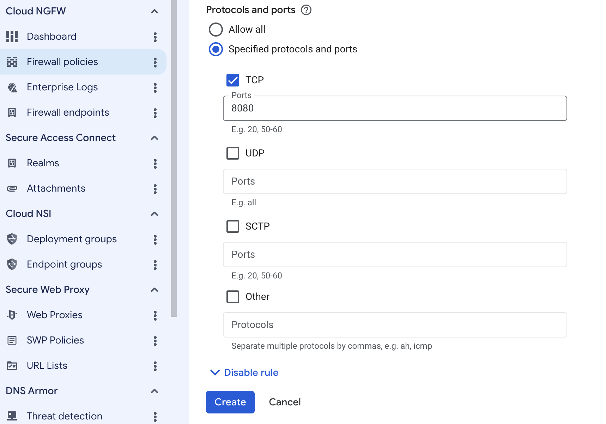

## Create a firewall rule on Google Cloud Platform

Create a firewall rule in Google Cloud console to allow incoming TCP traffic on port 8080 and make your Gerrit deployment accessible.

{}
If you need help setting up Google Cloud Platform (GCP), see the Learning Path [Getting started with Google Cloud Platform](/learning-paths/servers-and-cloud-computing/csp/google/).
{}

### Use the Google Cloud console to create a firewall rule

To expose TCP port 8080 for Gerrit, start by creating a new firewall rule in Google Cloud console:

1. Open the [Google Cloud console](https://console.cloud.google.com/).
2. In the navigation menu, select **VPC network** > **Firewall**.
3. Select **Create firewall rule**.

4. Set **Name** to `allow-tcp-8080`.
5. Select the network you want to use for your VM. The default is `autoscaling-net`, but your organization might use a different network.
6. Set **Direction of traffic** to **Ingress**.
7. Set **Action on match** to **Allow**.
8. For **Targets**, select **Specified target tags** and enter `allow-tcp-8080` in the **Target tags** field.
9. In **Source IPv4 ranges**, enter `0.0.0.0/0`.

This configuration allows incoming TCP traffic on port 8080 from any IPv4 address.

10. Next, configure the protocols and ports for your firewall rule:

    - Under **Protocols and ports**, select **Specified protocols and ports**.
    - Check the **TCP** box.
    - In the **Ports** field, enter `8080`.
    - Select **Create** to finish adding the firewall rule.

This step ensures that only TCP traffic on port 8080 is allowed through the firewall.

## What you've accomplished and what's next

You've now created a network firewall rule to allow access to your Gerrit deployment. 

Next, you'll create a Google Axion C4A virtual machine that you'll use to deploy Gerrit.