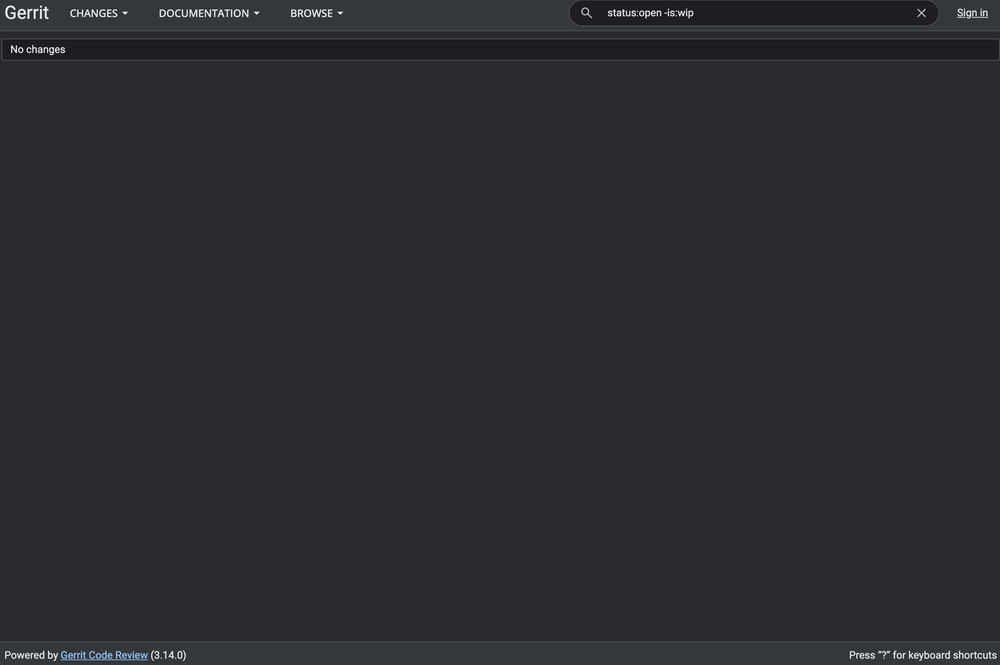

## Install Gerrit 

Install and configure Gerrit Server on your Ubuntu 24.04 LTS virtual machine (VM) on Google Cloud Platform (GCP). 

To ensure a successful setup, follow each step in order and check the output after each command. By doing this, you catch issues early and confirm that Gerrit is installed and running correctly.

### Set up your environment

Before installing Gerrit, update the system and install the required tools:

```console
sudo apt update && sudo apt upgrade -y
sudo apt install -y wget default-jdk git net-tools
```

### Download the Gerrit server package

Download the Gerrit server package for `arm64`:

```console
mkdir -p ${HOME}/gerrit
wget -O gerrit.war https://gerrit-releases.storage.googleapis.com/gerrit-3.14.0.war
java -jar gerrit.war init -d ${HOME}/gerrit --dev --batch --install-all-plugins
```

### Verify service status

Verify the status of the service:

```console
ps -ef | grep Gerrit
```

The output is similar to:

```output
doug_an+   11807       1 18 21:01 ?        00:00:14 GerritCodeReview -Dflogger.backend_factory=com.google.common.flogger.backend.log4j.Log4jBackendFactory#getInstance -Dflogger.logging_context=com.google.gerrit.server.logging.LoggingContext#getInstance -jar /home/doug_anson_arm_com/gerrit/bin/gerrit.war daemon -d /home/doug_anson_arm_com/gerrit --run-id=1781730091.11737
```

## Check whether necessary ports are open

To confirm Gerrit is ready to accept connections, check that the necessary ports are open and listening. If you see `LISTEN` next to these ports, Gerrit is running and network services are available.

Gerrit uses port `8080` for its web console function.

Run the following command to verify the ports are active:

```console
netstat -a | grep http | grep LISTEN
```

The output is similar to:

```output
tcp6       0      0 [::]:http-alt           [::]:*                  LISTEN   
```

If you see `LISTEN` for the `http-alt` port, Gerrit is ready for baseline testing and further configuration. This confirms that the core Gerrit services are running and accessible on your Arm-based GCP VM.

## Confirm that the Gerrit dashboard is accessible

Navigate to the following URL in a browser of your choice, replacing `my_vm_public_ip` with the public IP address of your VM instance:

```output
http://my_vm_public_ip_address:8080
```

You'll see the following dashboard:



## What you've accomplished and what's next

You've now installed and configured Gerrit on your Arm-based GCP C4A VM, and verified that Gerrit can accept connections.

Next, you'll benchmark Gerrit performance on the VM. 
