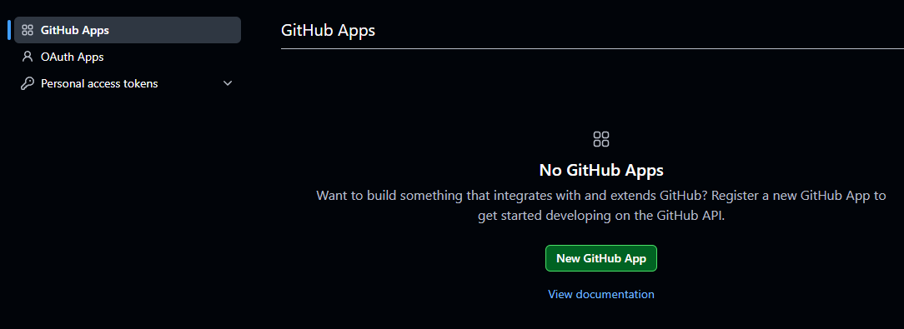
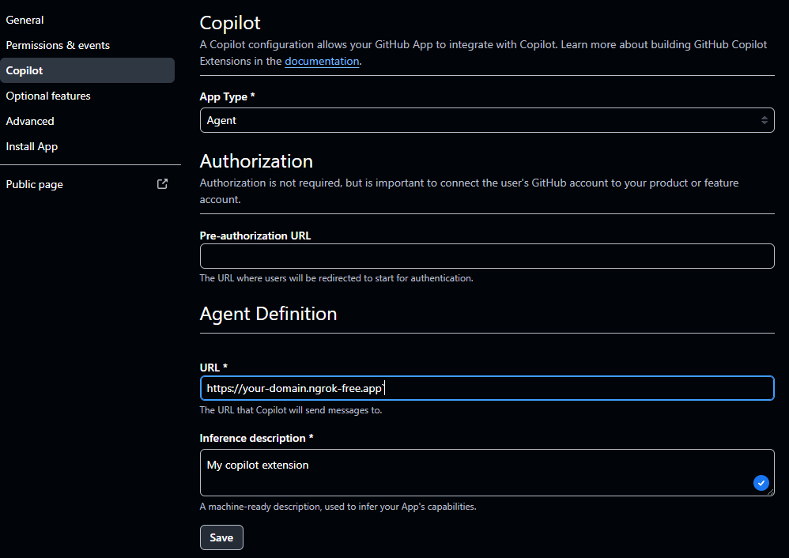

## How do I connect my Copilot extension to my GitHub account?

Create a GitHub App to connect your Python extension to your GitHub account. 

Click on your photo in the upper-right corner of GitHub and select `Settings`.

Scroll to the bottom left and select `Developer settings`. 

### Create a new GitHub App

<<<<<<< HEAD
Select the `GitHub Apps` on the left side and click `New GitHub App`.
=======
Select the `GitHub Apps` on the left slide and click `New GitHub App`.
>>>>>>> 5f2151168 (Changed model to Tiny Rock–Paper–Scissors CNN)

The important fields to complete or modify are listed below. 

| Field | Description |
|------|-------------|
| GitHub App Name | This can be any name, but it must be unique across all of GitHub. This is also the name you will use to invoke your extension in Copilot using the `@name` syntax. One way to avoid conflicts is to use your GitHub handle as the name or add some text to your handle, such as `@jasonrandrews-cp`. |
| Homepage URL | This needs to be filled in but is not used for a private extension, any URL can be entered such as https://learn.arm.com |
| Callback URL | Enter the URL of your ngrok domain such as `https://your-domain.ngrok-free.app` (substitute your domain). |
| Webhook | Uncheck the `Active` box. |
<<<<<<< HEAD
| Permissions | Select `Account permissions` and set the `GitHub Copilot Chat` to `Read-only`. |
=======
| Permissions | Select `Account permissions` and set the `GitHub Copilot Chat` and `GitHub Copilot Chat` to `Read-only`. |
>>>>>>> 5f2151168 (Changed model to Tiny Rock–Paper–Scissors CNN)
| Where can this GitHub App be installed? | Confirm `Only this account` is selected to make the GitHub App only for your use. |

Click the `Create GitHub App` to save the configuration. 

### Configure the Copilot settings

<<<<<<< HEAD
=======
### Configure the Copilot settings

>>>>>>> 5f2151168 (Changed model to Tiny Rock–Paper–Scissors CNN)
Click on the left side Copilot sidebar.

Modify and update the following fields:

| Step | Description |
|------|-------------|
| 1. Set the App Type | Set the `App Type` to `Agent`. |
| 2. Agent Definition | Enter your ngrok URL in the URL box, such as `https://your-domain.ngrok-free.app`. |
| 3. Interface Description | Any text can be added. |

The Copilot settings are shown below:

Click the `Save` button when the information is entered. 

### Install your GitHub App

<<<<<<< HEAD
When the GitHub App has been configured and saved, install it into your account using the `Install App` tab on the left side and click the `Install` button.

You might need to agree to install the GitHub App in your account. 

Once installed, you see the App in your account's [Applications](https://github.com/settings/installations).
=======
When the GitHub App has been configured and save, install it into your account using the `Install App` tab on the left site and the `Install` button.

You may need to agree to install the GitHub App in your account. 

Once installed, you see the App in your account's [Applications](https://github.com/settings/installations)
>>>>>>> 5f2151168 (Changed model to Tiny Rock–Paper–Scissors CNN)

Your GitHub App is now ready to use with Copilot. 