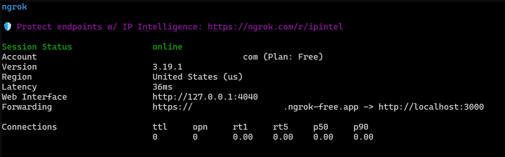

## How can I connect my Python extension with GitHub Copilot?

For development, you can use [ngrok](https://ngrok.com/) to connect your extension to Copilot. 

ngrok is a tool that creates a secure tunnel to your localhost, allowing you to expose a local server to the internet. This is useful for testing and development purposes.

## How do I install and configure ngrok?

Follow the steps below to set up ngrok. 

### Download and install ngrok 

If required, create a new account. 

Refer to the [Setup & installation](https://dashboard.ngrok.com/get-started/setup/linux) section for installation details.

If you are using a Debian based Linux system, run the command:

```console
curl -sSL https://ngrok-agent.s3.amazonaws.com/ngrok.asc \
	| sudo tee /etc/apt/trusted.gpg.d/ngrok.asc >/dev/null \
	&& echo "deb https://ngrok-agent.s3.amazonaws.com buster main" \
	| sudo tee /etc/apt/sources.list.d/ngrok.list \
	&& sudo apt update \
	&& sudo apt install ngrok
```

### Configure your ngrok account

Before starting the ngrok server, you need an Authtoken. If you don't currently have one, create a new Authtoken from the [Authtoken](https://dashboard.ngrok.com/get-started/your-authtoken) settings. 

Once you have the token, add it to the Linux computer where you are running your Python extension. 

Substitute your token in the command below:

```console
ngrok config add-authtoken <your-authtoken>
```

ngrok is easier to use if you create a domain name. Go to the [Domains](https://dashboard.ngrok.com/domains) section and add a new randomly generated domain name. You can create one domain name in a free account. 

Use the domain name in the next section to start the server.

### Start your local server

In a terminal, run the ngrok command to start the server. 

Substitute your domain name in the command below to start the server on port 3000.

```console
ngrok http --domain=your-domain.ngrok-free.app 3000
```



In the next section, you will use the public URL of your domain to configure a GitHub App in your GitHub account. 
