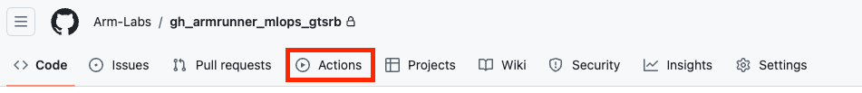

In this Learning Path, you will learn how to automate your MLOps workflow using an Arm-based GitHub runner and GitHub Actions. You will learn how to train and test a neural network model with PyTorch. You will compare the model inference time for your trained model using two different PyTorch backends. You will then containerize your trained model and deploy the container image to DockerHub for easy deployment of your application.

## Overview of GitHub Actions

GitHub Actions is a platform that automates software development workflows, including continuous integration and continuous delivery. Every repository on GitHub has a tab named _Actions_.

)

From here, you can create different _workflow files_ which automates processes that run when specific events occur in your GitHub code repository. You use [YAML](https://yaml.org/) to define a workflow. You specify how a job is triggered, the running environment, and the workflow commands. The machine which the workflow runs in is called a _runner_.

## Arm-based GitHub runners

Arm-based GitHub runners are a powerful addition to your CI/CD toolkit. They leverage the efficiency and performance of Arm64 architecture, making your build systems faster and easier to scale. By using the Arm-based GitHub runners, you can optimize your workflows, reduce costs, and improve energy consumption. Additionally, the Arm-based runners are preloaded with essential tools, making it easier for you to develop and test your applications.

Arm-hosted runners are available for Linux and Windows. This Learning Path uses Linux.

{}
You must have a Team or Enterprise Cloud plan to use Arm-hosted runners.
{}

Getting started with Arm-based GitHub runners is straightforward. Follow [these steps to create a Linux Arm-based runner within your organization](/learning-paths/cross-platform/github-arm-runners/runner/#how-can-i-create-an-arm-hosted-runner). 

Once you have created the runner within your organization, you can use the `runs-on` syntax in your GitHub Actions workflow file to execute the workflow on Arm. Shown here is an example workflow that executes on your Arm-hosted runner named `ubuntu-22.04-arm`:

```yaml
name: Example workflow
on:
  workflow_dispatch:
jobs:
  example-job:
    name: Example Job
    runs-on: ubuntu-22.04-arm-os # Custom ARM64 runner
    steps:
      - name: Example step
        run: echo "This line runs on Arm!"
```

This setup allows you to take full advantage of the Arm64 architecture's capabilities. Whether you are working on cloud, edge, or automotive projects, these runners provide a versatile and robust solution.

## Machine Learning Operations (MLOps)

With machine learning use-cases evolving and scaling, comes an increased need for reliable workflows to maintain them. There are many regular tasks that can be automated in the ML lifecycle. Models need to be re-trained, while ensuring they still perform at their best capacity. New training data needs to be properly stored and pre-processed, and the models need to be deployed in a good production environment. Developer Operations (DevOps) refers to good practices for CI/CD. The domain-specific needs for ML, combined with state of the art DevOps knowledge, created the term MLOps.

## German Traffic Sign Recognition Benchmark (GTSRB)

In this Learning path, you will train and test a PyTorch model for use in Traffic Sign recognition. You will use the GTSRB dataset to train the model. The dataset is free to use under the [Creative Commons](https://creativecommons.org/publicdomain/zero/1.0/) license. It contains thousands of images of traffic signs found in Germany. Thanks to the availability and real-world connection, it has become a well-known resource to showcase ML applications. Additionally, given that it is a benchmark, you can apply it in a MLOps context to compare model improvements. This makes it a great candidate for this Learning Path, where you compare the performance of your trained model using two different PyTorch backends.

With this background, let's review the code.
