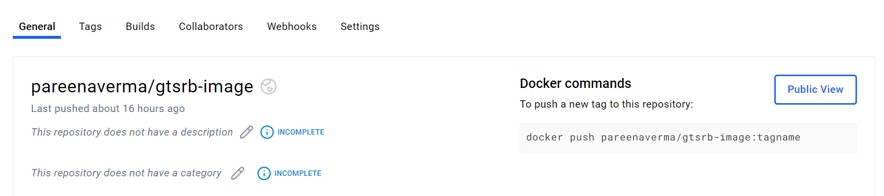

After your model has been trained and validated using the GitHub Actions workflows, your next step is to deploy the model into a production environment.
In this section, you will walk through the steps to containerize your trained model and push the container image to DockerHub.

## Containerize the Model

In order to create a docker container for the trained model with the scripts to deploy this model, observe the Dockerfile in the project containing the contents as shown:

```console
# Use the official PyTorch image as the base image
FROM armswdev/pytorch-arm-neoverse:r24.07-torch-2.3.0-onednn-acl

# Set the working directory
WORKDIR /app

# Copy the necessary files
COPY models/ /app/models/
COPY scripts/ /app/scripts/

# Install any additional dependencies
RUN pip install --no-cache-dir torch torchvision fastapi uvicorn python-multipart

# Expose the port the app will run on
EXPOSE 8000

# Specify the command to run the model server
CMD ["uvicorn", "scripts.serve_model:app", "--host", "0.0.0.0", "--port", "8000"]
```
The Dockerfile uses the PyTorch image with the ACL backend as the base image for the container. The working directory is set to `/app` where the trained model and the scripts to deploy the model are copied. The container runs a FastAPI application (`scripts/serve_model.py`) on port 8000. This script is called by `uvicorn` when the container is run. Uvicorn is a fast, lightweight ASGI (Asynchronous Server Gateway Interface) server, a good fit for serving Python web applications such as this.

## Deploy the trained model using FastAPI
FastAPI is an easy way to serve your trained model as API. You use a FastAPI application that loads your pre-trained model, accepts image uploads, and makes predictions on the uploaded images as shown in ´scripts/serve_model.py`:

```python
import torch
import torchvision.transforms as transforms
from fastapi import FastAPI, UploadFile, File, HTTPException
from fastapi.responses import JSONResponse
from PIL import Image
import io

# Define the model class (should match the model architecture used during training)
class TrafficSignNet(torch.nn.Module):
    def __init__(self):
        super(TrafficSignNet, self).__init__()
        self.conv1 = torch.nn.Conv2d(3, 32, kernel_size=3)
        self.conv2 = torch.nn.Conv2d(32, 64, kernel_size=3)
        self.fc1 = torch.nn.Linear(64 * 6 * 6, 128)
        self.fc2 = torch.nn.Linear(128, 43) # 43 classes in GTSRB dataset

    def forward(self, x):
        x = torch.relu(self.conv1(x))
        x = torch.max_pool2d(x, 2)
        x = torch.relu(self.conv2(x))
        x = torch.max_pool2d(x, 2)
        x = torch.flatten(x, 1)
        x = torch.relu(self.fc1(x))
        x = self.fc2(x)
        return x

# Load the trained model
model = TrafficSignNet()
model.load_state_dict(torch.load("/app/models/traffic_sign_net.pth",
map_location=torch.device('cpu')))
model.eval()

# Define image transformations (should match the preprocessing used during training)
transform = transforms.Compose([
    transforms.Resize((32, 32)),
    transforms.ToTensor(),
    transforms.Normalize((0.5,), (0.5,))
])

# Initialize FastAPI
app = FastAPI()

# Define the prediction endpoint
@app.post("/predict/")
async def predict(file: UploadFile = File(...)):
    try:
        # Read the image
        image_bytes = await file.read()
        image = Image.open(io.BytesIO(image_bytes)).convert("RGB")

        # Preprocess the image
        image = transform(image).unsqueeze(0) # Add batch dimension

        # Run the model on the image
        with torch.no_grad():
            output = model(image)
            _, predicted = torch.max(output, 1)

        # Return the prediction
        return {"predicted_class": predicted.item()}

       # Return the prediction as a JSON response
        return JSONResponse(content={"prediction": prediction.tolist()})

    except Exception as e:
        raise HTTPException(status_code=500, detail=str(e))
```
## Deploy with GitHub Actions

You can now automate the deployment of your containerized model on the Arm-based runner in GitHub Actions.
Navigate to the `.github/workflows` directory and inspect the YAML file named `deploy-model.yml`:

```console
name: Deploy to DockerHub

on:
  workflow_dispatch:
  workflow_run:
    workflows: [Test Model]
    types:
      - completed

jobs:
  deploy-to-dockerhub:
    runs-on: ubuntu-22.04-arm-os
    name: Build and Push Docker Image to DockerHub
    steps:
      - name: Checkout code
        uses: actions/checkout@v3

      - name: Set up Docker Buildx
        uses: docker/setup-buildx-action@v3

      - name: Log in to DockerHub
        uses: docker/login-action@v3
        with:
          username: ${{ secrets.DOCKER_USERNAME }}
          password: ${{ secrets.DOCKER_PASSWORD }}

      - name: Build and Push Docker Image
        run: |
          docker buildx build --platform linux/arm64 -t ${{ secrets.DOCKER_USERNAME }}/gtsrb-image:latest --push .
```
In this workflow, you build the Docker container for Arm64 architecture and push the container image to DockerHub.

Before you run this workflow, you need your Docker Hub username and a Personal Access Token (PAT). This enables you to automate the login to your Docker Hub account.

To save your secrets, click on the Settings tab in your new GitHub repository. Expand the Secrets and variables on the left side and click Actions.

Add two secrets using the New repository secret button:

 * DOCKER_USERNAME: Your DockerHub username
 * DOCKER_PASSWORD: Your DockerHub Personal Access Token

To run the action, navigate to the Actions tab in your repository. Select Deploy to DockerHub on the left.

Use the Run workflow drop-down on the right-hand side to click Run workflow.

## Verify the Deployment

After the `deploy-model.yml` workflow completes successfully, the docker container image is pushed to your DockerHub repository.

You can validate this by logging into DockerHub and checking your repository:



You can then pull this docker container image on your local machine and start the container:

```console
docker pull <docker-username>/gtsrb-image
docker run -d -p 8000:8000 <docker-username>/gtsrb-image
```
Now test the application by running a curl command to make a POST request to the predict endpoint using a test image:

```bash
curl -X 'POST'   'http://localhost:8000/predict/'   -H 'accept: application/json'   -H 'Content-Type: multipart/form-data'   -F 'file=@test-img.png;type=image/png'
```
The output should look like:
```ouput
{"predicted_class":1}
```

You have now validated that you were able to successfully deploy your application, serve your model as an API and make predictions on a test image.

In the last section, you will learn how to build a complete end-to-end MLOps workflow by combining the individual workflows.
