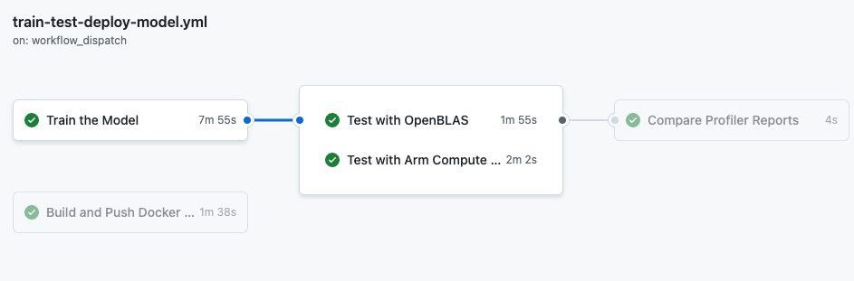

So far, you have run three individual workflows covering the tasks in the ML lifecycle: 
- Training 
- Testing
- Performance monitoring
- Deployment

With GitHub Actions, you can build an end-to-end custom MLOPs workflow that combines and automates the individual workflows.

To demonstrate this, the repository contains a workflow in `.github/workflows/train-test-deploy-model.yml` that automates the individual steps. 

Here is the complete **Train, Test, and Deploy Model** workflow file: 

```yaml
name: Train, Test and Deploy Model

on:
  workflow_dispatch:
  push:
    branches: main

jobs:
  train-model:
    name: Train the Model
    runs-on: ubuntu-22.04-arm-os # Custom ARM64 runner
    container:
      image: armswdev/pytorch-arm-neoverse:r24.07-torch-2.3.0-openblas
      options: --user root
    steps:
      - name: Checkout code
        uses: actions/checkout@v4
      - name: Run training script
        run: python scripts/train_model.py
      - name: Upload Artifact
        uses: actions/upload-artifact@v4
        with:
          name: traffic_sign_net
          path: ${{ github.workspace }}/models/traffic_sign_net.pth
          retention-days: 5
  test-model-openblas:
    name: Test with OpenBLAS
    needs: train-model
    runs-on: ubuntu-22.04-arm-os
    container:
      image: armswdev/pytorch-arm-neoverse:r24.07-torch-2.3.0-openblas
      options: --user root
    steps:
      - name: Checkout code
        uses: actions/checkout@v4
      - name: Download model artifact
        uses: actions/download-artifact@v4
        with:
          name: traffic_sign_net
      - name: Test with OpenBLAS
        run: python scripts/test_model.py --model models/traffic_sign_net.pth | tee openblas.txt
      - name: Upload Artifact
        uses: actions/upload-artifact@v4
        with:
          name: openblas
          path: openblas.txt
          retention-days: 5
  test-model-onednn-acl:
    name: Test with Arm Compute Library
    needs: train-model
    runs-on: ubuntu-22.04-arm-os
    container:
      image: armswdev/pytorch-arm-neoverse:r24.07-torch-2.3.0-onednn-acl
      options: --user root
    steps:
      - name: Checkout code
        uses: actions/checkout@v4
      - name: Download model artifact
        uses: actions/download-artifact@v4
        with:
          name: traffic_sign_net
      - name: Test with oneDNN and Arm Compute Library
        run: python scripts/test_model.py --model models/traffic_sign_net.pth | tee acl.txt
      - name: Upload Artifact
        uses: actions/upload-artifact@v4
        with:
          name: acl
          path: acl.txt
          retention-days: 5
  compare-results:
    name: Compare Profiler Reports
    needs: [test-model-openblas, test-model-onednn-acl]
    runs-on: ubuntu-22.04-arm-os
    steps:
      - name: Checkout code
        uses: actions/checkout@v4
      - name: Download OpenBLAS artifact
        uses: actions/download-artifact@v4
        with:
          name: openblas
      - name: Download ACL artifact
        uses: actions/download-artifact@v4
        with:
          name: acl
      - name: Parse output
        run: python scripts/parse_output.py openblas.txt acl.txt
      - name: Remove output files
        run: rm -rf openblas.txt acl.txt
  push-artifact:
    name: Push the updated model
    needs: compare-results
    runs-on: ubuntu-22.04-arm-os
    steps:
      - name: Checkout code
        uses: actions/checkout@v4
      - name: Download model artifact
        uses: actions/download-artifact@v4
        with:
          name: traffic_sign_net
          path: models/
      - name: Push updated model to repository
        run: |
          git config --global user.name "GitHub Actions"
          git config --global user.email "actions@users.noreply.github.com"
          git add models/traffic_sign_net.pth
          git commit -m "Add updated model"
          git push
  deploy-to-dockerhub:
    name: Build and Push Docker Image to DockerHub
    needs: push-artifact
    runs-on: ubuntu-22.04-arm-os
    steps:
      - name: Checkout code
        uses: actions/checkout@v3

      - name: Set up Docker Buildx
        uses: docker/setup-buildx-action@v3

      - name: Log in to DockerHub
        uses: docker/login-action@v3
        with:
          username: ${{ secrets.DOCKER_USERNAME }}
          password: ${{ secrets.DOCKER_PASSWORD }}

      - name: Build and Push Docker Image
        run: |
          docker buildx build --platform linux/arm64 -t ${{ secrets.DOCKER_USERNAME }}/gtsrb-image:latest --push .
```

These steps should look familiar and now they are put together to curate an end-to-end MLOPs workflow. 

The training and testing steps are run like before. The output report is saved and parsed to show the compare the performance changes in inference time. 

The trained model is updated in the repository. 

The deployment step connects to DockerHub, pushes the containerized model and scripts, which can then be downloaded and run. 

The steps depend on each other, requiring the previous one to run before the next is triggered. The entire workflow is triggered automatically any time a change is pushed into the main branch of your repository. 

Using what you have learned, navigate to the **Train, Test and Deploy** workflow and run it.

The diagram below shows the end-to-end workflow, the relationship between the steps, and the time required to run each step:



You have run an MLOps workflow using GitHub Actions with Arm-hosted runners for managing all of the steps in your ML application's lifecycle.
