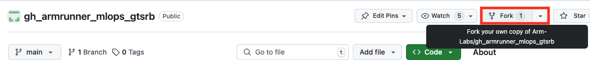

## Fork the example repository

In this section, you will fork the example GitHub repository containing the project code.

Get started by forking the example repository. In a web browser, navigate to the repository at:

```bash
https://github.com/Arm-Labs/gh_armrunner_mlops_gtsrb
```
Fork the repository, using the **Fork** button:



Create a fork within a GitHub Organization or Team where you have access to Arm-hosted GitHub runners. 

{}
If a repository with the same name `gh_armrunner_mlops_gtsrb` already exists in your Organization or Team, you can modify the repository name to make it unique.
{}

## Learn about model training and testing

In this section, you will inspect the Python code for training and testing a neural network model.

Explore the repository using a browser to get familiar with code and the workflow files. 

{}
No actions are required in the sections below.

The purpose is to provide an overview of the code used for training and testing a PyTorch model on the GTSRB dataset. 
{}

### Model training

In the `scripts` directory, there is a Python script called `train_model.py`. This script loads the GTSRB dataset, defines a neural network, and trains the model on the dataset.

#### Data preprocessing

The first section loads the GTSRB dataset to prepare it for training. The GTSRB dataset is built into `torchvision`, which makes loading easier. 

The transformations used when loading data are part of the preprocessing step, which makes the data uniform and ready to run through the extensive math operations of the ML model. 

In accordance with common machine learning practices, data is separated into training and testing data to avoid overfitting the neural network.

Here is the code to load the dataset:

```python
transform = transforms.Compose([
    transforms.Resize((32, 32)),
    transforms.ToTensor(),
    transforms.Normalize((0.5,), (0.5,))
])

train_set = torchvision.datasets.GTSRB(root='./data', split='train', download=True, transform=transform)
train_loader = DataLoader(train_set, batch_size=64, shuffle=True)
```

#### Model creation

The next step is to define a class for the model, listing the layers used. 

The model defines the forward pass function used at training time to update the weights. Additionally, the loss function and optimizer for the model are defined.

Here is the code that defines the model:

```python
class TrafficSignNet(nn.Module):
    def __init__(self):
        super(TrafficSignNet, self).__init__()
        self.conv1 = nn.Conv2d(3, 32, kernel_size=3)
        self.conv2 = nn.Conv2d(32, 64, kernel_size=3)
        self.fc1 = nn.Linear(64 * 6 * 6, 128)
        self.fc2 = nn.Linear(128, 43) # 43 classes in GTSRB dataset

    def forward(self, x):
        x = torch.relu(self.conv1(x))
        x = torch.max_pool2d(x, 2)
        x = torch.relu(self.conv2(x))
        x = torch.max_pool2d(x, 2)
        x = torch.flatten(x, 1)
        x = torch.relu(self.fc1(x))
        x = self.fc2(x)
        return x

model = TrafficSignNet()
criterion = nn.CrossEntropyLoss()
optimizer = optim.Adam(model.parameters(), lr=0.001)
```

#### Model training and the model file

A training loop performs the actual training. 

The number of epochs is arbitrarily set to 10 for this example. When the training is finished, the model weights are saved to a `.pth` file.

Here is the code for the training loop:

```python
num_epochs = 10
model.train()
for epoch in range(num_epochs):
    running_loss = 0.0
    for i, data in enumerate(train_loader, 0):
        inputs, labels = data
        optimizer.zero_grad()

        # Forward pass
        outputs = model(inputs)
        loss = criterion(outputs, labels)

        # Backward pass and optimization
        loss.backward()
        optimizer.step()

        running_loss += loss.item()
        if i % 100 == 99: # Print every 100 mini-batches
            print(f'Epoch [{epoch + 1}/{num_epochs}], Step [{i + 1}/{len(train_loader)}], Loss: {running_loss / 100:.4f}')
            running_loss = 0.0

torch.save(model.state_dict(), './models/traffic_sign_net.pth')
```

You now have an understanding of how to load the GTSRB dataset, define a neural network, train the model on the dataset, and save the trained model.

The next step is testing the trained model.

### Model testing

The `test_model.py` Python script in the `scripts` directory verifies how accurately the ML model classifies traffic signs. 

It uses the PyTorch profiler to measure the CPU performance in terms of execution time. The profiler measures the model inference time when different PyTorch backends are used to test the model.

#### Model loading and testing data

Testing is done by loading the model that was saved after training and preparing it for evaluation on a test dataset. 

As in training, transformations are used to load the test data from the GTSRB dataset.

Here is the code to load the model and the test data:

```python
model_path = args.model if args.model else './models/traffic_sign_net.pth'

model = TrafficSignNet()
model.load_state_dict(torch.load(model_path))
model.eval()

transform = transforms.Compose([
    transforms.Resize((32, 32)),
    transforms.ToTensor(),
    transforms.Normalize((0.5,), (0.5,))
])

test_set = torchvision.datasets.GTSRB(root='./data', split='test', download=True, transform=transform)
test_loader = DataLoader(test_set, batch_size=64, shuffle=False)
```

#### Testing loop and profiling results

The testing loop passes each batch of test data through the model and compares predictions to the actual labels to calculate accuracy. 

The accuracy is calculated as a percentage of correctly classified images. Both the accuracy and PyTorch profiler reports are printed at the end of the script.

Here is the testing loop with profiling:

```python
correct = 0
total = 0
with torch.no_grad():
    for data in test_loader:
        images, labels = data
        with profile(activities=[ProfilerActivity.CPU], record_shapes=True) as prof:
            with record_function("model_inference"):
                outputs = model(images)
        _, predicted = torch.max(outputs.data, 1)
        total += labels.size(0)
        correct += (predicted == labels).sum().item()

print(f'Accuracy of the model on the test images: {100 * correct / total:.2f}%')
print(prof.key_averages().table(sort_by="cpu_time_total", row_limit=10))
```

You now have a good overview of the code for training and testing the model on the GTSRB dataset using PyTorch. 

In the next section, you will learn how to use GitHub Actions workflows to run the training and testing scripts on an Arm-hosted GitHub runner.
