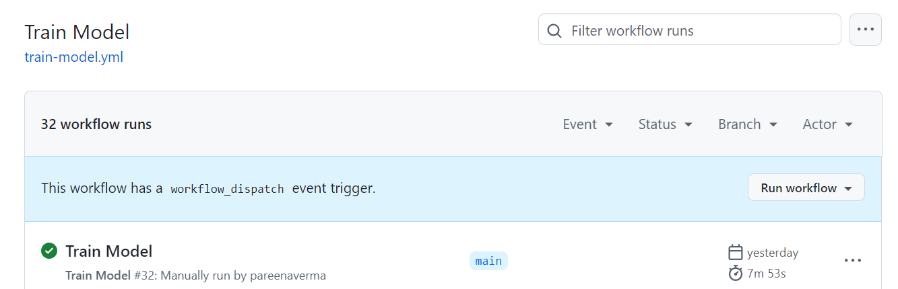
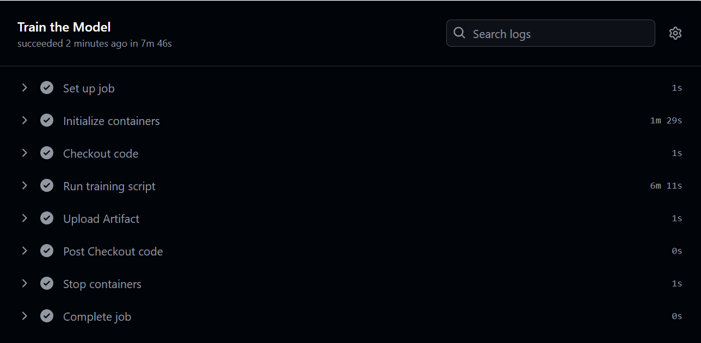
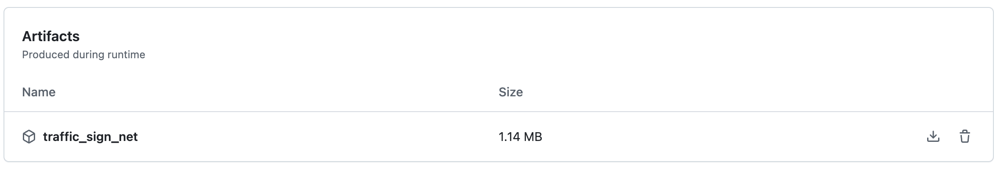
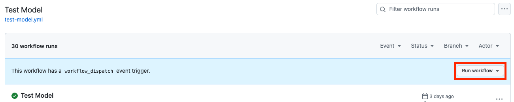
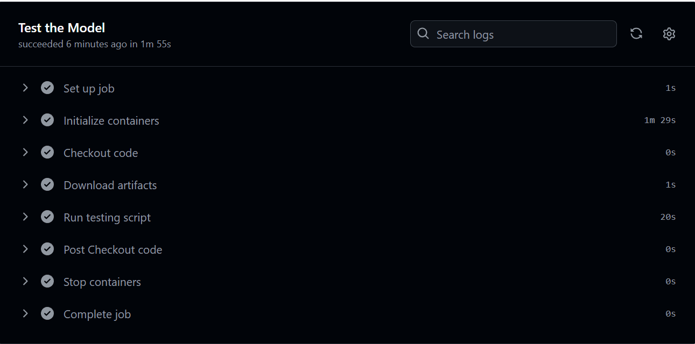

## Run GitHub Actions workflows

In this section, you will use GitHub Actions to run the training and testing scripts on an Arm-hosted GitHub runner.

### Train the model

GitHub Actions are defined by workflows in the `.github/workflows` directory of a project. 

The workflow at `.github/workflows/train-model.yml` automates the model training. 

The training workflow uses a [PyTorch 2.3.0 Docker Image compiled with OpenBLAS from DockerHub](https://hub.docker.com/r/armswdev/pytorch-arm-neoverse) and runs the script at `scripts/train_model.py` in the container. 

When training is complete, the model is saved for future use as an artifact of the workflow.

Review the **Train Model** workflow by opening the file `.github/workflows/train-model.yml` from your fork in your browser:

```yaml
name: Train Model

on:
  workflow_dispatch:

jobs:
  train-model:
    name: Train the Model
    runs-on: ubuntu-22.04-arm-os # Custom ARM64 runner
    container:
      image: armswdev/pytorch-arm-neoverse:r24.07-torch-2.3.0-openblas
      options: --user root
    steps:
      - name: Checkout code
        uses: actions/checkout@v4
      - name: Run training script
        run: python scripts/train_model.py
      - name: Upload Artifact
        uses: actions/upload-artifact@v4
        with:
          name: traffic_sign_net
          path: ${{ github.workspace }}/models/traffic_sign_net.pth
          retention-days: 5
```

The workflow specifies one job named **Train the Model**. 

The job runs in the runner environment specified by `runs-on`. The `runs-on: ubuntu-22.04-arm-os` points to the Arm-hosted GitHub runner you setup in the first section.

### Run the training workflow

Navigate to the **Train Model** workflow under the `Actions` tab.

Press the `Run workflow` button and run the workflow on the main branch. 



The workflow starts running. It takes about 8 minutes to complete. 

Click on the workflow to see the output from each step of the workflow. 



Expand on the `Run training script` step to see the training loss per epoch followed by `Finished Training`.

The output is similar to:

```output
(...)
Epoch [8/10], Step [400/417], Loss: 0.0230
Epoch [9/10], Step [100/417], Loss: 0.0193
Epoch [9/10], Step [200/417], Loss: 0.0207
Epoch [9/10], Step [300/417], Loss: 0.0204
Epoch [9/10], Step [400/417], Loss: 0.0244
Epoch [10/10], Step [100/417], Loss: 0.0114
Epoch [10/10], Step [200/417], Loss: 0.0168
Epoch [10/10], Step [300/417], Loss: 0.0208
Epoch [10/10], Step [400/417], Loss: 0.0152
Finished Training
```

Confirm the model is generated and saved as an artifact in the job's overview.



This trained model artifact is used in the next step. 

### Test the model

The next workflow called `test-model.yml` automates running the `test_model.py` script on the Arm-hosted runner. 

The test job downloads the artifact generated by the training workflow in the previous step, and runs the inference using PyTorch with the OpenBLAS backend from the specified container image.

Review the **Test Model** workflow by opening the file `.github/workflows/test-model.yml` in your browser: 

```yaml
name: Test Model

on:
  workflow_dispatch:

jobs:
  test-model:
    name: Test the Model
    runs-on: ubuntu-22.04-arm-os # Custom ARM64 runner
    container:
      image: armswdev/pytorch-arm-neoverse:r24.07-torch-2.3.0-openblas
      options: --user root
    steps:
      - name: Checkout code
        uses: actions/checkout@v4
      - name: Download artifacts
        uses: actions/download-artifact@v4
        with:
          name: traffic_sign_net
          run-id: <11-digit run ID>
          github-token: ${{ secrets.GITHUB_TOKEN }}
      - name: Run testing script
        run: python scripts/test_model.py --model traffic_sign_net.pth

```

### Run the testing workflow

{}
The `test-model.yml` file needs to be edited to be able to use the saved model from the training run.
{}

#### Modify the workflow file

Complete the steps below to modify the testing workflow file:

1. Navigate to the **Actions** tab on your GitHub repository. 

2. Click on **Train Model** on the left side of the page.

3. Click on the completed **Train Model** workflow. 

4. Copy the 11-digit ID number from the end of the URL in your browser address bar.


5. Navigate back to the **Code** tab and open the file `.github/workflows/test-model.yml`. 

6. Click the Edit button, represented by a pencil on the top right of the file contents.

7. Update the `run-id` parameter with the 11 digit ID number you copied. 

8. Save the file by clicking the **Commit changes** button.


#### Run the workflow file

You are now ready to run the **Test Model** workflow.

1. Navigate to the `Actions` tab and select the **Test Workflow** on the left side.

2. Click the **Run workflow** button to run the workflow on the main branch.



The workflow starts running. 

Click on the workflow to view the output from each step.



Click on the **Run testing script** step to see the accuracy of the model and a table of the results from the PyTorch profiler. 

The output from is similar to:

```output
Accuracy of the model on the test images: 90.48%
-------------------------------------  ------------  ------------  ------------  ------------  ------------  ------------
                                 Name    Self CPU %      Self CPU   CPU total %     CPU total  CPU time avg    # of Calls
-------------------------------------  ------------  ------------  ------------  ------------  ------------  ------------
                      model_inference         2.35%     332.000us       100.00%      14.141ms      14.141ms             1
                     aten::max_pool2d         0.10%      14.000us        34.06%       4.817ms       2.409ms             2
        aten::max_pool2d_with_indices        33.97%       4.803ms        33.97%       4.803ms       2.401ms             2
                         aten::linear         0.08%      11.000us        32.98%       4.663ms       2.332ms             2
                          aten::addmm        32.58%       4.607ms        32.71%       4.626ms       2.313ms             2
                         aten::conv2d         0.08%      12.000us        22.37%       3.164ms       1.582ms             2
                    aten::convolution         0.13%      19.000us        22.29%       3.152ms       1.576ms             2
                   aten::_convolution         0.21%      29.000us        22.16%       3.133ms       1.567ms             2
    aten::_nnpack_spatial_convolution        21.88%       3.094ms        21.95%       3.104ms       1.552ms             2
                           aten::relu         0.11%      15.000us         8.17%       1.155ms     385.000us             3
-------------------------------------  ------------  ------------  ------------  ------------  ------------  ------------
Self CPU time total: 14.141ms
```

In the next section, you will learn how to modify the testing workflow to compare the inference performance using PyTorch with two different backends.
