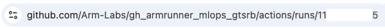

## GitHub Actions workflows

### Train Model

In this section, you will execute the script through the _Train Model_ workflow in the GitHub Actions UI. This workflow pulls a [PyTorch 2.3.0 Docker Image compiled with OpenBLAS from DockerHub](https://hub.docker.com/r/armswdev/pytorch-arm-neoverse), and runs the training script `scripts/train_model.py` within that container. The model is trained on the GTSRB dataset using this script and saved as an artifact of the job.

```yaml
name: Train Model

on:
  workflow_dispatch:

jobs:
  train-model:
    name: Train the Model
    runs-on: ubuntu-22.04-arm-os # Custom ARM64 runner
    container:
      image: armswdev/pytorch-arm-neoverse:r24.07-torch-2.3.0-openblas
      options: --user root
    steps:
      - name: Checkout code
        uses: actions/checkout@v4
      - name: Run training script
        run: python scripts/train_model.py
      - name: Upload Artifact
        uses: actions/upload-artifact@v4
        with:
          name: traffic_sign_net
          path: ${{ github.workspace }}/models/traffic_sign_net.pth
          retention-days: 5
```

Navigate to the _Train Model_ workflow under the _Actions_ tab, and press the _Run workflow_ button. You can see the training loss per epoch and finally a `Finished Training`.

```output
(...)
Epoch [8/10], Step [400/417], Loss: 0.0230
Epoch [9/10], Step [100/417], Loss: 0.0193
Epoch [9/10], Step [200/417], Loss: 0.0207
Epoch [9/10], Step [300/417], Loss: 0.0204
Epoch [9/10], Step [400/417], Loss: 0.0244
Epoch [10/10], Step [100/417], Loss: 0.0114
Epoch [10/10], Step [200/417], Loss: 0.0168
Epoch [10/10], Step [300/417], Loss: 0.0208
Epoch [10/10], Step [400/417], Loss: 0.0152
Finished Training
```
Confirm that the model has been generated as an artifact in the job's overview.


This file is used to run the next step: testing the performance.

### Test Model

Similarly to `train_model.py`, there is an associated workflow which executes in a Docker container: _Test Model_. The test job downloads the artifact generated by the training job, and runs inference with the version of PyTorch installed in the container.

```yaml
name: Test Model

on:
  workflow_dispatch:

jobs:
  test-model:
    name: Test the Model
    runs-on: ubuntu-22.04-arm-os # Custom ARM64 runner
    container:
      image: armswdev/pytorch-arm-neoverse:r24.07-torch-2.3.0-openblas
      options: --user root
    steps:
      - name: Checkout code
        uses: actions/checkout@v4
      - name: Download artifacts
        uses: actions/download-artifact@v4
        with:
          name: traffic_sign_net
          run-id: <11-digit run ID>
          github-token: ${{ secrets.GITHUB_TOKEN }}
      - name: Run testing script
        run: python scripts/test_model.py --model traffic_sign_net.pth

```

In order to use the model created by your _Train Model_ job, you can edit the _Test Model_ workflow file.

Open the training job which uploaded the ML model as an artifact by navigating to the _Actions_ tab on your GitHub repository. Choose the _Train Model_ under _All workflows_, and select the latest successful job. The URL from here contains an 11-digit number. Note down this number, which is the _run ID_ which is used to pick up the model for testing. Open the workflow file for _Test Model_, `test-model.yml`, and update the `run-id` parameter. Save the file.



Trigger the _Test Model_ job by pressing the _Run workflow_ button in the job's overview. You can check the output to see how the artifact you generated is used for testing. The PyTorch profiler will print a table of the results, which you can compare in the next step. It should look something like this for the first run, which uses a backend in PyTorch called OpenBLAS.

```output
Accuracy of the model on the test images: 90.48%
-------------------------------------  ------------  ------------  ------------  ------------  ------------  ------------
                                 Name    Self CPU %      Self CPU   CPU total %     CPU total  CPU time avg    # of Calls
-------------------------------------  ------------  ------------  ------------  ------------  ------------  ------------
                      model_inference         2.35%     332.000us       100.00%      14.141ms      14.141ms             1
                     aten::max_pool2d         0.10%      14.000us        34.06%       4.817ms       2.409ms             2
        aten::max_pool2d_with_indices        33.97%       4.803ms        33.97%       4.803ms       2.401ms             2
                         aten::linear         0.08%      11.000us        32.98%       4.663ms       2.332ms             2
                          aten::addmm        32.58%       4.607ms        32.71%       4.626ms       2.313ms             2
                         aten::conv2d         0.08%      12.000us        22.37%       3.164ms       1.582ms             2
                    aten::convolution         0.13%      19.000us        22.29%       3.152ms       1.576ms             2
                   aten::_convolution         0.21%      29.000us        22.16%       3.133ms       1.567ms             2
    aten::_nnpack_spatial_convolution        21.88%       3.094ms        21.95%       3.104ms       1.552ms             2
                           aten::relu         0.11%      15.000us         8.17%       1.155ms     385.000us             3
-------------------------------------  ------------  ------------  ------------  ------------  ------------  ------------
Self CPU time total: 14.141ms
```


In the next section, you learn how to modify the testing workflow to improve the inference performance of the model.
