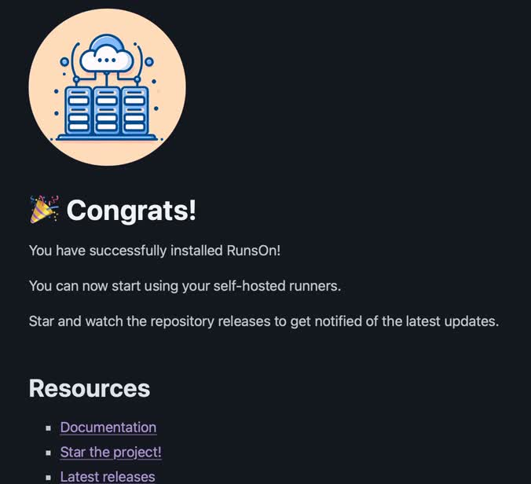

---
# User change
title: "Install RunsOn in your AWS account"

weight: 3 # 1 is first, 2 is second, etc.

# Do not modify these elements
layout: "learningpathall"
---
## Install RunsOn

Follow this three-step process to install RunsOn:

1. Connect to your AWS account: using your AWS credentials, log in to the AWS console for the account where you would like to set up RunsOn. It's best to install RunsOn in its own AWS sub-account if you can, for better isolation and security.

2. Create the CloudFormation stack and GitHub app for RunsOn by following the official [installation guide](https://runs-on.com/guides/install/). This takes about 10 minutes.

    The installation guide has a link at the top to obtain the license key. 
    
    Once you have your key, proceed with the installation guide by selecting the AWS region you would like to use, creating the CloudFormation stack, and installing the GitHub app. 

3. At the end, follow the link to the deployed App Runner service endpoint, and you should see a page indicating that your installation is successful. 

    At this point you can start using RunsOn to spawn runners for your GitHub Actions workflows.

Continue to the next page to learn how to use your new runners in GitHub Actions workflows.