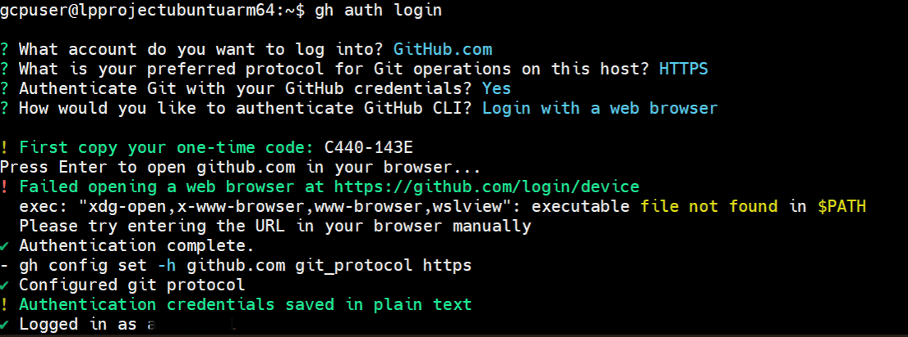
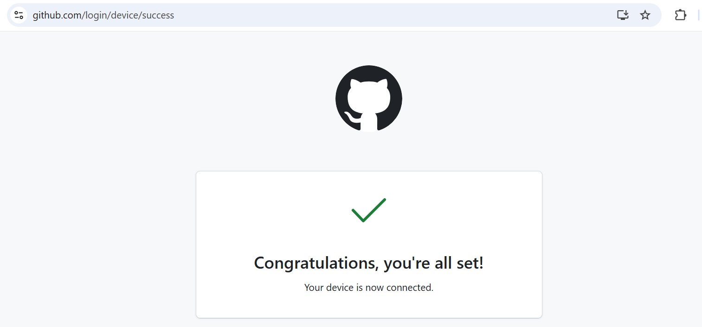
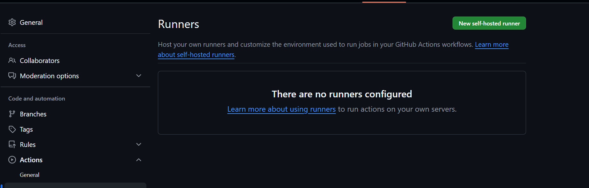
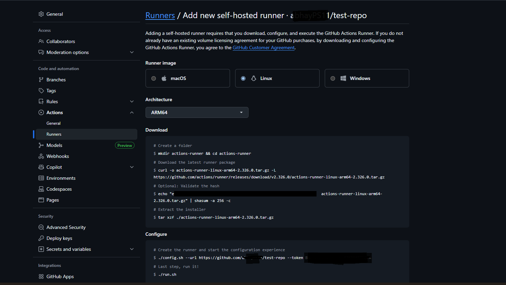
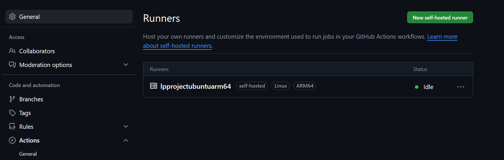

## Set Up GitHub Actions Self-Hosted Runner on Google Axion C4A Virtual Machine

This Learning Path shows how to deploy a self-hosted GitHub Actions runner on a Google Cloud C4A Arm64 virtual machine running Ubuntu. It covers installing Git and GitHub CLI, authenticating with GitHub and configuring the runner on an Arm64 environment for optimized CI/CD workflows.

### Install Git and GitHub CLI 
```console
sudo apt update 
sudo apt install -y git gh
```
Login to GitHub
```console
gh auth login 
 ```
The command `gh auth login` is used to authenticate the GitHub CLI with your GitHub account. It allows you to securely log in using a web browser or token, enabling the CLI to interact with repositories, actions, and other GitHub features on your behalf.



Below is the GitHub login UI:



### Test GitHub CLI and Git 
Create a test repo: 
```console
gh repo create test-repo –public
```
You should see an output similar to:
```output
✓ Created repository <your-github-account>/test-repo on GitHub
  https://github.com/<your-github-account>/test-repo
```

The command `gh repo create test-repo --public` creates a new public GitHub repository named **test-repo** using the GitHub CLI. It sets the repository visibility to public, meaning anyone can view it 

### Configure the Self-Hosted Runner
Go to your repository's **Settings > Actions**, and under the **Runners** section, click on **Add Runner** or view existing self-hosted runners.
If the **Actions** tab is not visible, ensure Actions are enabled by navigating to **Settings > Actions > General**, and select **Allow all actions and reusable workflows**.



Then, click on the **New runner** button, followed by **New self-hosted runner**. In the **Add new self-hosted runner** section, proceed as follows:
- Select Linux for the operating system.
- Choose ARM64 for the architecture



Next, execute the following instructions on your Google Axion C4A virtual machine:
```console
mkdir actions-runner && cd actions-runner# Download the latest runner package
curl -o actions-runner-linux-arm64-2.326.0.tar.gz -L https://github.com/actions/runner/releases/download/v2.326.0/actions-runner-linux-arm64-2.326.0.tar.gz
echo "ee7c229c979c5152e9f12be16ee9e83ff74c9d9b95c3c1aeb2e9b6d07157ec85  actions-runner-linux-arm64-2.326.0.tar.gz" | shasum -a 256 -c# Extract the installer
tar xzf ./actions-runner-linux-arm64-2.326.0.tar.gz
```
Then, configure the virtual machine with the following command:

```console
./config.sh --url https://github.com/<YOUR_USERNAME>/YOUR_REPO --token YOUR_TOKEN
```
Replace `YOUR_USERNAME`, `YOUR_REPO`, and `YOUR_TOKEN` accordingly.
This command links the runner to your GitHub repo using a one-time registration token.

During the command’s execution, you will be prompted to provide the runner group, the name of the runner, and the work folder name. You can accept the defaults by pressing **Enter** at each step. The output will resemble as below:

You should see an output similar to:

```output
--------------------------------------------------------------------------------
|        ____ _ _   _   _       _          _        _   _                      |
|       / ___(_) |_| | | |_   _| |__      / \   ___| |_(_) ___  _ __  ___      |
|      | |  _| | __| |_| | | | | '_ \    / _ \ / __| __| |/ _ \| '_ \/ __|     |
|      | |_| | | |_|  _  | |_| | |_) |  / ___ \ (__| |_| | (_) | | | \__ \     |
|       \____|_|\__|_| |_|\__,_|_.__/  /_/   \_\___|\__|_|\___/|_| |_|___/     |
|                                                                              |
|                       Self-hosted runner registration                        |
|                                                                              |
--------------------------------------------------------------------------------

# Authentication

√ Connected to GitHub
# Runner Registration
Enter the name of the runner group to add this runner to: [press Enter for Default]
Enter the name of runner: [press Enter for lpprojectubuntuarm64]
This runner will have the following labels: 'self-hosted', 'Linux', 'ARM64'
Enter any additional labels (ex. label-1,label-2): [press Enter to skip]
√ Runner successfully added
√ Runner connection is good
```

Finally, start the runner by executing:
```console
./run.sh
```
You should see an output similar to:

```output
√ Connected to GitHub

Current runner version: '2.326.0'
2025-07-15 05:51:13Z: Listening for Jobs
```
The runner will now be visible in the GitHub actions:


