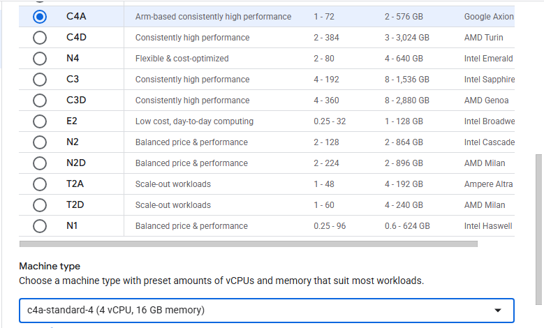

## Overview

This section walks you through creating a Google Axion C4A Arm virtual machine on Google Cloud with the `c4a-standard-4` (4 vCPUs, 16 GB memory) machine type using the Google Cloud Console. You will use this VM later as the host for a GitHub Actions self-hosted runner.

If you don't have a Google Cloud account, see the Learning Path [Getting started with Google Cloud Platform](/learning-paths/servers-and-cloud-computing/csp/google/).

## Create an Arm-based virtual machine (C4A)

Follow these steps in the Google Cloud Console:

- Open the [Google Cloud Console](https://console.cloud.google.com/).
- Go to **Navigation menu ▸ Compute Engine ▸ VM instances**, then select **Create instance**.
- Under **Machine configuration**:
  - Enter **Instance name**, **Region**, and **Zone**
  - Set **Series** to `C4A`
  - Choose a machine type such as `c4a-standard-4`
- Under **OS and storage**, select **Change**, pick **Ubuntu** as the operating system, and choose **Ubuntu 24.04 LTS Minimal**. Make sure you select the Arm image variant.
- Under **Networking**, enable **Allow HTTP traffic** so you can test workloads like NGINX later.
- Select **Create** to launch the instance.

{}
Do not leave **Allow HTTP traffic** enabled permanently. For long-term use, allow traffic only from the IP addresses you use to connect to the instance.
{}

Access the VM from the instance list by selecting **SSH** in the instance overview. Use this command line interface (CLI) to run the commands in the remainder of this Learning Path.
