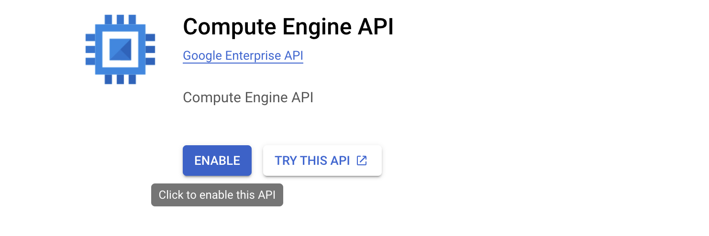
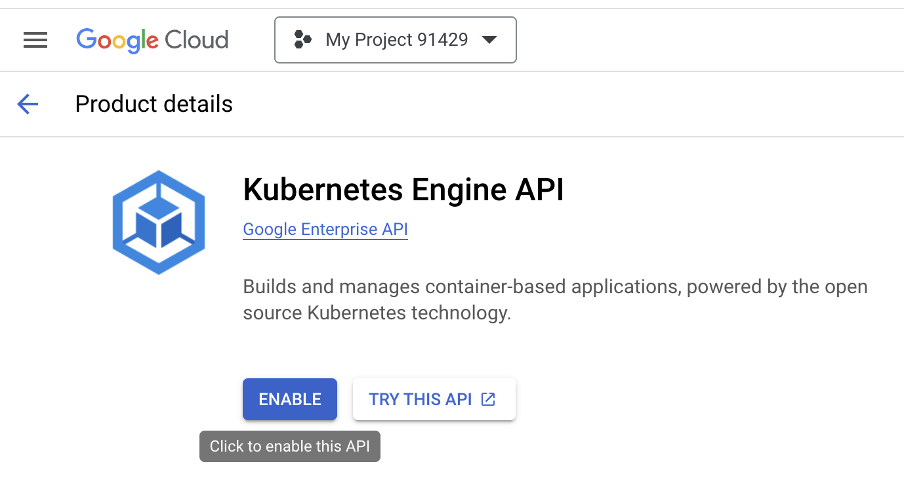

---
# User change
title: "Deploy an Arm-based GKE Cluster using Terraform"

weight: 2 # 1 is first, 2 is second, etc.

# Do not modify these elements
layout: "learningpathall"
---

You can run Google Kubernetes Engine (GKE), a fully managed Kubernetes platform, on the Tau T2A family of virtual machines. Tau T2A is powered by Ampere Altra Arm-based processors and offers compelling price-performance.

## Before you begin

Any computer which has the required tools installed can be used for this section. 

You will need a [Google Cloud account](https://console.cloud.google.com/). Create an account if needed. 

Three tools are required on the computer you are using. Follow the links to install the required tools.

* [Terraform](/install-guides/terraform)
* [Kubectl](/install-guides/kubectl/)
* [Google Cloud CLI](/install-guides/gcloud)

## Create a GKE cluster using Terraform

### Create a new project

1. Log in to your GCP account and create a project in the console using the dropdown menu next to the Google Cloud logo. 


2. Click **New Project** on the top right corner.


3. Enter the name of your project in the **Project name** field.

4. Click **Create**. The console navigates to the Dashboard page and your project is created within a few minutes.  


5. Go to the **[Dashboard](https://console.cloud.google.com/home?_ga=2.56408877.721166205.1675053595-562732326.1671688536&_gac=1.125526520.1675155465.CjwKCAiAleOeBhBdEiwAfgmXfwdH3kCFBFeYzoKSuP1DzwJq7nY083_qzg7oyP2gwxMvaE0PaHVgFhoCmXoQAvD_BwE)** in the Google Cloud console. 

6. Save the **Project ID** as shown in the **Project info** Dashboard. You will need it for future steps.


### Acquire GCP Access Credentials

The installation of Terraform on your Desktop/Laptop needs to communicate with GCP. Thus, Terraform needs to be authenticated.

To obtain GCP user credentials, follow this [guide](/install-guides/gcloud#acquire-user-credentials).

### Enable APIs

1. Open [Compute Engine](https://console.developers.google.com/apis/api/compute.googleapis.com/overview) in a browser and click the `Enable` button to enable the Compute Engine API.




2. Open [Kubernetes Engine](https://console.cloud.google.com/apis/api/container.googleapis.com/overview) in a browser and click the `Enable` button to enable the Kubernetes Engine API. 



APIs for your Google Cloud project are required for using Terraform. 

### Create Service Accounts 

Service Account credentials are needed for Terraform to interact with the **Google Cloud APIs** to create the cluster and related networking components.

1. In the Google Cloud Console on the top left corner menu, go to **IAM & Admin** and click **Service Accounts**. 

2. Click on **CREATE SERVICE ACCOUNT**. 


3. Enter a **Service account name** and click on **Create and continue**. 


4. When promoted for a role select **Basic: Owner** from dropdown menu and Click the **DONE** button to finish service account creation. 


Save your service account name for a future step, it will be of the form `your-service-account-name@your-project-id.iam.gserviceaccount.com`

Visit [IAM roles](https://cloud.google.com/iam/docs/understanding-roles) to learn more about roles. 

For advanced usage, you can learn how to create and manage the [service accounts](https://cloud.google.com/iam/docs/creating-managing-service-accounts) using the `gcloud` command.

### Create Terraform files

To create the cluster on GKE, the Terraform configuration is separated into four files: 
- `providers.tf`
- `variables.tf`
- `main.tf`
- `terraform.tfvars`

Create each of the files, the last two need to be modified using your account data. 

1. Use a text editor to create the file `providers.tf` with the code below: 

```console
provider "google" {
project = var.gcp_project_id
region = var.gcp_region
}


# google_client_config and kubernetes provider must be explicitly specified like the following.

data "google_client_config" "default" {}

provider "kubernetes" {
  host                   = "https://${module.gke.endpoint}"
  token                  = data.google_client_config.default.access_token
  cluster_ca_certificate = base64decode(module.gke.ca_certificate)
}
```

2. Use a text editor to create the file `variables.tf` with the code below: 

```console
variable "gcp_project_id" {
type = string
description = "gcp_project_id"
}

variable "gcp_region" {
type = string
description = "GCP region"
}

variable "gke_regional" {
type = bool
description = "Gke regional"
}

variable "gcp_cluster_name" {
type = string
description = "GCP Cluster name"
}

variable "gke_zones" {
type = list(string)
description = "list of zones"
}

variable "gke_network" {
type = string
description = "vpc network"
}

variable "gke_subnetwork" {
type = string
description = "vpc subnetwork"
}
```

3. Use a text editor to create the file `terraform.tfvars` with the code below: 

This file contains variable values specific to your project.

{}
Replace ```"your project ID"``` with the project ID you have created. 

Replace ```"your cluster name"``` with any name you want to use for the cluster. 
{}

```console
gcp_project_id = "your project ID"
gcp_region = "us-central1"
gke_zones =  ["us-central1-a","us-central1-b","us-central1-f"]
gke_regional = false
gke_network = "default"
gke_subnetwork = "default"
gcp_cluster_name = "your cluster name"
```

A zonal cluster has been created but you can create a [regional](https://cloud.google.com/kubernetes-engine/docs/concepts/types-of-clusters) cluster as well.

4. Use a text editor to create the file `main.tf` with the code below: 

{}
Replace ```"your-service-account-name@your-project-id.iam.gserviceaccount.com"``` with your service account.
{}

```console
module "gke" {
  source                     = "terraform-google-modules/kubernetes-engine/google"
  project_id                 = var.gcp_project_id
  name                       = var.gcp_cluster_name
  region                     = var.gcp_region
  regional                   = var.gke_regional
  zones                      = var.gke_zones
  network                    = var.gke_network
  subnetwork                 = var.gke_subnetwork
  ip_range_pods              = ""
  ip_range_services          = ""
  http_load_balancing        = false
  network_policy             = false
  horizontal_pod_autoscaling = true
  filestore_csi_driver       = false

  node_pools = [
    {
      name                      = "default-node-pool"
      machine_type              = "t2a-standard-1"
      min_count                 = 1
      max_count                 = 100
      autoscaling               = true
      spot                      = false
      disk_size_gb              = 100
      disk_type                 = "pd-standard"
      image_type                = "COS_CONTAINERD"
      auto_repair               = true
      auto_upgrade              = true
      service_account           = "your-service-account-name@your-project-id.iam.gserviceaccount.com"
      preemptible               = false
      initial_node_count        = 1
    },
  ]

  node_pools_oauth_scopes = {
    all = [
      "https://www.googleapis.com/auth/logging.write",
      "https://www.googleapis.com/auth/monitoring",
    ]
  }

  node_pools_labels = {
    all = {}

    default-node-pool = {
      default-node-pool = true
    }
  }

  node_pools_metadata = {
    all = {}

    default-node-pool = {
      node-pool-metadata-custom-value = "my-node-pool"
    }
  }

  node_pools_taints = {
    all = []

    default-node-pool = [
      {
        key    = "default-node-pool"
        value  = true
        effect = "PREFER_NO_SCHEDULE"
      },
    ]
  }

  node_pools_tags = {
    all = []

    default-node-pool = [
      "default-node-pool",
    ]
  }
}
```

You can use the block labeled **node_pools** to enter the **service_account**, the number of nodes **(node_count)** for the cluster, a [minimum CPU platform](https://cloud.google.com/kubernetes-engine/docs/how-to/min-cpu-platform), [Spot VMs](https://cloud.google.com/kubernetes-engine/docs/concepts/spot-vms), a specific [node image](https://cloud.google.com/kubernetes-engine/docs/concepts/node-images), different [machine types](https://cloud.google.com/compute/docs/machine-types), or a more efficient [virtual network interface](https://cloud.google.com/kubernetes-engine/docs/how-to/using-gvnic). 

The **machine_type** is how you set the cluster to be deployed with Ampere Altra Arm processor. You can select **t2a-standard-1** which is a 1 vCPU that runs on the Ampere Altra Arm processor. Tau T2A standard machine types have 4 GB of system memory per vCPU.

There are various standards for the [Tau T2A machine series](https://cloud.google.com/compute/docs/general-purpose-machines#t2a_machines) that can be selected. Tau T2A is available only in the selected [regions and zones](https://cloud.google.com/compute/docs/regions-zones#available).

## Run the Terraform commands

Run the Terraform commands in the directory where you saved the Terraform files.

### Initialize Terraform

Run `terraform init` to download the dependencies required for Google Cloud as a provider and set up a working directory.

```console
terraform init
```

The output will be similar to:

```output
Initializing the backend...
Initializing modules...
Downloading registry.terraform.io/terraform-google-modules/kubernetes-engine/google 31.1.0 for gke...
- gke in .terraform/modules/gke
Initializing provider plugins...
- Finding hashicorp/google versions matching ">= 5.25.0, < 6.0.0"...
- Finding hashicorp/kubernetes versions matching "~> 2.10"...
- Finding hashicorp/random versions matching ">= 2.1.0"...
- Installing hashicorp/google v5.36.0...
- Installed hashicorp/google v5.36.0 (signed by HashiCorp)
- Installing hashicorp/kubernetes v2.31.0...
- Installed hashicorp/kubernetes v2.31.0 (signed by HashiCorp)
- Installing hashicorp/random v3.6.2...
- Installed hashicorp/random v3.6.2 (signed by HashiCorp)
Terraform has created a lock file .terraform.lock.hcl to record the provider
selections it made above. Include this file in your version control repository
so that Terraform can guarantee to make the same selections by default when
you run "terraform init" in the future.

Terraform has been successfully initialized!

You may now begin working with Terraform. Try running "terraform plan" to see
any changes that are required for your infrastructure. All Terraform commands
should now work.

If you ever set or change modules or backend configuration for Terraform,
rerun this command to reinitialize your working directory. If you forget, other
commands will detect it and remind you to do so if necessary.
```

### Create a Terraform execution plan

Run `terraform plan` to create an execution plan.

```console
terraform plan
```

A long output of resources to be created will be printed. The `terraform plan` command is helpful to identify any errors and confirm the resources that will be created. 

### Apply a Terraform execution plan

Run `terraform apply` to apply the execution plan to your cloud infrastructure. The below command creates all required infrastructure.

```console
terraform apply
```      
Answer yes to the prompt to confirm you want to create Google Cloud resources.

It will take about 10 minutes to create the resources. 

The last few lines of output will be similar to:

```output
module.gke.google_container_node_pool.pools["default-node-pool"]: Still creating... [5m31s elapsed]
module.gke.google_container_node_pool.pools["default-node-pool"]: Creation complete after 5m37s [id=projects/gke-test-381318/locations/us-central1-a/clusters/gke-arm-cluster/nodePools/default-node-pool]

Apply complete! Resources: 9 added, 0 changed, 0 destroyed.
```

### View the GKE cluster 

1. In the Google Cloud console go to **Kubernetes Engine » Clusters**.


2. In Kubernetes Engine, select the **cluster** and use the three dots to select **Connect**.


3. Copy the `gcloud` command shown 

This command will retrieve the access credentials for your cluster and automatically configure kubectl. 


4. Paste the `gcloud` command in your terminal.

Your command will look similar to this command:

```console
gcloud container clusters get-credentials gke-arm-cluster --zone us-central1-a --project gke-cluster-375814
```

The output will be similar to:

```output
Fetching cluster endpoint and auth data.
CRITICAL: ACTION REQUIRED: gke-gcloud-auth-plugin, which is needed for continued use of kubectl, was not found or is not executable. Install gke-gcloud-auth-plugin for use with kubectl by following https://cloud.google.com/blog/products/containers-kubernetes/kubectl-auth-changes-in-gke
kubeconfig entry generated for gke-arm-cluster.
```

If you have the **CRITICAL:** you can follow the link to install the gke-gcloud-auth-plugin. 

If you are on Ubuntu or Debian Linux run:

```console
sudo apt-get install google-cloud-sdk-gke-gcloud-auth-plugin
```

### Configure kubectl

1. Run the following command to see the status of the nodes. The status must be in ready state.

```console
kubectl get nodes
```

The output will be similar to:

```output
NAME                                             STATUS   ROLES    AGE   VERSION
gke-arm-cluster-default-node-pool-82579cfc-rs99   Ready    <none>   19m   v1.25.6-gke.1000
gke-arm-cluster-default-node-pool-b31cd2bf-1726   Ready    <none>   19m   v1.25.6-gke.1000
gke-arm-cluster-default-node-pool-ba7acc8a-d8pc   Ready    <none>   19m   v1.25.6-gke.1000

```

2. Run `kubectl` again to see the current pods running on the cluster.

```console
kubectl get pods -A
```

The output will be similar to:

```output
NAMESPACE     NAME                                                        READY   STATUS    RESTARTS   AGE
kube-system   event-exporter-gke-755c4b4d97-pqjqh                         2/2     Running   0          21m
kube-system   fluentbit-gke-j8nms                                         2/2     Running   0          20m
kube-system   fluentbit-gke-l4fzt                                         2/2     Running   0          20m
kube-system   fluentbit-gke-n9w8x                                         2/2     Running   0          20m
kube-system   gke-metadata-server-4fbzv                                   1/1     Running   0          20m
kube-system   gke-metadata-server-6zrn2                                   1/1     Running   0          20m
kube-system   gke-metadata-server-z669k                                   1/1     Running   0          20m
kube-system   gke-metrics-agent-85twx                                     2/2     Running   0          20m
kube-system   gke-metrics-agent-jbmdg                                     2/2     Running   0          20m
kube-system   gke-metrics-agent-mszkn                                     2/2     Running   0          20m
kube-system   konnectivity-agent-54bc6f8ccb-6vpc6                         1/1     Running   0          21m
kube-system   konnectivity-agent-54bc6f8ccb-7w9v4                         1/1     Running   0          20m
kube-system   konnectivity-agent-54bc6f8ccb-vkpmb                         1/1     Running   0          20m
kube-system   konnectivity-agent-autoscaler-7dc78c8c9-ntsbl               1/1     Running   0          21m
kube-system   kube-dns-7b9b6ffbd9-bjh8s                                   4/4     Running   0          20m
kube-system   kube-dns-7b9b6ffbd9-xmtb2                                   4/4     Running   0          21m
kube-system   kube-dns-autoscaler-5f56f8997c-mkbxx                        1/1     Running   0          21m
kube-system   kube-proxy-gke-arm-cluster-default-node-pool-82579cfc-rs99   1/1     Running   0          20m
kube-system   kube-proxy-gke-arm-cluster-default-node-pool-b31cd2bf-1726   1/1     Running   0          20m
kube-system   kube-proxy-gke-arm-cluster-default-node-pool-ba7acc8a-d8pc   1/1     Running   0          20m
kube-system   metrics-server-v0.5.2-67864775dc-gxjdc                      2/2     Running   0          20m
kube-system   netd-6mlwf                                                  1/1     Running   0          20m
kube-system   netd-bkj84                                                  1/1     Running   0          20m
kube-system   netd-fndml                                                  1/1     Running   0          20m
kube-system   pdcsi-node-6pmf6                                            2/2     Running   0          20m
kube-system   pdcsi-node-m58ss                                            2/2     Running   0          20m
kube-system   pdcsi-node-z98kx                                            2/2     Running   0          20m
```

3. Run `kubectl` to open a shell on one of the nodes.

```console
kubectl debug node/gke-arm-cluster-default-node-pool-82579cfc-rs99 -it --image=ubuntu
```

The terminal will open a shell with output similar to:

```output
Creating debugging pod node-debugger-gke-arm-cluster-default-node-pool-82579cfc-rs99-j2p65 with container debugger on node gke-arm-cluster-default-node-pool-82579cfc-rs99.
If you don't see a command prompt, try pressing enter.
root@gke-arm-cluster-default-node-pool-82579cfc-rs99:/# 
```

4. At the new shell prompt, run the `uname` command:

```console
uname -a
```

The output confirm the node is an Arm instance:

```output
Linux gke-arm-cluster-default-node-pool-82579cfc-rs99 5.15.65+ #1 SMP Sat Jan 21 10:10:29 UTC 2023 aarch64 aarch64 aarch64 GNU/Linux
```

You have successfully installed a Kubernetes cluster on GKE using Arm-based instances. 

### Clean up resources

Run `terraform destroy` to delete all resources created.

```console
terraform destroy
```

Answer `yes` at the prompt to destroy all resources. 
