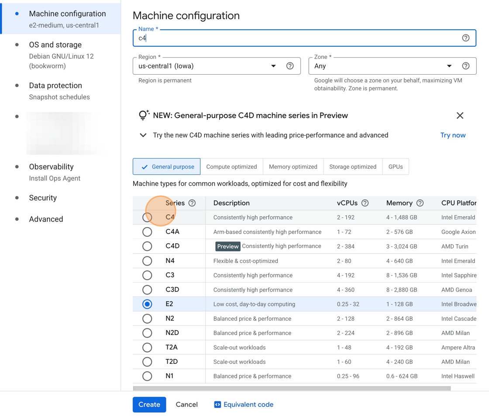
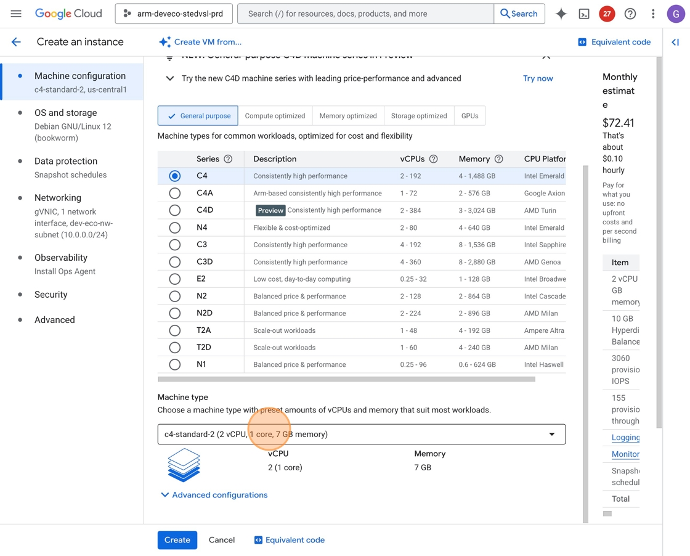
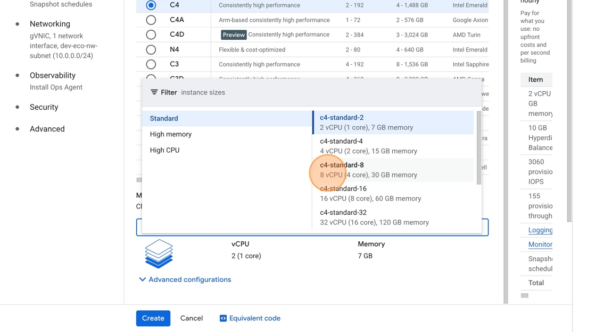

## Section Overview
In this section, you will set up the second benchmarking system, an Intel-based c4-standard-8 instance.

## Creating the Instance

To create the second system, follow the previous lesson's c4a install instructions, but make the following changes:

1. **Name your instance:** For the `Name` field, enter "c4".

2. **Select machine series:** Scroll down to the Machine series section, and select the C4 radio button.

3. **View machine types:** Scroll down to the Machine type dropdown, and click it to show all available options.

4. **Choose machine size:** Select "c4-standard-8" under the Standard tab.

After the c4 instance starts up, you are ready to continue to the next section, where you'll install the benchmarking software.