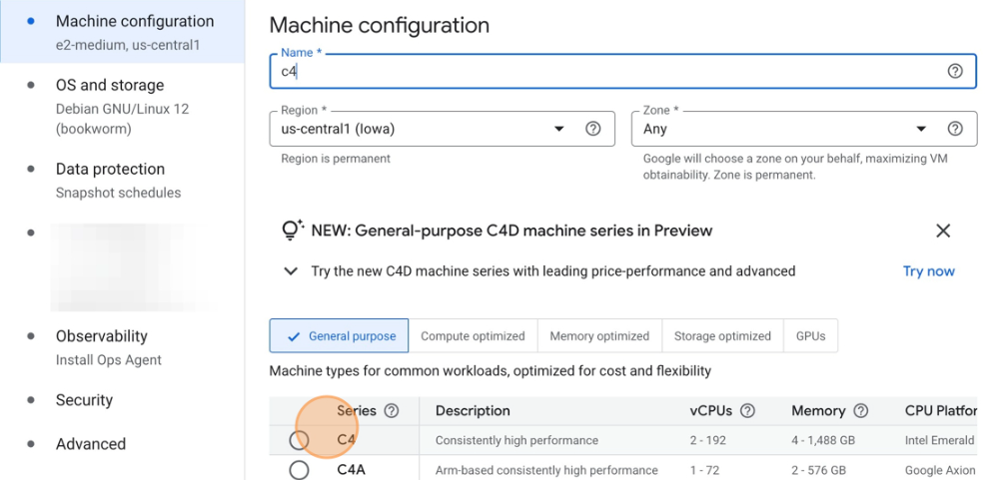

## Launch an x86-based `c4-standard-8` instance
In this section, you will set up the second benchmarking system, an Intel Emerald Rapids `c4-standard-8` instance.

## Creating the Instance

Follow the same steps from the previous section where you launched the c4a instance, but make the following changes for the Intel-based c4-standard-8:

* Where you name the instance, in the **Name** field, enter "c4".

* Where you select the machine series, scroll down and select the C4 radio button.

For the machine types section, scroll down to the **Machine type** dropdown, and click it to show all available options.

Where you choose machine size, select "c4-standard-8" under the **Standard** tab.

{} 
Be sure to set the disk size to **1000 GB** in the **OS and Storage** tab, just as you did for the `c4a` instance.
{}

After the c4 instance starts up, you are ready to continue to the next section, where you'll install the benchmarking software.
