## Overview
In this section, you'll learn how to spin up the first of two different VMs used for benchmarking Go tests, an Arm-based Google Axion c4a-standard-4 (c4a for short).

## Creating the c4a-standard-4 Instance

1. **Access Google Cloud Console:** Navigate to [https://console.cloud.google.com/welcome](https://console.cloud.google.com/welcome)

2. **Search for VM instances:** Click into the Search field.

3. **Find VM Instances:** Start typing `vm` until the UI auto-completes `VM Instances`, then click it.

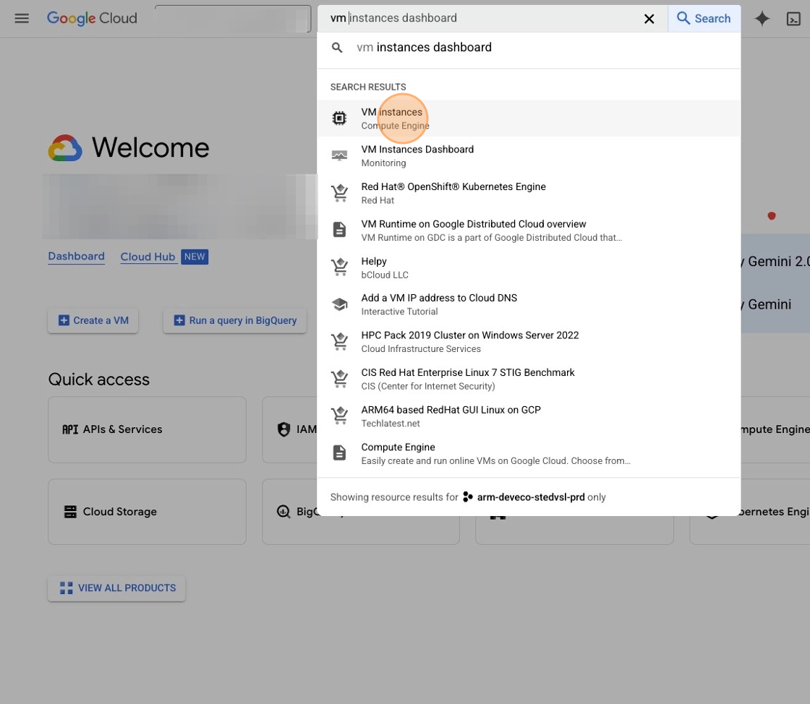

The VM Instances page appears.

4. **Create a new instance:** Click `Create instance`

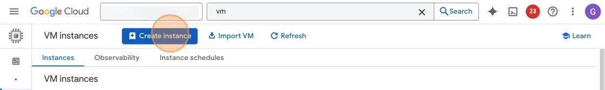

The Machine configuration page appears.

5. **Name your instance:** Click the `Name` field, and enter "c4a" for the `Name`.

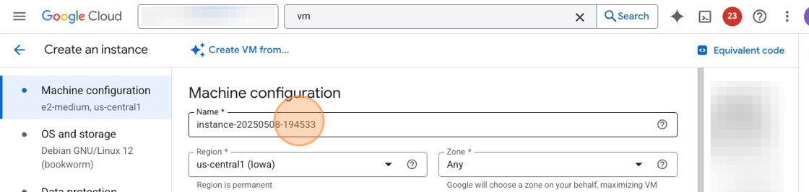

6. **Select machine series:** Scroll down to the Machine series section, and select the C4A radio button.

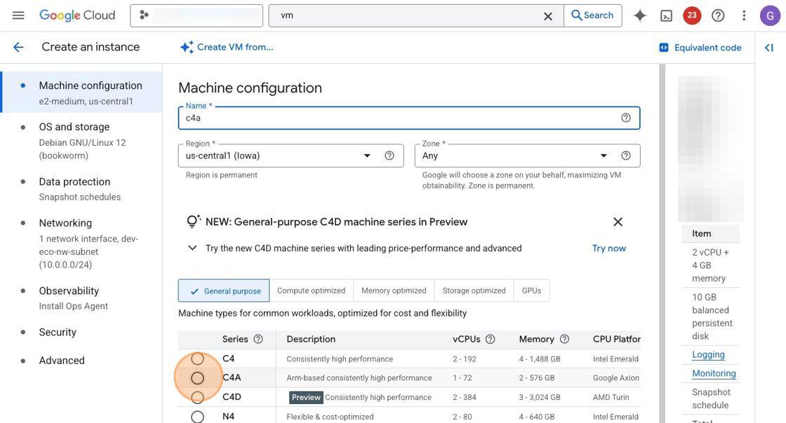

7. **View machine types:** Scroll down to the Machine type dropdown, and click it to show all available options.

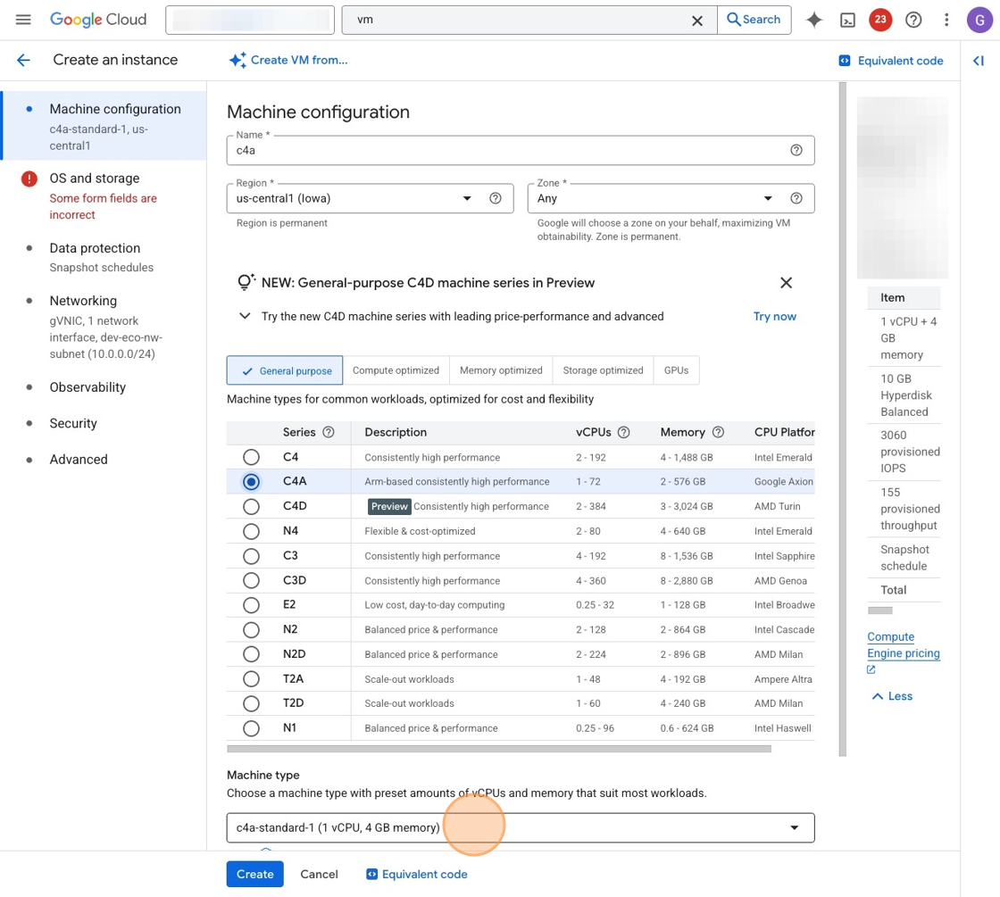

8. **Choose machine size:** Select "c4a-standard-4" under the Standard tab.

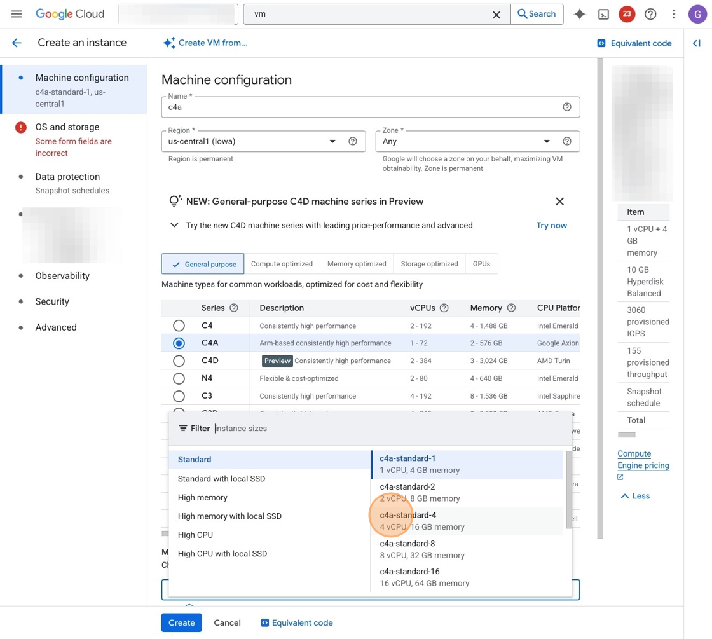

9. **Configure storage:** Click the "OS and Storage" tab.

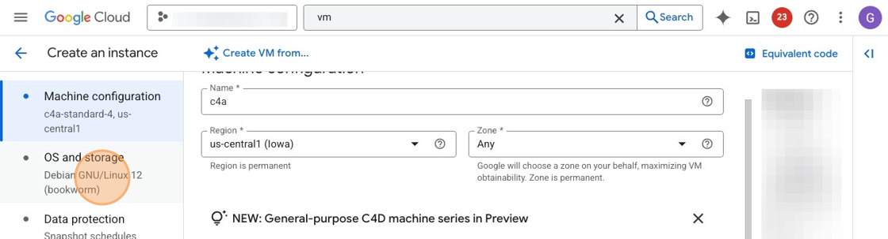

10. **Modify storage settings:** Click "Change"

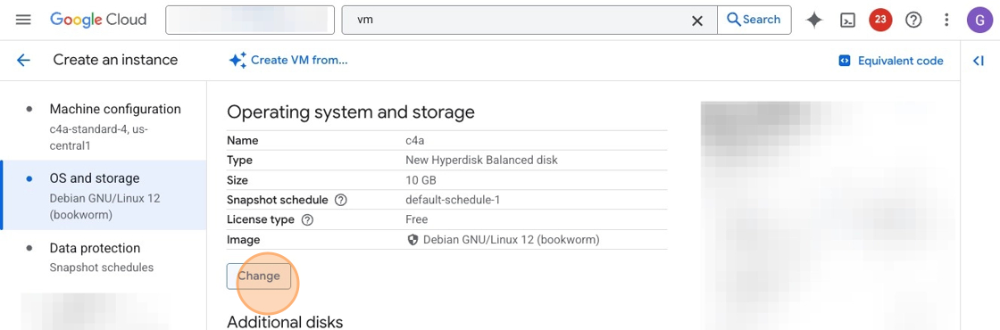

11. **Set disk size:** Double-click the "Size (GB)" field, then enter "1000" for the value.

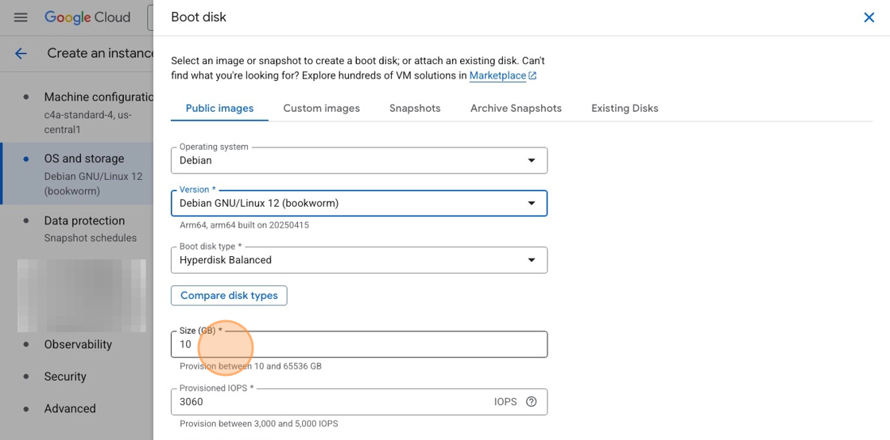

12. **Confirm storage settings:** Click "Select" to continue.

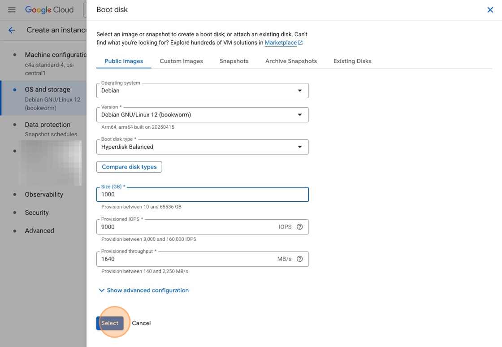

13. **Launch the instance:** Click "Create" to bring up the instance.

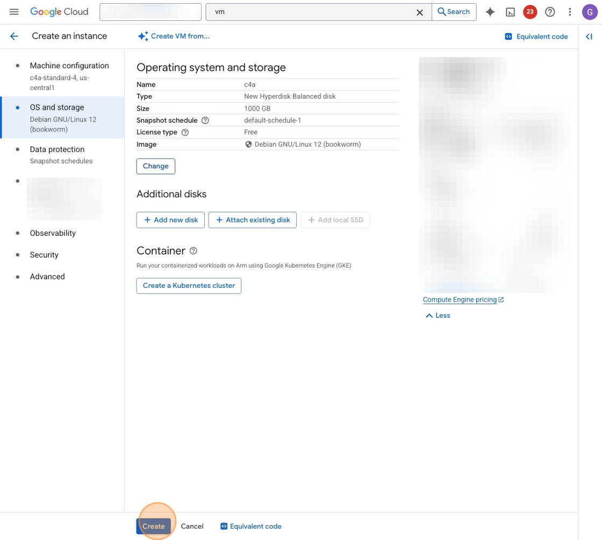

After a few seconds, your c4a instance starts up, and you are ready to continue to the next section. In the next step, you will launch the second VM, an Intel-based Emerald Rapids c4-standard-8 (c4 for short), which will serve as the comparison system for our benchmarking tests.

