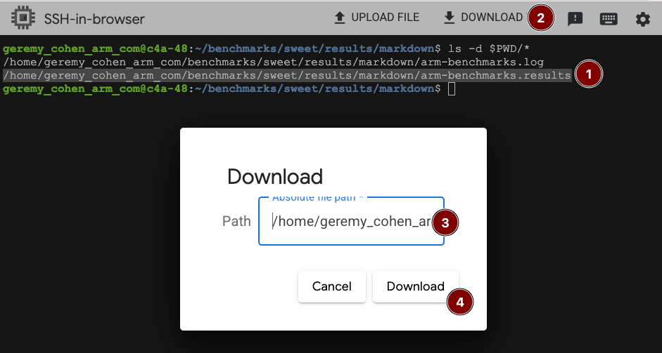
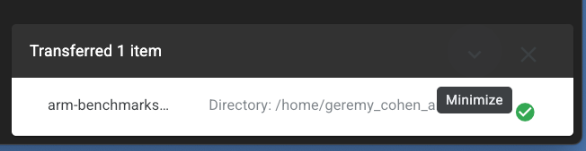

In this section, you'll download the benchmark results you ran manually in previous steps from each VM. You will use these results to understand how `sweet` and `benchstat` work together.

## Download benchmark results from each VM
Start by retrieving the results generated by Sweet from your earlier benchmark runs.


### Locate results

Change directory to the `results/markdown` directory and list the files to see the `arm-benchmarks.result` file:

   ```bash
   cd results/markdown
   ls -d $PWD/*
   ```

### Copy result path

Copy the absolute pathname of `arm-benchmarks.result`. You'll need this to initiate the download.

### Download results

Select `DOWNLOAD FILE`  in your GCP terminal interface. Paste the absolute pathname you copied into the dialog and confirm the download. This downloads the benchmark results to your local machine.

   

### Rename the file

After downloading the file to your local machine, rename it to `c4a.result` to distinguish it from the x86 results you'll download next. This naming convention helps you clearly identify which architecture each result came from. You'll know the download was successful if you see the file named `c4a.result` in your Downloads folder and receive a confirmation in your browser.

   

### Repeat for the second VM

Repeat the same process with your c4 (x86) VM. Use the same results/markdown directory and download the `arm-benchmarks.result` file. This time, rename it to `c4.result` after downloading.

Now that you have the results from both VMs, in the next section, you'll learn how to use Benchstat to analyze these results and understand the performance differences between the two architectures.
